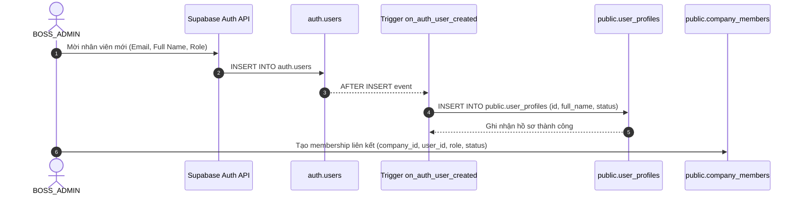
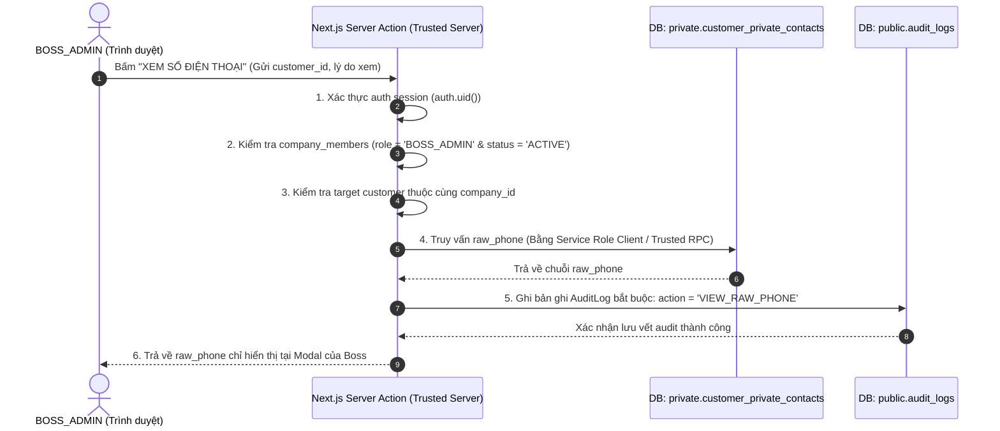
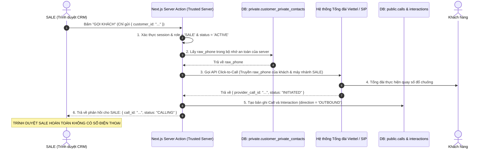

# Auth Design

> **Tài liệu Kiến trúc Xác thực (Authentication) & Ủy quyền Ứng dụng (Authorization)**
> **Dự án:** AI CRM đa kênh cho doanh nghiệp sản xuất cửa chống ngập theo đơn đặt hàng.
> **Trạng thái:** Thiết kế cơ sở nền tảng (Baseline Design) — Chuẩn bị cho pha RLS Design & Migrations.
> **Tham chiếu hợp đồng bất biến:** `docs/PROJECT_MASTER.md`, `docs/DATA_CONTRACT.md`, `docs/SUPABASE_SCHEMA_DESIGN.md`.

---

## 1. Scope and Principles

### 1.1. Phạm vi thiết kế
- **Vị trí trong lộ trình phát triển:**
  `DATA_CONTRACT → SUPABASE SCHEMA DESIGN → AUTH DESIGN → RLS DESIGN → MIGRATIONS`
- **Mục tiêu tài liệu:** Định nghĩa toàn bộ kiến trúc xác thực người dùng (Authentication) và ủy quyền ứng dụng (Application Authorization) đa tầng giữa Next.js App Router và Supabase Auth.
- **Giới hạn nghiêm ngặt:**
  - Đây là tài liệu thiết kế kiến trúc thuần túy (Design Document Only).
  - Không triển khai mã nguồn giao diện (login pages, UI forms).
  - Không viết mã lệnh runtime xác thực hoặc API endpoints.
  - Không triển khai các chính sách Row Level Security (RLS) hay hàm SQL trong bước này (đây là nhiệm vụ của pha RLS Design tiếp theo).
  - Không tạo các tệp migration SQL.
  - Không sửa đổi ba tài liệu hợp đồng đã đóng băng (`PROJECT_MASTER.md`, `DATA_CONTRACT.md`, `SUPABASE_SCHEMA_DESIGN.md`).

### 1.2. Các nguyên tắc cốt lõi (Core Principles)
1. **Phân định ranh giới nghiêm ngặt giữa Xác thực (AuthN) và Ủy quyền (AuthZ):**
   - Supabase Auth chịu trách nhiệm xác thực: *"Người dùng này là ai?"*.
   - Hồ sơ thành viên doanh nghiệp `company_members` chịu trách nhiệm ủy quyền: *"Người dùng này có quyền làm gì trong Doanh nghiệp cụ thể này?"*.
2. **Không tin cậy Client (Zero Client Trust):**
   - Trình duyệt và Client Components là môi trường không tin cậy tuyệt đối.
   - Các kiểm tra quyền ở giao diện người dùng (UI) chỉ mang giá trị cải thiện trải nghiệm (UX optimization), hoàn toàn không có giá trị bảo mật.
   - Mọi thao tác đọc/ghi dữ liệu đều bắt buộc phải được tái thẩm định quyền độc lập ở tầng Máy chủ tin cậy (Next.js Server Actions / Route Handlers) và tầng Cơ sở dữ liệu (RLS & Database Constraints).
3. **Bảo vệ tuyệt đối Số điện thoại Khách hàng (Zero Phone Exposure):**
   - Tài khoản `SALE` và `TECHNICIAN` tuyệt đối không nhận được chuỗi số điện thoại (`raw_phone` và `normalized_phone`) dưới bất kỳ hình thức nào.
   - Luồng gọi điện của SALE chỉ truyền `customer_id`; máy chủ tin cậy truy xuất số từ schema cách ly `private.customer_private_contacts` và chuyển tiếp trực tiếp sang tổng đài viễn thông qua API Server-to-Server.
4. **Bất biến lịch sử & Không cascade xóa tác nhân (Historical Preservation):**
   - Khi một nhân sự nghỉ việc (`status = 'INACTIVE'`), toàn bộ dấu vết lịch sử trong quá khứ (`interactions.actor_user_id`, `surveys.completed_by`, `appointments.assignee_id`, `audit_logs.user_id`) phải được bảo toàn vĩnh viễn. Không bao giờ xóa cứng bản ghi hoặc null hóa các khóa ngoại lịch sử.
5. **Thiết kế sẵn sàng cho Multi-Company (Multi-Tenant Ready):**
   - Mặc dù giai đoạn vận hành ban đầu chỉ có đúng 1 Company và 1 SALE duy nhất, mọi hàm kiểm tra quyền và truy vấn đều phải nhận tham số ngữ cảnh `company_id` tường minh, tuyệt đối không gắn cứng giả định "toàn hệ thống chỉ có một company duy nhất".

---

## 2. Authentication vs Authorization

Hệ thống phân tách rạch ròi hai khái niệm nhằm loại bỏ hoàn toàn các lỗ hổng bảo mật leo thang đặc quyền:

```text
┌──────────────────────────────────────────────────────────────────────────────────────┐
│                              NGƯỜI DÙNG TRUY CẬP HỆ THỐNG                            │
└──────────────────────────────────────────┬───────────────────────────────────────────┘
                                           │
                                           ▼
┌──────────────────────────────────────────────────────────────────────────────────────┐
│ 1. XÁC THỰC (AUTHENTICATION - AuthN)                                                 │
│ "Bạn là ai trong hệ thống?"                                                          │
│ ──────────────────────────────────────────────────────────────────────────────────── │
│ • Quản lý bởi: Supabase Auth (auth.users, Session Cookies, Access Tokens)            │
│ • Cơ chế: Email + Mật khẩu (Phase 1), chuẩn bị sẵn cho MFA / OTP                     │
│ • Kết quả: Định danh người dùng toàn cục (auth.uid() / user_profiles.id)             │
│ • NGUYÊN TẮC: Xác thực thành công KHÔNG CẤP BẤT KỲ quyền truy cập dữ liệu kinh doanh │
└──────────────────────────────────────────┬───────────────────────────────────────────┘
                                           │
                                           ▼
┌──────────────────────────────────────────────────────────────────────────────────────┐
│ 2. HỒ SƠ ỨNG DỤNG (APPLICATION IDENTITY)                                             │
│ "Hồ sơ cá nhân ứng dụng của bạn là gì?"                                              │
│ ──────────────────────────────────────────────────────────────────────────────────── │
│ • Quản lý bởi: public.user_profiles (id = auth.users.id, full_name, status)          │
│ • Vai trò: Cung cấp thông tin hiển thị và trạng thái kích hoạt tài khoản ứng dụng   │
└──────────────────────────────────────────┬───────────────────────────────────────────┘
                                           │
                                           ▼
┌──────────────────────────────────────────────────────────────────────────────────────┐
│ 3. ỦY QUYỀN DOANH NGHIỆP (AUTHORIZATION - AuthZ)                                     │
│ "Bạn có vai trò gì trong Doanh nghiệp này và được làm những gì?"                     │
│ ──────────────────────────────────────────────────────────────────────────────────── │
│ • Quản lý bởi: public.company_members (company_id, user_id, role, status = 'ACTIVE') │
│ • Ba vai trò bất biến: BOSS_ADMIN, SALE, TECHNICIAN                                  │
│ • Ma trận quyền logic: Triển khai theo hợp đồng AccessPolicy                         │
│ • Kết quả: Quyết định Cho phép (Allow) hoặc Từ chối (Deny) từng hành động cụ thể     │
└──────────────────────────────────────────────────────────────────────────────────────┘
```

### Các quy tắc cấm kỵ (Anti-Patterns Prohibited)
- **CẤM** lưu trữ vai trò doanh nghiệp (`role`), quyền hạn (`permissions`) hoặc danh sách `company_id` trong `raw_user_meta_data` hoặc `app_metadata` của Supabase Auth để làm căn cứ ủy quyền. (Metadata trong JWT có thể bị lỗi thời khi quyền bị thu hồi đột ngột giữa phiên làm việc).
- **CẤM** tin cậy giá trị role được gửi lên từ client payload hoặc cookies không được ký bảo mật.
- **CẤM** suy diễn quyền hạn từ thông tin hiển thị của `user_profiles`.

---

## 3. Identity Model

Mô hình định danh liên kết 3 tầng thực thể:

```text
auth.users (Supabase Auth Internal)
    └── 1:1 ── public.user_profiles (Application User Profile)
                   └── 1:N ── public.company_members (Tenant Membership & Role)
                                  └── N:1 ── public.companies (Tenant Root)
```

### 3.1. Chi tiết thực thể định danh

#### 1. `auth.users` (Cơ chế lõi Supabase Auth)
- Chứa thông tin đăng nhập: `id` (UUIDv4), `email`, `encrypted_password`, `email_confirmed_at`, `created_at`.
- Thuộc schema nội bộ `auth` do Supabase quản lý, hoàn toàn cách ly với mã nguồn ứng dụng client.

#### 2. `public.user_profiles` (Hồ sơ người dùng ứng dụng)
- Định danh: `id uuid PRIMARY KEY REFERENCES auth.users(id) ON DELETE RESTRICT`.
- Thuộc tính:
  - `full_name text NOT NULL`: Họ tên nhân sự hiển thị trên giao diện CRM.
  - `status text NOT NULL DEFAULT 'ACTIVE'`: Trạng thái tài khoản người dùng ứng dụng (`'ACTIVE'`, `'INACTIVE'`).
  - `created_at timestamptz NOT NULL DEFAULT now()`.
  - `updated_at timestamptz NOT NULL DEFAULT now()`.
- Ràng buộc: `ON DELETE RESTRICT` ngăn chặn tuyệt đối việc xóa tài khoản trong Auth khi hồ sơ đã phát sinh liên kết nghiệp vụ hoặc kiểm toán.
- *Ghi chú thiết kế:* Các ngữ nghĩa mở rộng như tạm dừng tài khoản (`SUSPENDED`) không nằm trong schema hiện tại; nếu cần thiết trong tương lai, phải được quyết định qua quy trình cập nhật schema chính thức.

#### 3. `public.company_members` (Thành viên & Vai trò Doanh nghiệp)
- Định danh: `id uuid PRIMARY KEY DEFAULT gen_random_uuid()`.
- Thuộc tính:
  - `company_id uuid NOT NULL REFERENCES companies(id) ON DELETE RESTRICT`.
  - `user_id uuid NOT NULL REFERENCES user_profiles(id) ON DELETE RESTRICT`.
  - `role text NOT NULL`: Vai trò nghiệp vụ, bắt buộc thuộc 3 giá trị đóng băng:
    - `'BOSS_ADMIN'`: Sếp / Quản trị viên tối cao.
    - `'SALE'`: Nhân viên kinh doanh tư vấn và chốt đơn.
    - `'TECHNICIAN'`: Kỹ thuật viên hiện trường đo đạc và lắp đặt.
  - `status text NOT NULL DEFAULT 'ACTIVE'`: Trạng thái thành viên trong doanh nghiệp (`'ACTIVE'`, `'INACTIVE'`). Token `'ACTIVE'` là giá trị đã khóa chính thức `[FROZEN]`.
  - `created_at timestamptz NOT NULL DEFAULT now()`.
- Ràng buộc quan trọng:
  - `uq_company_members_user`: `UNIQUE (company_id, user_id)` — Mỗi người dùng chỉ có đúng 1 bản ghi thành viên trong một Company.
  - `uq_company_members_single_active_sale`:
    ```sql
    CREATE UNIQUE INDEX uq_company_members_single_active_sale
    ON company_members (company_id)
    WHERE role = 'SALE' AND status = 'ACTIVE';
    ```
    Bảo đảm ở cấp vật lý cơ sở dữ liệu: Mỗi công ty chỉ có **tối đa một SALE hoạt động** tại một thời điểm.

### 3.2. Phân định rõ giữa `user_profiles.status` và `company_members.status`
- **`user_profiles.status` (Trạng thái Người dùng Toàn cục):**
  - Trạng thái `user_profiles.status = 'INACTIVE'` **không tự động ngăn cản việc xác thực danh tính của Supabase Auth** (Supabase Auth vẫn có thể cấp token xác thực người dùng).
  - Trách nhiệm từ chối truy cập thuộc về tầng ủy quyền ứng dụng (Application Authorization): Máy chủ Next.js và các hàm kiểm tra quyền bắt buộc đọc `user_profiles` và từ chối toàn bộ quyền truy cập vào mọi chức năng và dữ liệu nghiệp vụ của toàn bộ các Company khi `user_profiles.status != 'ACTIVE'` (trả về lỗi HTTP 403 Forbidden).
  - Nếu hệ thống sau này cần cấm đăng nhập hoàn toàn ở tầng Auth (hard ban/disable tài khoản hoặc thu hồi phiên tức thì), đó là hành động quản trị riêng biệt qua Supabase Auth Admin API (`auth.admin.updateUserById`) và không được nhầm lẫn với trạng thái `user_profiles.status`.
- **`company_members.status` (Trạng thái Thành viên theo Tenant):**
  - Khi `company_members.status = 'INACTIVE'`, người dùng vẫn có thể đăng nhập vào tài khoản cá nhân, nhưng bị từ chối truy cập 100% dữ liệu của Company đó. Nếu người dùng thuộc nhiều Company, họ vẫn có thể hoạt động tại Company khác nếu membership ở đó là `ACTIVE`.

---

## 4. User Provisioning

### 4.1. Quy trình tạo tài khoản tự động qua Database Trigger
Để loại bỏ tình trạng mồ côi tài khoản (auth user tồn tại nhưng không có hồ sơ CRM), hệ thống đặc tả trigger đồng bộ tự động ở cấp cơ sở dữ liệu:



### 4.2. Đặc tả kỹ thuật cho Trigger `on_auth_user_created`
1. **Sự kiện kích hoạt:** `AFTER INSERT ON auth.users FOR EACH ROW`.
2. **Hành vi xử lý:**
   - Trích xuất `full_name` từ metadata đăng ký: `COALESCE(NEW.raw_user_meta_data->>'full_name', 'Thành viên mới')`.
   - Ghi bản ghi vào `public.user_profiles` với:
     - `id = NEW.id`
     - `full_name = <trích xuất>`
     - `status = 'ACTIVE'`
3. **Xử lý lỗi và xung đột (Failure & Duplicate Behavior):**
   - Sử dụng mệnh đề `ON CONFLICT (id) DO UPDATE SET full_name = EXCLUDED.full_name, updated_at = now()` để bảo đảm tính lũy kế (idempotency) khi các sự kiện auth bị retry.
   - Thao tác nằm trong cùng một transaction của engine Supabase Auth. Nếu bước tạo hồ sơ thất bại nghiêm trọng, thao tác tạo user bị rollback hoàn toàn để không để lại tài khoản auth rác.

### 4.3. Quy trình mời và kích hoạt tài khoản thành viên (Invitation & Activation Lifecycle)
Hệ thống sử dụng triệt để hai trạng thái đã chuẩn hóa trong schema (`'ACTIVE'` và `'INACTIVE'`), không tự ý bổ sung trạng thái `PENDING` hay `SUSPENDED`:

```text
[1. Sếp gửi lời mời]
       │  Boss nhập Email, Họ tên, Role
       ▼
[2. Khởi tạo Auth & Profile]
       │  auth.admin.inviteUserByEmail() ──> Trigger tạo user_profiles (status = 'ACTIVE')
       ▼
[3. Tạo Membership trung gian: INACTIVE]
       │  INSERT INTO company_members (company_id, user_id, role, status = 'INACTIVE')
       │  *LƯU Ý CỐT TỬ: Bản ghi INACTIVE không chiếm vị trí trong Partial Unique Index của SALE*
       ▼
[4. Người dùng kích hoạt tài khoản]
       │  Bấm link email, thiết lập mật khẩu tại /(auth)/reset-password
       ▼
[5. Ràng buộc & Kích hoạt tại Máy chủ Tin cậy (Server Action)]
       │  1. Máy chủ gọi supabase.auth.getUser(), trích xuất verified_user_id
       │  2. Nạp bản ghi INACTIVE: WHERE user_id = verified_user_id (không tin cậy role/target từ client)
       │  3. Lấy role lưu trữ từ DB; nếu role = 'SALE', kiểm tra bất biến duy nhất 1 SALE active
       ├──> Vi phạm bất biến SALE ──────> Báo lỗi xung đột, giữ nguyên INACTIVE chờ xử lý
       ▼  Hợp lệ
       │  UPDATE company_members SET status = 'ACTIVE'
       │  WHERE id = candidate_member_id AND company_id = target_company_id AND user_id = verified_user_id AND status = 'INACTIVE'
       ▼
[6. Gia nhập thành công]
```

- **Quy tắc an ninh cốt tử về ràng buộc kích hoạt (Invitation Activation Binding):**
  - **Client TUYỆT ĐỐI KHÔNG có quyền quyết định thẩm quyền:** Các tham số do client gửi lên như `candidate_member_id`, `company_id`, `role` hoặc mục tiêu kích hoạt (`activation target`) hoàn toàn không được tin cậy. Bất kỳ `candidate_member_id` hay `company_id` nào nhận từ route params hoặc client payload chỉ thuần túy là định danh định vị tài nguyên ứng viên (untrusted candidate identifiers) và **bắt buộc phải được tái thẩm định quyền sở hữu đối chiếu trực tiếp với `verified_user_id`**.
  - **Quy trình thực thi bắt buộc tại Máy chủ Tin cậy (Trusted Server Action):**
    1. Máy chủ tin cậy gọi `supabase.auth.getUser()`, xác thực người dùng hiện tại và trích xuất `verified_user_id` từ người dùng đã được xác thực an toàn (tuyệt đối không lấy từ client input).
    2. Nạp bản ghi `company_members` đang mang trạng thái `status = 'INACTIVE'` do `BOSS_ADMIN` đã khởi tạo từ trước.
    3. Thẩm tra nghiêm ngặt: `membership.user_id = verified_user_id` và xác thực ngữ cảnh `company_id` hợp lệ. Nếu không khớp, từ chối ngay lập tức (HTTP 403 Forbidden / 404 Not Found).
    4. Sử dụng vai trò được lưu trữ sẵn trong cơ sở dữ liệu (`membership.role`), tuyệt đối không chấp nhận vai trò do client truyền lên.
    5. Nếu vai trò lưu trữ là `role = 'SALE'`: Tái kiểm tra bất biến "Duy nhất 1 SALE active" trong Company. Nếu tại thời điểm kích hoạt đã tồn tại một SALE khác mang `status = 'ACTIVE'`, hệ thống chặn kích hoạt, thông báo xung đột nghiệp vụ và giữ nguyên bản ghi ở trạng thái `INACTIVE` để Sếp xử lý.
    6. Chỉ khi toàn bộ các điều kiện trên thỏa mãn, máy chủ tin cậy mới thực thi thao tác cập nhật kích hoạt bằng cách sử dụng `verified_user_id` làm ràng buộc danh tính bắt buộc (identity binding).

- **Câu lệnh SQL định niệm kích hoạt có ràng buộc danh tính bắt buộc (Explicit Identity Binding):**
  ```sql
  -- TUYỆT ĐỐI CẤM cập nhật chỉ bằng `WHERE id = member_id` mà thiếu ràng buộc danh tính.
  -- Thao tác cập nhật kích hoạt bắt buộc phải gắn chặt với verified_user_id, company_id và trạng thái hiện tại:
  UPDATE company_members
  SET status = 'ACTIVE'
  WHERE id = candidate_member_id
    AND company_id = target_company_id
    AND user_id = verified_user_id
    AND status = 'INACTIVE';
  ```
  > [!NOTE]
  > **Lưu ý kiến trúc về ngữ cảnh thực thi cơ sở dữ liệu:**
  > - Tham số `verified_user_id` BẮT BUỘC phải trích xuất từ phiên đã xác thực phía máy chủ (`supabase.auth.getUser()`) và TUYỆT ĐỐI KHÔNG lấy từ input của client.
  > - Không giả định `auth.uid()` luôn tự động khả dụng trong các thao tác ghi cơ sở dữ liệu sử dụng Service Role Client có đặc quyền cao (privileged service-role writes không thể mặc định `auth.uid()` đại diện cho end user).
  > - Nếu trong tương lai có hàm SQL/RPC được thiết kế chủ đích chạy dưới ngữ cảnh JWT của end user, `auth.uid()` có thể được sử dụng trực tiếp tại đó; còn các thao tác ghi bằng service role phải luôn truyền tham số ràng buộc tường minh `user_id = verified_user_id`.

- **Quy trình chi tiết:**
  1. **Bước 1 (Sếp gửi lời mời):** `BOSS_ADMIN` nhập Email, Họ tên và Vai trò (`SALE` hoặc `TECHNICIAN`) trên giao diện Quản trị.
  2. **Bước 2 (Khởi tạo Auth & Hồ sơ):** Hệ thống gọi Supabase Auth Admin API (`auth.admin.inviteUserByEmail`). Trigger `on_auth_user_created` tự động tạo bản ghi `public.user_profiles` tương ứng.
  3. **Bước 3 (Ghi nhận Membership trạng thái `INACTIVE`):** Hệ thống tạo bản ghi `public.company_members` với `status = 'INACTIVE'`. Ở trạng thái này, người dùng hoàn toàn chưa có quyền truy cập dữ liệu công ty. Nếu vai trò là `SALE`, trạng thái `INACTIVE` không chiếm slot của chỉ mục `uq_company_members_single_active_sale`.
  4. **Bước 4 (Kích hoạt mật khẩu):** Người dùng nhận email từ Supabase Auth, bấm liên kết xác nhận, chuyển hướng đến trang thiết lập mật khẩu lần đầu (`/(auth)/reset-password`).
  5. **Bước 5 (Tái kiểm tra bất biến & Kích hoạt theo ràng buộc bảo mật):** Sau khi đổi mật khẩu thành công, Next.js Server Action thực hiện tuần tự các bước thẩm tra danh tính theo quy tắc *Invitation Activation Binding* ở trên sử dụng `verified_user_id`. Nếu hợp lệ, kích hoạt `company_members.status = 'ACTIVE'`.
  6. **Bước 6 (Xử lý lời mời thất bại hoặc bị bỏ rơi):** Nếu người dùng không kích hoạt hoặc link email hết hạn, bản ghi `company_members` vẫn được giữ nguyên ở trạng thái `INACTIVE` (không chiếm slot của chỉ mục SALE duy nhất). Cho phép thực hiện quy trình gửi lại lời mời (invitation resend/recovery) theo luồng đã được phê duyệt; bản ghi membership được bảo toàn vĩnh viễn và không bị xóa cứng vật lý trừ khi có một quyết định schema trong tương lai xác định rõ lộ trình dọn dẹp an toàn. Tuyệt đối không tự ý bổ sung trạng thái mới.

---

## 5. Session Model

### 5.1. Cơ chế quản lý phiên với Next.js 16 App Router
Hệ thống sử dụng cơ chế lưu trữ phiên làm việc dựa trên Cookies theo mô hình tiêu chuẩn của thư viện `@supabase/ssr`:

- **Mô hình Cookie của Supabase SSR:**
  - Phiên làm việc được lưu trữ qua các cookie phiên chuẩn do `@supabase/ssr` quản lý (lưu Access Token JWT và Refresh Token).
  - Tuân thủ cấu hình tiêu chuẩn của Supabase SSR:
    - Cờ `Secure = true` trong môi trường Production (truyền qua HTTPS); môi trường Local Development chấp nhận `Secure = false` khi chạy `localhost`.
    - Cấu hình `SameSite = Lax` và `Path = /` để bảo đảm các liên kết điều hướng từ email kích hoạt/đặt lại mật khẩu hoạt động trơn tru mà vẫn phòng chống CSRF.
    - Không bắt buộc cờ `HttpOnly = true` trên toàn bộ các cookie vì mô hình hybrid của Supabase SSR cho phép client SDK đồng bộ trạng thái phiên hợp lệ, nhưng **tuyệt đối không tự ý lưu token vào `localStorage`**.
  - **Nguyên tắc an ninh:** Dữ liệu phiên tại trình duyệt (browser session) hoàn toàn không được tin cậy cho ủy quyền nghiệp vụ; RLS và kiểm tra quyền tại máy chủ/cơ sở dữ liệu là bắt buộc tuyệt đối.
  - **Chiến lược phòng chống rò rỉ token do XSS:** Không dựa dẫm vào giả định sai lầm rằng cookie loại trừ được XSS. Hệ thống giảm thiểu rủi ro XSS đa tầng:
    - Áp dụng Content Security Policy (CSP) chặt chẽ và cơ chế render an toàn của React/Next.js (không dùng `dangerouslySetInnerHTML` với dữ liệu ngoài).
    - Access Token JWT có thời gian sống ngắn.
    - Cơ chế xoay vòng Refresh Token (Refresh Token Rotation).
    - Nguyên tắc quyền tối thiểu (Least Privilege) và RLS bảo vệ dữ liệu cấp dòng.

- **Vòng đời và Thời gian sống của Token (Session & Token Lifetimes):**
  - **Access Token (JWT):** Vòng đời ngắn (mặc định trong Supabase Auth là 3600 giây = 1 giờ, có thể cấu hình). Chứa định danh danh tính `sub: <auth.uid>`.
  - **Refresh Token:** Tham gia vào cơ chế xoay vòng tự động (Refresh Token Rotation) tại máy chủ Supabase Auth. Khi một Refresh Token được sử dụng để lấy Access Token mới, token cũ bị hủy ngay lập tức nhằm ngăn ngừa tấn công phát lại (Replay Attacks).
  - Vòng đời phiên làm việc tổng thể, thời gian chờ do không hoạt động (inactivity timeout) và thời hạn tối đa được quản lý qua chính sách cấu hình phiên của Supabase (chi tiết tại Auth Open Decision 04).

### 5.2. Vòng đời phiên làm việc (Session Lifecycle Flows)

#### 1. Đăng nhập (Sign In)
- Người dùng gửi Email và Mật khẩu qua Server Action `loginWithPassword`.
- Máy chủ Next.js gọi `supabase.auth.signInWithPassword`.
- Supabase xác thực thông tin, trả về Access Token & Refresh Token.
- Next.js Server Client thiết lập cookies phiên trên response headers và chuyển hướng người dùng vào Dashboard tương ứng với vai trò.

#### 2. Làm mới phiên tự động qua Next.js 16 Proxy
- Được thực thi tự động trong **Next.js 16 Proxy (`proxy.ts`)**:
  - Proxy chạy trên **Node.js runtime** và đóng vai trò chốt chặn thô (coarse request gating).
  - Proxy kiểm tra cookie phiên trong mỗi HTTP Request đến các route được bảo vệ.
  - Proxy gọi `supabase.auth.getUser()`. Nếu Access Token hết hạn nhưng Refresh Token còn hiệu lực, Supabase client tự động làm mới Access Token và cập nhật lại cookie trên response.

#### 3. Đăng xuất (Sign Out)
- Người dùng nhấn "Đăng xuất" trên giao diện.
- Gọi Server Action `logoutAction`.
- Máy chủ gọi `supabase.auth.signOut()`, đồng thời xóa sạch cookie phiên auth trên trình duyệt client và điều hướng về trang `/(auth)/login`.

#### 4. Đặt lại mật khẩu (Password Reset)
- Người dùng yêu cầu quên mật khẩu tại `/(auth)/forgot-password`.
- Hệ thống gửi email chứa Magic Link / OTP xác nhận theo cấu hình của Supabase Auth.
- Người dùng bấm link, chuyển hướng về `/(auth)/reset-password` mang mã phiên tạm thời để đổi mật khẩu mới qua `supabase.auth.updateUser({ password: newPassword })`.

#### 5. Vô hiệu hóa phiên khi có biến động quyền (Session Invalidation on AuthZ Changes)
- **Vấn đề cốt tử:** Một Access Token JWT có thể vẫn còn hạn sử dụng (ví dụ trong 1 giờ tới), nhưng quyền của người dùng trong `company_members` có thể bị Sếp hạ cấp hoặc khóa ngay lập tức.
- **Giải pháp thiết kế:**
  - Phiên JWT của Supabase **CHỈ ĐẠI DIỆN CHO DANH TÍNH XÁC THỰC (Identity Authentication)**, hoàn toàn không đại diện cho quyền doanh nghiệp.
  - Trên mỗi thao tác Server Action, Route Handler hoặc truy vấn Server Component nhạy cảm, máy chủ Next.js **BẮT BUỘC TRUY VẤN TRỰC TIẾP** bảng `company_members` để xác thực trạng thái `status = 'ACTIVE'` và `role` hiện tại trong cơ sở dữ liệu.
  - Ngay giây phút Sếp chuyển `company_members.status = 'INACTIVE'`, yêu cầu tiếp theo của nhân viên đó lập tức bị chặn (trả về lỗi HTTP 403 Forbidden) dù phiên JWT vẫn còn hạn sử dụng.

---

## 6. Company Membership Resolution

### 6.1. Quy trình phân giải quyền truy cập (Resolution Pipeline)
Mỗi yêu cầu nghiệp vụ gửi tới hệ thống đều phải trải qua luồng thẩm định quyền tuần tự nghiêm ngặt:

```text
[HTTP Request từ Client]
       │
       ▼
[Bước 1: Xác thực Phiên]
       │  Gọi: supabase.auth.getUser()
       ├──> Không có phiên / Token lỗi ──> Trả về HTTP 401 Unauthorized / Chuyển hướng về /login
       │
       ▼  Xác thực thành công (Lấy được auth.uid())
[Bước 2: Kiểm tra Hồ sơ Ứng dụng]
       │  Truy vấn: user_profiles WHERE id = auth.uid()
       ├──> status <> 'ACTIVE' ──────────> Trả về HTTP 403 Forbidden (Tài khoản người dùng bị khóa)
       │
       ▼  Hồ sơ ứng dụng hợp lệ
[Bước 3: Xác định Ngữ cảnh Doanh nghiệp (Tenant Context)]
       │  Lấy target_company_id từ Route Params / Payload / Session Context
       │
       ▼
[Bước 4: Kiểm tra Thẩm quyền Thành viên trong Doanh nghiệp]
       │  Truy vấn: company_members
       │           WHERE user_id = auth.uid()
       │             AND company_id = target_company_id
       │             AND status = 'ACTIVE'
       │
       ├──> Không tìm thấy bản ghi ──────> Trả về HTTP 403 Forbidden (Không phải thành viên hợp lệ)
       │
       ▼  Thành viên hợp lệ (Lấy được role: BOSS_ADMIN, SALE, hoặc TECHNICIAN)
[Bước 5: Thẩm định Quyền thao tác theo Ma trận AccessPolicy]
       │  Kiểm tra role có được phép thực thi action này hay không?
       │
       ├──> Sai vai trò yêu cầu ─────────> Trả về HTTP 403 Forbidden (Không đủ đặc quyền vai trò)
       │
       ▼  Quyền hợp lệ
[Bước 6: Thực thi Nghiệp vụ & Ghi Audit Log nếu nhạy cảm]
```

### 6.2. Sẵn sàng cho Multi-Company (Multi-Tenant Safety)
- Trong giai đoạn hiện tại, toàn hệ thống có đúng 1 Company. Tuy nhiên, kiến trúc hàm phân giải thẩm quyền tuyệt đối không sử dụng hardcoded company ID hay giả định global singleton.
- Mọi hàm phân giải quyền (Authorization Helpers) bắt buộc phải nhận tham số `target_company_id`.
- Khi hệ thống mở rộng sang mô hình nhiều doanh nghiệp:
  - Người dùng có danh sách các Company mà mình là thành viên `ACTIVE`.
  - Trên giao diện CRM có bộ chuyển đổi tổ chức (Tenant Switcher).
  - Ngữ cảnh `company_id` được truyền tường minh qua cấu trúc URL route (ví dụ `/(dashboard)/[companyId]/...`) hoặc header `x-company-id`.

---

## 7. Role Model

Hệ thống triển khai chính xác ma trận quyền hạn tối thiểu (Least Privilege Matrix) theo hợp đồng bất biến tại `PROJECT_MASTER.md` (Mục 14 & 15) và `DATA_CONTRACT.md` (Mục 28 `AccessPolicy`):

### 7.1. Bảng Ma trận Phân quyền Vai trò Chi tiết

| Chức năng / Thẩm quyền | SẾP / QUẢN TRỊ (`BOSS_ADMIN`) | KINH DOANH (`SALE`) | KỸ THUẬT VIÊN (`TECHNICIAN`) | Cơ chế thực thi bảo mật |
| :--- | :---: | :---: | :---: | :--- |
| **Xem số điện thoại thật (`raw_phone`)** | **CÓ** (Phải qua API riêng có ghi vết bắt buộc vào `audit_logs`) | **TUYỆT ĐỐI CẤM** | **TUYỆT ĐỐI CẤM** | Bảng nằm ở schema `private`; SALE/TECH không có quyền và không có view nào trả về phone. |
| **Xem số điện thoại chuẩn hóa (`normalized_phone`)** | **CÓ** | **TUYỆT ĐỐI CẤM** | **TUYỆT ĐỐI CẤM** | Phân loại dữ liệu nhạy cảm PII; cấm trả về client của SALE/TECH. |
| **Bấm gọi khách hàng (Click-to-Call)** | **CÓ** (Tùy cấu hình) | **CÓ** (Chỉ truyền `customer_id`, máy chủ tự quay số qua tổng đài) | **TUYỆT ĐỐI CẤM** (Chưa duyệt quy trình gọi) | Server Action kiểm tra quyền, server lấy phone từ `private` schema chuyển SIP PBX. |
| **Xuất danh bạ / Export Contacts** | **CÓ** (Theo cấu hình quản trị có kiểm soát) | **TUYỆT ĐỐI CẤM** | **TUYỆT ĐỐI CẤM** | Server Action từ chối mọi yêu cầu export từ non-BOSS. |
| **Xem dữ liệu khách hàng CRM cơ bản** | **CÓ** | **CÓ** (Tên, mã `customer_code`, lịch sử tương tác, báo giá) | **CHỈ XEM CÔNG VIỆC GIAO** (Địa chỉ khảo sát, lịch hẹn) | RLS và Server Component layout filter. |
| **Hộp thư tích hợp (Facebook/Zalo chat)** | **CÓ** | **CÓ** (Chat trực tiếp, phân công hội thoại) | **KHÔNG** | Phân quyền route và RLS bảng `conversations`. |
| **Xem bảng giá & Quản lý chính sách giá (`pricing_policies`)** | **CÓ** (Toàn quyền đọc trực tiếp, ban hành, chỉnh sửa bản nháp, kích hoạt) | **TUYỆT ĐỐI CẤM ĐỌC TRỰC TIẾP** (Chỉ nhận kết quả thương mại đã tính: PriceCalculation / Báo giá / Đơn hàng) | **TUYỆT ĐỐI CẤM** | RLS bảng `pricing_policies` chỉ cho phép `BOSS_ADMIN`. |
| **Chốt đơn hàng & Tạo báo giá** | **CÓ** | **CÓ** (Tính giá từ thông số, tạo đơn hàng) | **KHÔNG** | Logic nghiệp vụ Server Action. |
| **Xem giao dịch ngân hàng tổng (`payment_transactions`)** | **CÓ** | **TUYỆT ĐỐI CẤM** | **TUYỆT ĐỐI CẤM** | RLS chặn hoàn toàn quyền đọc đối với role `SALE` và `TECHNICIAN`. |
| **Xem tài chính tổng doanh nghiệp (`finance_summaries`)** | **CÓ** | **TUYỆT ĐỐI CẤM** | **TUYỆT ĐỐI CẤM** | RLS chỉ cho phép `BOSS_ADMIN` đọc. |
| **Xem thông tin tiền trên Đơn hàng (`orders`)** | **CÓ** | **CÓ** (Chỉ xem `final_amount`, `deposit_status`, công nợ cần thu của đơn) | **KHÔNG** | Column selection an toàn tại Server Action / View. |
| **Xác nhận đặt cọc thủ công** | **CÓ** (Kiểm tra khi đối soát tự động không khớp) | **TUYỆT ĐỐI CẤM** (Hệ thống tự động khớp hoặc Sếp duyệt) | **TUYỆT ĐỐI CẤM** | Server Action kiểm tra role `BOSS_ADMIN`. |
| **Tải lên hợp đồng đã ký (`signed_file_ref`)** | **CÓ** | **CÓ** (Sau khi khách ký, tải lên để kích hoạt xưởng) | **KHÔNG** | Server Action kiểm tra vai trò và quyền cập nhật hợp đồng. |
| **Nhập kết quả khảo sát đo đạc** | **CÓ** | **KHÔNG** | **CÓ** (Chỉ nhập cho lịch hẹn được phân công hợp lệ `assignee_id`) | Thẩm định quyền phân công hiện tại từ `appointments.assignee_id` (không dùng `completed_by` làm căn cứ ủy quyền hiện tại). |
| **Quản trị thành viên & Phân vai trò** | **CÓ** | **TUYỆT ĐỐI CẤM** | **TUYỆT ĐỐI CẤM** | Server Action quản trị, chặn nhân viên tự đổi quyền. |

### 7.2. Ràng buộc bất biến: Duy nhất 1 SALE active trong mỗi Company
- **Yêu cầu:** Mỗi doanh nghiệp chỉ được có tối đa một `CompanyMember` có `role = 'SALE'` và `status = 'ACTIVE'`.
- **Thực thi:**
  - Tầng Cơ sở dữ liệu: Bảo vệ bằng chỉ mục duy nhất bộ phận `uq_company_members_single_active_sale`.
  - Tầng Ứng dụng: Khi Sếp mời nhân viên SALE mới hoặc đổi role của một nhân sự thành SALE:
    1. Ứng dụng kiểm tra trong Company đã có SALE nào đang mang `status = 'ACTIVE'` hay chưa.
    2. Nếu đã có: Chặn thao tác, thông báo lỗi nghiệp vụ rõ ràng: *"Doanh nghiệp hiện đã có một nhân viên Kinh doanh (SALE) đang hoạt động. Vui lòng chuyển trạng thái SALE hiện tại sang INACTIVE trước khi bổ nhiệm hoặc kích hoạt SALE mới."*
    3. Nếu có race condition cố tình bypass ứng dụng: Cơ sở dữ liệu sẽ ném lỗi vi phạm Unique Constraint `uq_company_members_single_active_sale`, bảo đảm tính toàn vẹn 100%.

---

## 8. Next.js Trust Boundaries

Để bảo vệ ứng dụng Next.js App Router, hệ thống thiết lập 4 ranh giới tin cậy độc lập (Defense-in-Depth):

```mermaid
graph TB
    subgraph ClientZone [VÙNG KHÔNG TIN CẬY: Trình duyệt Client]
        BrowserUI[Giao diện Trình duyệt Client]
        ClientComp[Client Components]
        AnonKey[NEXT_PUBLIC_SUPABASE_ANON_KEY]
    end

    subgraph ServerZone [VÙNG MÁY CHỦ TIN CẬY: Next.js Server App Router]
        Proxy[Next.js 16 Proxy: Gating thô (Node.js runtime)]
        ServerComp[Server Components: SSR an toàn]
        ServerAction[Server Actions: Đột biến nghiệp vụ]
        RouteHandler[Route Handlers: API Webhooks]
        AuthZHelpers[Authorization Helpers: Kiểm tra quyền]
        ServiceRoleClient[Supabase Service Role Client: Thao tác bảo mật]
    end

    subgraph SupabaseZone [VÙNG CƠ SỞ DỮ LIỆU: Supabase / PostgreSQL]
        PublicSchema[public Schema: Có RLS bảo vệ]
        PrivateSchema[private Schema: KHÔNG expose PostgREST]
        AuthSchema[auth Schema: Quản lý mật khẩu & Token]
    end

    BrowserUI -->|1. Gửi Request kèm Session Cookies| Proxy
    Proxy -->|2. Chuyển tiếp Request đã refresh| ServerZone
    ClientComp -.->|CẤM TRUY CẬP TRỰC TIẾP| PrivateSchema
    ServerComp -->|3. Thẩm định quyền qua helper| AuthZHelpers
    ServerAction -->|4. Thẩm định quyền qua helper| AuthZHelpers
    AuthZHelpers -->|5. Kiểm tra DB| PublicSchema
    ServerAction -->|6. Thao tác nhạy cảm: Phone / PBX| ServiceRoleClient
    ServiceRoleClient -->|7. Truy cập bảng nhạy cảm| PrivateSchema
    ServiceRoleClient -->|8. Ghi log kiểm toán| PublicSchema
```

### 8.1. Quy tắc quản lý biến môi trường và Khóa bí mật
1. **`NEXT_PUBLIC_SUPABASE_URL` & `NEXT_PUBLIC_SUPABASE_ANON_KEY`:**
   - Được phép công khai trên trình duyệt client.
   - Khi client sử dụng anon key truy vấn Supabase qua PostgREST, PostgREST tự động áp dụng RLS của schema `public`.
   - Vì bảng `customer_private_contacts` nằm trong schema `private`, PostgREST hoàn toàn không nhìn thấy và không thể truy vấn bảng này bằng anon key hay bất kỳ JWT nào từ trình duyệt.
2. **`SUPABASE_SERVICE_ROLE_KEY`:**
   - **TUYỆT ĐỐI KHÔNG CÓ TIỀN TỐ `NEXT_PUBLIC_`.**
   - Chỉ tồn tại trong môi trường runtime của máy chủ Node.js (Next.js Server Components, Server Actions, Route Handlers).
   - Tuyệt đối không import file cấu hình chứa Service Role Key vào bất kỳ tệp nào có chỉ thị `'use client'`.
   - Tuyệt đối không log Service Role Key ra console hoặc commit vào git repository.

### 8.2. Trách nhiệm của các thành phần Next.js
- **Client Components (`'use client'`):**
  - Chỉ phục vụ hiển thị trạng thái giao diện và tương tác người dùng.
  - Các cờ boolean kiểu `if (user.role === 'SALE')` trên client chỉ nhằm mục đích ẩn/hiện nút bấm hoặc menu (UI hints), hoàn toàn không được coi là chốt chặn bảo mật.
- **Next.js 16 Proxy (`proxy.ts`):**
  - Đóng vai trò **chốt chặn thô (Coarse Gating)**, chạy trên **Node.js runtime**:
    - Làm mới phiên làm việc (Session Refresh qua `supabase.auth.getUser()`) để duy trì và đồng bộ cookie hợp lệ.
    - Chặn người dùng chưa đăng nhập truy cập vào các route nhóm `/(dashboard)/*` và chuyển hướng về `/login`.
    - Chặn người dùng đã đăng nhập truy cập vào các trang `/(auth)/login` và chuyển hướng vào Dashboard.
  - **CẢNH BÁO KIẾN TRÚC:** Proxy KHÔNG chịu trách nhiệm kiểm tra quyền chi tiết cấp tài nguyên (Fine-grained Authorization). Không sử dụng Proxy cho phân quyền sâu. Quyền truy cập chi tiết phải được thẩm định tại Server Components, Server Actions và chính sách RLS tại cơ sở dữ liệu.
- **Server Components (RSC):**
  - Mặc định chạy 100% trên máy chủ.
  - Thực thi kiểm tra thẩm quyền vai trò trước khi fetch dữ liệu.
  - Lọc bỏ hoàn toàn các trường dữ liệu nhạy cảm trước khi render HTML gửi về client.
- **Server Actions:**
  - Nơi tiếp nhận các đột biến dữ liệu nghiệp vụ (Mutations: tạo đơn, tính giá, gửi tin, gọi khách).
  - Luôn luôn gọi hàm `require_company_role()` ở dòng đầu tiên của action trước khi chạm vào cơ sở dữ liệu.
- **Route Handlers (`app/api/*`):**
  - Tiếp nhận các sự kiện Webhook từ bên ngoài (Zalo OA, Facebook Messenger, Ngân hàng VietQR/SeAPay).
  - Không dựa vào session cookie người dùng mà xác thực qua Webhook Signature (HMAC secret token của nhà cung cấp).

---

## 9. Route Protection Strategy

Cấu trúc phân vùng Route Groups trong Next.js App Router:

```text
app/
├── (auth)/                          --> VÙNG CÔNG KHAI (Public / Guest Only)
│   ├── login/                       --> Đăng nhập email/mật khẩu
│   ├── forgot-password/             --> Yêu cầu khôi phục mật khẩu
│   └── reset-password/              --> Đặt lại mật khẩu qua liên kết email
│
└── (dashboard)/                     --> VÙNG YÊU CẦU ĐĂNG NHẬP (Authenticated Shared)
    ├── layout.tsx                   --> Layout chung: Kiểm tra Auth & Active Membership
    ├── account/                     --> Cài đặt tài khoản cá nhân (Đổi tên hiển thị, mật khẩu)
    │
    ├── admin/                       --> VÙNG SẾP / QUẢN TRỊ (BOSS_ADMIN ONLY)
    │   ├── members/                 --> Quản lý nhân sự, mời thành viên, phân vai trò
    │   ├── finance/                 --> Báo cáo tài chính tổng, dòng tiền, công nợ
    │   ├── pricing/                 --> Quản lý bảng giá, kích hoạt phiên bản bảng giá
    │   ├── audit/                   --> Nhật ký kiểm toán hệ thống
    │   └── settings/                --> Cấu hình kết nối Hotline, OA, Ngân hàng
    │
    ├── crm/                         --> VÙNG KINH DOANH (SALE & BOSS_ADMIN)
    │   ├── inbox/                   --> Hộp thư tích hợp (Facebook Messenger & Zalo OA)
    │   ├── customers/               --> Danh sách khách hàng (Không hiển thị số điện thoại)
    │   ├── customers/[id]/          --> Chi tiết khách hàng 360, báo giá, gọi khách
    │   ├── orders/                  --> Quản lý đơn hàng, hợp đồng, tiến độ
    │   └── care/                    --> Chiến dịch chăm sóc khách hàng tự động
    │
    └── field/                       --> VÙNG KỸ THUẬT HIỆN TRƯỜNG (TECHNICIAN & BOSS_ADMIN)
        ├── appointments/            --> Lịch hẹn khảo sát / lắp đặt được giao
        ├── surveys/[id]/            --> Màn hình nhập số đo, hiện trường, ảnh chụp
        └── installations/[id]/      --> Nghiệm thu lắp đặt, tải ảnh hoàn thiện
```

### 9.1. Ma trận bảo vệ Route

| Phân nhóm Route | Yêu cầu Xác thực (AuthN) | Yêu cầu Vai trò (AuthZ) | Hành vi khi vi phạm |
| :--- | :--- | :--- | :--- |
| `/(auth)/*` | Chưa đăng nhập (Guest) | Bất kỳ | Nếu đã đăng nhập: Tự động chuyển hướng vào `/(dashboard)` |
| `/(dashboard)/account/*` | Đã đăng nhập (`auth.uid()`) | `status = 'ACTIVE'` | Nếu chưa đăng nhập: Chuyển hướng về `/login` |
| `/(dashboard)/admin/*` | Đã đăng nhập | Bắt buộc `BOSS_ADMIN` | Chuyển hướng về `/(dashboard)/crm` hoặc trả về HTTP 403 Forbidden |
| `/(dashboard)/crm/*` | Đã đăng nhập | `BOSS_ADMIN` hoặc `SALE` | Kỹ thuật viên truy cập: Chuyển hướng về `/(dashboard)/field` |
| `/(dashboard)/field/*` | Đã đăng nhập | `BOSS_ADMIN` hoặc `TECHNICIAN` | Nhân viên Sale truy cập: Chuyển hướng về `/(dashboard)/crm` |

---

## 10. Server-Only Operations

Để loại bỏ hoàn toàn nguy cơ rò rỉ dữ liệu nhạy cảm hoặc tấn công leo thang đặc quyền qua Supabase Client SDK, các thao tác sau đây **BẮT BUỘC PHẢI LÀ THAO TÁC MÁY CHỦ (Server-Only: Server Actions hoặc Route Handlers)**, tuyệt đối cấm client gọi trực tiếp:

1. **Truy xuất số điện thoại thật của Sếp (`viewBossRawPhoneAction`):**
   - Chỉ máy chủ mới có quyền truy cập schema `private.customer_private_contacts`.
   - Bắt buộc thẩm định quyền `BOSS_ADMIN` và ghi bản ghi `audit_logs` trước khi trả dữ liệu.
2. **Kích hoạt cuộc gọi ra cho SALE (`initiateOutboundCallAction`):**
   - Client chỉ gửi `customer_id`. Máy chủ tin cậy lấy số và bắn lệnh quay số sang tổng đài viễn thông.
3. **Đối soát giao dịch ngân hàng & Khớp cọc (`reconcilePaymentAction`):**
   - Không cho phép bất kỳ client nào được quyền tự cập nhật trạng thái `deposit_status` sang `CONFIRMED`.
4. **Mời nhân sự & Điều chỉnh quyền thành viên (`inviteMemberAction`, `updateMemberRoleAction`):**
   - Kiểm tra bất biến tối đa 1 SALE active và gọi Supabase Admin API.
5. **Ban hành & Kích hoạt phiên bản Bảng giá (`activatePricingPolicyAction`):**
   - Đóng băng chính sách giá, ngăn ngừa việc AI hoặc nhân sự sửa đổi giá cũ.
6. **Sinh file Hợp đồng & Xác thực Hợp đồng đã ký (`generateContractAction`, `verifySignedContractAction`):**
   - Kiểm tra tính toàn vẹn của tệp tải lên trong private bucket, chuyển đổi trạng thái `is_current` theo transaction nguyên tử.
7. **Tiếp nhận Webhook từ Zalo, Facebook, Ngân hàng, Tổng đài:**
   - Xử lý tại `app/api/webhooks/*`, xác thực chữ ký số của nhà cung cấp.

---

## 11. Sensitive Phone Access

### 11.1. Luồng Sếp xem số điện thoại thật (Audited Boss Raw Phone View)
Hệ thống cho phép `BOSS_ADMIN` xem số điện thoại thật của khách hàng khi cần xử lý sự vụ đặc biệt, nhưng luồng này phải tuyệt đối minh bạch và lưu vết kiểm toán:



### 11.2. Luồng SALE gọi khách không lộ số (Zero-Phone Outbound Calling)
Nhân viên SALE được quyền liên hệ khách hàng để tư vấn và chốt đơn, nhưng trình duyệt của SALE hoàn toàn vô can với số điện thoại thật:



---

## 12. Membership and Role Lifecycle

### 12.1. Quản lý trạng thái khi nhân sự thay đổi
1. **Khi SALE nghỉ việc hoặc chuyển trạng thái `INACTIVE`:**
   - Cập nhật `company_members.status = 'INACTIVE'`.
   - Ngay lập tức, tài khoản này không thể truy cập bất kỳ dữ liệu nào của Company.
   - Vị trí SALE của Company trở nên trống (`0 active SALE`). Sếp có thể bổ nhiệm nhân viên khác làm SALE.
   - Toàn bộ lịch sử chăm sóc, tin nhắn, báo giá và đơn hàng mà SALE này đã xử lý trong quá khứ (`interactions.actor_user_id`, `orders.created_at`) **được bảo tồn nguyên vẹn 100%**.
2. **Khi TECHNICIAN nghỉ việc hoặc chuyển trạng thái `INACTIVE`:**
   - Cập nhật `company_members.status = 'INACTIVE'`.
   - Kỹ thuật viên không thể đăng nhập xem lịch hẹn hoặc gửi kết quả khảo sát mới.
   - Các bản ghi khảo sát trong quá khứ (`surveys.completed_by`) và lịch hẹn (`appointments.assignee_id`) giữ nguyên danh tính lịch sử.
3. **Khi thay đổi vai trò (Role Change):**
   - Chỉ `BOSS_ADMIN` mới có quyền thay đổi role của thành viên khác.
   - Nếu đổi một TECHNICIAN thành SALE: Bắt buộc hệ thống phải kiểm tra bất biến "tối đa 1 SALE active". Nếu đang có SALE khác active, giao dịch đổi role bị hủy.
   - Mọi thao tác đổi vai trò bắt buộc sinh một bản ghi `audit_logs` ghi nhận: người thực hiện, người bị đổi, role cũ, role mới.

---

## 13. Authorization Helper Contracts

Các hàm trợ giúp kiểm tra quyền phía máy chủ (Server Authorization Helpers) được định nghĩa dưới dạng các hợp đồng interface chuẩn, chạy trong runtime Node.js của Next.js Server:

```typescript
// Định nghĩa ngữ cảnh người dùng đã xác thực
export interface AuthenticatedUserContext {
  userId: string;          // auth.uid() / user_profiles.id
  email: string;
  fullName: string;
}

// Định nghĩa ngữ cảnh thành viên doanh nghiệp hợp lệ
export interface ActiveMemberContext extends AuthenticatedUserContext {
  companyId: string;       // Tenant ID được xác thực
  memberId: string;        // company_members.id
  role: 'BOSS_ADMIN' | 'SALE' | 'TECHNICIAN';
  status: 'ACTIVE';
}

/**
 * 1. Yêu cầu người dùng phải đăng nhập hợp lệ
 * Ném lỗi 401 Unauthorized nếu phiên không tồn tại hoặc hết hạn.
 */
export type RequireAuthenticatedUser = () => Promise<AuthenticatedUserContext>;

/**
 * 2. Yêu cầu người dùng phải là thành viên ACTIVE của Company mục tiêu
 * Ném lỗi 403 Forbidden nếu người dùng không thuộc Company hoặc bị vô hiệu hóa.
 */
export type RequireActiveMember = (
  companyId: string
) => Promise<ActiveMemberContext>;

/**
 * 3. Yêu cầu người dùng phải có vai trò nằm trong danh sách được phép
 * Ném lỗi 403 Forbidden nếu vai trò không khớp.
 */
export type RequireCompanyRole = (
  companyId: string,
  allowedRoles: Array<'BOSS_ADMIN' | 'SALE' | 'TECHNICIAN'>
) => Promise<ActiveMemberContext>;

/**
 * 4. Helper chuyên biệt cho Sếp / Quản trị viên tối cao
 */
export type RequireBossAdmin = (
  companyId: string
) => Promise<ActiveMemberContext>;

/**
 * 5. Helper chuyên biệt cho Nhân viên Kinh doanh (SALE)
 */
export type RequireSale = (
  companyId: string
) => Promise<ActiveMemberContext>;

/**
 * 6. Helper chuyên biệt cho Kỹ thuật viên (TECHNICIAN)
 */
export type RequireTechnician = (
  companyId: string
) => Promise<ActiveMemberContext>;
```

---

## 14. Audit Requirements

### 14.1. Các sự kiện an ninh bắt buộc ghi vết vào `public.audit_logs`
Mọi hành động thuộc danh mục dưới đây bắt buộc phải được ghi nhật ký kiểm toán không thể xóa (`Strict Append-Only`):

1. **`VIEW_RAW_PHONE`:** `BOSS_ADMIN` xem số điện thoại thật của khách hàng.
2. **`INITIATE_CALL`:** SALE thực hiện cuộc gọi ra qua tổng đài.
3. **`INVITE_MEMBER`:** Mời nhân sự mới tham gia Company.
4. **`UPDATE_MEMBER_ROLE`:** Thay đổi vai trò của thành viên (`role`).
5. **`DEACTIVATE_MEMBER`:** Khóa hoặc vô hiệu hóa thành viên (`status = 'INACTIVE'`).
6. **`MANUAL_DEPOSIT_CONFIRMATION`:** Sếp duyệt thủ công giao dịch đặt cọc không khớp tự động.
7. **`ACTIVATE_PRICING_POLICY`:** Kích hoạt phiên bản chính sách giá mới.
8. **`SUPERSEDE_CONTRACT`:** Phát hành bản phụ lục hợp đồng mới thay thế bản cũ.

### 14.2. Nguyên tắc làm sạch dữ liệu kiểm toán (Sanitization Invariant)
- **TUYỆT ĐỐI CẤM** ghi các dữ liệu sau vào cột `metadata` hoặc bất kỳ trường nào của `audit_logs`:
  - Chuỗi số điện thoại thô (`raw_phone`) hoặc chuẩn hóa (`normalized_phone`).
  - Mật khẩu người dùng dạng rõ hoặc hash.
  - Access Token, Refresh Token, Session Secrets, API Keys, Webhook Secrets.
  - Số tài khoản ngân hàng cá nhân hoặc mã thẻ tín dụng đầy đủ.
- Dữ liệu trong `audit_logs.metadata` chỉ được phép lưu: ID tham chiếu tài nguyên (`customer_id`, `order_id`), tên hành động, trạng thái trước/sau, mã lỗi tóm tắt và địa chỉ IP rút gọn.

---

## 15. Error Handling

Hệ thống quy chuẩn các trạng thái lỗi xác thực và ủy quyền nhằm ngăn chặn tấn công dò quét thông tin (Information Enumeration):

| Mã HTTP | Tình huống phát sinh | Thông điệp trả về Client | Ghi chú bảo mật |
| :--- | :--- | :--- | :--- |
| **401 Unauthorized** | Người dùng chưa đăng nhập hoặc phiên JWT hết hạn không thể refresh | `"Phiên làm việc đã hết hạn. Vui lòng đăng nhập lại."` | Chuyển hướng người dùng về `/login`. |
| **403 Forbidden** | Tài khoản bị khóa (`user_profiles.status <> 'ACTIVE'`) | `"Tài khoản của bạn đã bị tạm khóa. Vui lòng liên hệ quản trị viên."` | Chặn truy cập toàn bộ ứng dụng. |
| **403 Forbidden** | Người dùng không phải thành viên của Company mục tiêu hoặc membership bị `INACTIVE` | `"Bạn không có quyền truy cập vào tổ chức này."` | Không giải thích chi tiết lý do kỹ thuật. |
| **403 Forbidden** | Người dùng có vai trò không đủ đặc quyền (ví dụ SALE vào route Admin) | `"Bạn không có đặc quyền thực hiện thao tác này."` | Không làm lộ cấu trúc API nội bộ. |
| **404 Not Found** | Truy cập tài nguyên của Company khác (IDOR attempt) | `"Không tìm thấy tài nguyên yêu cầu."` | **Quy tắc mặt nạ:** Trả về 404 thay vì 403 khi ID tồn tại ở Company khác để kẻ tấn công không biết tài nguyên đó có tồn tại hay không. |
| **409 Conflict** | Cố tình kích hoạt SALE thứ hai trong Company | `"Doanh nghiệp đã có một nhân viên Kinh doanh (SALE) đang hoạt động. Vui lòng vô hiệu hóa SALE hiện tại trước."` | Bảo vệ bất biến "Duy nhất 1 SALE active". |

---

## 16. Security Threat Review

Bảng đánh giá rủi ro an ninh và giải pháp thiết kế triệt tiêu nguy cơ:

| Mối đe dọa (Threat) | Mức độ & Tác động (Impact) | Giải pháp thiết kế triệt tiêu (Design Mitigation) |
| :--- | :---: | :--- |
| **1. Tin cậy Role từ Client (Trusting Client Claims)** | **NGHIÊM TRỌNG (CRITICAL)**<br>Kẻ tấn công sửa đổi state client để chiếm quyền Sếp. | Loại bỏ hoàn toàn role ở client khỏi quyết định an ninh. Mọi Server Action và Route Handler bắt buộc đọc lại `company_members.role` trực tiếp từ cơ sở dữ liệu. |
| **2. Truy cập tham chiếu trực tiếp đối tượng (IDOR)** | **NGHIÊM TRỌNG (CRITICAL)**<br>User công ty A gửi ID đơn hàng của công ty B để xem trộm hoặc sửa đổi. | Sử dụng Khóa ngoại phức hợp (`company_id, id`) ở DB và helper kiểm tra `company_id` ở máy chủ. Nếu ID không thuộc company, trả về 404 Not Found. |
| **3. Rò rỉ số điện thoại cho SALE/TECH** | **NGHIÊM TRỌNG (CRITICAL)**<br>Nhân viên tuồn dữ liệu khách ra ngoài hoặc liên hệ riêng gây mất doanh thu. | Tách số điện thoại vào schema `private.customer_private_contacts` không expose PostgREST. Quy trình gọi điện chỉ dùng `customer_id`. |
| **4. Rò rỉ Service Role Key** | **THẢM HỌA (CATASTROPHIC)**<br>Kẻ tấn công bypass toàn bộ RLS và chiếm toàn quyền cơ sở dữ liệu. | Cấm đặt tiền tố `NEXT_PUBLIC_` cho Service Role Key. Khóa chỉ được load trong runtime Node.js của Server Components / Server Actions. |
| **5. Phiên làm việc lỗi thời sau khi đổi quyền (Stale Session)** | **CAO (HIGH)**<br>Nhân sự bị đuổi việc vẫn dùng phiên JWT cũ để thao tác dữ liệu trong 1 giờ. | Kiểm tra trực tiếp trạng thái `company_members.status = 'ACTIVE'` trên mỗi mutation và request nhạy cảm phía server. Thu hồi quyền có hiệu lực tức thì. |
| **6. Tấn công vượt quyền qua hàm SECURITY DEFINER (Search Path Injection)** | **CAO (HIGH)**<br>Hàm quyền cao bị chiếm đoạt để thực thi mã độc. | Mọi hàm `SECURITY DEFINER` truy cập `private` schema bắt buộc phải gán cứng `SET search_path = private, pg_temp` và schema-qualified toàn bộ tên bảng. |
| **7. Tranh chấp kích hoạt nhiều SALE (Race Condition on SALE)** | **TRUNG BÌNH (MEDIUM)**<br>Hai admin cùng bấm kích hoạt tạo ra 2 SALE hoạt động đồng thời. | Cơ sở dữ liệu khóa chặt bằng Partial Unique Index `uq_company_members_single_active_sale`. Một trong hai request chắc chắn bị ném lỗi conflict. |
| **8. Ghi lộ bí mật vào Logs / Audit** | **CAO (HIGH)**<br>Mật khẩu, token hoặc số điện thoại bị lộ qua hệ thống giám sát log. | Áp dụng quy tắc làm sạch dữ liệu kiểm toán (Sanitization Invariant). Trigger và API tự động loại bỏ các key nhạy cảm trước khi ghi vào `audit_logs`. |
| **9. Chiếm đoạt Cookie phiên (Session Hijacking / XSS)** | **CAO (HIGH)**<br>Mã độc Javascript đánh cắp token phiên người dùng. | Cookie phiên theo mô hình chuẩn `@supabase/ssr` (`Secure = true` trong production, cấu hình `SameSite/Path` phù hợp; không dùng localStorage). Giảm thiểu rủi ro XSS đa tầng: CSP chặt chẽ, render an toàn tránh chèn HTML/script nguy hại, quyền tối thiểu, RLS, Access Token ngắn hạn và xoay vòng Refresh Token. Dữ liệu phiên ở trình duyệt không được tin cậy cho ủy quyền nghiệp vụ. |
| **10. Đổi quyền trái phép (Unauthorized Privilege Escalation)** | **CAO (HIGH)**<br>Nhân viên tự gọi API sửa vai trò của mình thành BOSS_ADMIN. | Bảng `company_members` cấm client tự UPDATE. Thao tác đổi role bắt buộc qua Server Action có kiểm tra `require_boss_admin()`. |

---

## 17. RLS Handoff Requirements

Tài liệu này xác lập các yêu cầu đầu vào bắt buộc để bàn giao cho giai đoạn thiết kế tiếp theo (**RLS DESIGN**):

### 17.1. Các dữ kiện nhận diện phiên RLS cần cung cấp
Khi một truy vấn từ Supabase Client SDK hoặc Server Client (chạy dưới danh nghĩa người dùng) tiếp cận PostgreSQL:
1. **`auth.uid()`:** Định danh người dùng đang gửi truy vấn (trích xuất từ JWT do Supabase Auth cấp).
2. **Ngữ cảnh Company:**
   - Người dùng có thể thuộc nhiều Company, do đó RLS không thể dùng một biến đơn lẻ toàn cục `auth.current_company_id()`.
   - Các hàm trợ giúp RLS (RLS Helper Functions) ở cấp cơ sở dữ liệu phải được thiết kế nhận diện quyền theo dòng dữ liệu mục tiêu (`target_company_id`).

### 17.2. Đặc tả các hàm trợ giúp SQL dự kiến cho pha RLS (Prerequisites)
Trong pha RLS Design, cần thiết kế các hàm PostgreSQL mang thuộc tính `STABLE` và `SECURITY DEFINER`:

1. **`is_active_member(target_company_id uuid) RETURNS boolean`:**
   - Kiểm tra xem `auth.uid()` có bản ghi trong `public.company_members` với `company_id = target_company_id` và `status = 'ACTIVE'` hay không.
2. **`has_company_role(target_company_id uuid, required_role text) RETURNS boolean`:**
   - Kiểm tra xem `auth.uid()` có bản ghi trong `public.company_members` với `company_id = target_company_id`, `role = required_role` và `status = 'ACTIVE'` hay không.
3. **`is_assigned_technician(appointment_id uuid) RETURNS boolean`:**
   - Kiểm tra xem `appointments.assignee_id = auth.uid()` (dựa trên phân công khảo sát/lắp đặt hợp lệ hiện tại hoặc phân công lại được duyệt theo nghiệp vụ Appointment/Survey).
   - **Lưu ý kiến trúc cốt tử:** Tuyệt đối không dùng trường lịch sử `surveys.completed_by = auth.uid()` làm quy tắc tự động cấp quyền truy cập hiện tại. `completed_by` chỉ là bằng chứng lịch sử ghi nhận ai đã hoàn thành khảo sát thực tế. Việc kỹ thuật viên có quyền đọc lại dữ liệu khảo sát sau khi hoàn thành hay không là một quyết định phân quyền cần được phê duyệt (xem Auth Open Decision 05).

### 17.3. Danh sách các bảng nhạy cảm yêu cầu chính sách RLS nghiêm ngặt
- `private.customer_private_contacts`: Không cấp quyền cho `anon` và `authenticated`, không mở PostgREST.
- `payment_transactions`: RLS chỉ cho phép `has_company_role(company_id, 'BOSS_ADMIN')`.
- `finance_summaries`: RLS chỉ cho phép `has_company_role(company_id, 'BOSS_ADMIN')`.
- `pricing_policies`:
  - `BOSS_ADMIN`: Được quyền đọc trực tiếp (`SELECT`) và toàn quyền quản trị (`INSERT/UPDATE/DELETE`).
  - `SALE`: **TUYỆT ĐỐI CẤM ĐỌC TRỰC TIẾP** bảng/quy tắc chính sách giá (`pricing_policies`). SALE chỉ được nhận các kết quả thương mại đã tính toán hợp lệ (như `PriceCalculation`, báo giá, `orders.final_amount`) phục vụ việc tư vấn khách hàng/đơn hàng của mình.
  - `TECHNICIAN`: **TUYỆT ĐỐI CẤM ĐỌC** `pricing_policies`.
- `company_members`:
  - `BOSS_ADMIN`: Được quyền đọc (`SELECT`), thêm mới (`INSERT`) và cập nhật (`UPDATE`) các bản ghi `company_members` trong phạm vi Company được ủy quyền. Thao tác xóa cứng vật lý thông thường trong ứng dụng (hard DELETE) bị nghiêm cấm vì `company_members` là bản ghi có trạng thái không được xóa (Stateful Non-Deletable Record). Mọi hành động vô hiệu hóa nhân sự hoặc thu hồi quyền truy cập nghiệp vụ bắt buộc phải sử dụng: `company_members.status = 'INACTIVE'`.
  - `SALE` và `TECHNICIAN`: **Mặc định KHÔNG được cấp quyền đọc trực tiếp toàn bộ danh sách thành viên (`broad direct SELECT`)**. Người dùng non-BOSS chỉ được phép đọc dữ liệu tối thiểu về membership của chính mình (`self-membership`) hoặc dữ liệu định danh nhân sự tối thiểu phục vụ các ca sử dụng ứng dụng đã được phê duyệt chính thức.
  - Chính sách `SELECT` chi tiết và các ngoại lệ hiển thị tối thiểu sẽ được chuẩn hóa và chốt chính thức trong giai đoạn **RLS DESIGN**.
  - Các hàm trợ giúp ủy quyền (Authorization Helpers) phía máy chủ và cơ sở dữ liệu được phép nội bộ kiểm tra bảng `company_members` khi cần thiết để xác thực `auth.uid()`, `role` và tính hợp lệ của `ACTIVE` membership.

---

## 18. Auth Decisions

Dưới đây là các quyết định kiến trúc xác thực và phân quyền đã được chuẩn hóa và khóa cứng:

1. **Quyết định 1 — Mô hình Session Cookie `@supabase/ssr` cho Next.js 16:**
   - Sử dụng phiên làm việc dựa trên cookies tuân thủ mô hình chuẩn của `@supabase/ssr` (không bắt buộc áp đặt HttpOnly trên toàn bộ cookie phiên nhằm tương thích với client SDK phía trình duyệt; kích hoạt `Secure` trong Production, cấu hình `SameSite = Lax` và `Path = /`).
   - Tuyệt đối không tự ý triển khai lưu trữ auth token trong `localStorage`.
   - Dữ liệu phiên ở trình duyệt luôn được coi là không tin cậy đối với ủy quyền nghiệp vụ; RLS và kiểm tra thẩm quyền tại server/database là chốt chặn bắt buộc.
2. **Quyết định 2 — Không lưu trữ quyền hạn trong Metadata của Supabase Auth:**
   - Metadata của `auth.users` chỉ dùng cho các thông tin profile cơ bản (như `full_name`). Quyền hạn doanh nghiệp được lưu duy nhất tại bảng `company_members` trong database để bảo đảm khả năng thu hồi quyền tức thì.
3. **Quyết định 3 — Cơ chế gọi điện Zero-Phone-Exposure cho SALE:**
   - SALE bấm gọi chỉ gửi `customer_id`. Máy chủ tin cậy truy xuất số từ schema `private` và bắn API sang tổng đài viễn thông. Trình duyệt client không bao giờ nhìn thấy chuỗi số điện thoại.
4. **Quyết định 4 — Bảo vệ kép cho bất biến 1 SALE duy nhất:**
   - Kết hợp kiểm tra nghiệp vụ trước khi mời/đổi role tại Next.js Server Action và khóa cứng bằng Partial Unique Index `uq_company_members_single_active_sale` tại PostgreSQL.
5. **Quyết định 5 — Bảo toàn lịch sử nhân sự khi nghỉ việc:**
   - Khi nhân sự nghỉ việc, chỉ chuyển `company_members.status = 'INACTIVE'`. Tuyệt đối không xóa bản ghi hoặc null hóa khóa ngoại của nhân viên đó trên các bảng lịch sử tương tác, khảo sát, đơn hàng và audit.

---

## 19. Open Decisions

Các vấn đề kiến trúc liên quan đến Auth cần thống nhất trước khi triển khai mã nguồn:

1. **[AUTH OPEN DECISION 01] Cơ chế xác thực hai yếu tố (MFA / 2FA) cho tài khoản Sếp (`BOSS_ADMIN`):**
   - *Vấn đề:* Do tài khoản Sếp có đặc quyền xem số điện thoại thật và toàn bộ tài chính ngân hàng, có bắt buộc kích hoạt Supabase MFA (TOTP / Google Authenticator) ngay trong Phase 1 hay cho phép trì hoãn sang Phase 2?
   - *Đề xuất:* Phase 1 cho phép đăng nhập Email + Mật khẩu mạnh, sẵn sàng hook tích hợp MFA khi triển khai hệ thống cho các doanh nghiệp quy mô lớn.
2. **[AUTH OPEN DECISION 02] Cấu hình thời hạn hiệu lực của Lời mời thành viên qua email (Invitation / Email-Link Expiration):**
   - *Vấn đề:* Dự án nên cấu hình thời hạn hiệu lực cho liên kết/mã OTP mời thành viên qua email (`auth.admin.inviteUserByEmail`) là bao lâu để đáp ứng cân bằng giữa an ninh và vận hành thực tế (ví dụ: 24 giờ, 48 giờ, 7 ngày hay khoảng thời gian khác)?
   - *Lưu ý kiến trúc:* Thời hạn này do cấu hình thời hạn email OTP/link của Supabase Auth quản lý, không áp đặt giá trị mặc định cố định. Khi triển khai cấu hình dự án, giá trị này phải được thiết lập nhất quán với chính sách an ninh và quy trình tiếp nhận nhân sự của tổ chức.
3. **[AUTH OPEN DECISION 03] Chính sách thu hồi phiên khi đổi mật khẩu (Session Revocation Policy on Password Change):**
   - *Vấn đề & Kết quả an ninh mong muốn:* Khi người dùng tự đổi mật khẩu hoặc Sếp reset mật khẩu của nhân viên, hệ thống áp dụng chính sách thu hồi phiên nào trên các thiết bị đang đăng nhập?
     - *Lựa chọn 1 (`scope: 'others'`):* Thu hồi năng lực refresh token của toàn bộ các phiên khác, duy trì phiên hiện tại của người vừa thực hiện đổi mật khẩu.
     - *Lựa chọn 2 (`scope: 'global'`):* Thu hồi năng lực refresh token trên toàn bộ mọi thiết bị (kể cả phiên hiện tại), buộc người dùng phải đăng nhập lại hoàn toàn.
   - *Lưu ý kiến trúc cốt tử:* Các hàm `signOut({ scope: 'others' | 'global' })` của Supabase Auth thu hồi năng lực làm mới phiên (Refresh Token). Tuy nhiên, các Access Token (JWT) đã phát hành có thể vẫn còn hiệu lực kỹ thuật cho đến khi hết hạn (ví dụ tối đa 1 giờ). Do đó, các thao tác nghiệp vụ nhạy cảm phía máy chủ (Server Actions, RLS) phải luôn kiểm tra trạng thái thành viên trực tiếp trong database (`company_members.status = 'ACTIVE'`) và không được tin cậy mù quáng vào chữ ký JWT còn hạn.
4. **[AUTH OPEN DECISION 04] Chính sách vòng đời phiên làm việc (Session Lifetime Policy):**
   - *Vấn đề:* Các tham số quản lý phiên làm việc nào cần được phê duyệt và cấu hình chính thức cho dự án?
     - *Thời gian sống của Access Token JWT (JWT Expiry):* Supabase mặc định thông thường là 1 giờ (3600 giây); dự án có cần điều chỉnh ngắn hơn (ví dụ 15-30 phút) để tăng tính tức thời khi thu hồi quyền không?
     - *Thời gian chờ do không hoạt động (Inactivity Timeout):* Có tự động ngắt phiên sau một khoảng thời gian người dùng không thao tác hay không?
     - *Thời hạn tối đa của phiên làm việc (Maximum Session Lifetime / Time-box):* Phiên làm việc tổng thể kéo dài tối đa bao lâu trước khi người dùng buộc phải đăng nhập lại?
     - *Hành vi đa phiên (Multi-session Behavior):* Cho phép một tài khoản đăng nhập đồng thời trên nhiều thiết bị/trình duyệt hay giới hạn duy nhất 1 phiên hoạt động?
5. **[AUTH OPEN DECISION 05] Quyền đọc dữ liệu khảo sát lịch sử của Kỹ thuật viên sau khi hoàn thành (Technician Post-Completion Survey Read Access):**
   - *Vấn đề:* Sau khi kỹ thuật viên hoàn thành khảo sát đo đạc thực tế (`surveys.completed_by`), kỹ thuật viên có quyền tiếp tục đọc lại thông tin khảo sát/đơn hàng đó hay không, hay quyền truy cập chỉ giới hạn trong thời gian có lịch hẹn khảo sát đang phân công (`appointments.assignee_id`)?
   - *Lưu ý kiến trúc:* Hợp đồng kiến trúc đóng băng (`DATA_CONTRACT.md`) xác định `completed_by` là bằng chứng lịch sử ghi nhận nhân sự thực hiện, không tự động trao quyền truy cập hiện tại. Nếu doanh nghiệp yêu cầu kỹ thuật viên được đọc lại hồ sơ khảo sát do chính mình thực hiện trong quá khứ, quy tắc này cần được phê duyệt chính thức trước khi thiết kế RLS cho bảng `surveys`.

---

## 20. Items Required Before Auth Implementation

Trước khi nhóm phát triển tiến hành viết mã nguồn xác thực hoặc cấu hình Supabase Auth thật, các hạng mục sau đây bắt buộc phải được hoàn tất và phê duyệt:

- [ ] **Phê duyệt toàn bộ nội dung tài liệu `docs/AUTH_DESIGN.md`:** Thống nhất các ranh giới tin cậy, ma trận vai trò và luồng phân giải quyền.
- [ ] **Hoàn thành thiết kế chính sách RLS (`docs/SUPABASE_RLS_DESIGN.md`):** Đặc tả chi tiết từng câu lệnh SQL Policy cho 29 bảng vật lý.
- [ ] **Chốt Auth Open Decisions 01, 02, 03, 04, 05:** Thống nhất chính sách MFA, thời hạn lời mời, thu hồi phiên khi đổi mật khẩu, chính sách vòng đời phiên và quyền đọc dữ liệu khảo sát lịch sử của kỹ thuật viên.
- [ ] **Cấu hình Template Email Supabase Auth:** Chuẩn hóa nội dung email mời thành viên (`Invite User`) và email đặt lại mật khẩu (`Reset Password`) bằng tiếng Việt chuyên nghiệp, đúng nhận diện thương hiệu.
- [ ] **Chuẩn bị các biến môi trường an toàn:** Thiết lập tệp `.env.example` phân định rõ ràng giữa `NEXT_PUBLIC_SUPABASE_ANON_KEY` và `SUPABASE_SERVICE_ROLE_KEY`.
- [ ] **Rà soát tính nhất quán giữa Auth Helpers và Server Actions:** Bảo đảm mọi Server Action trong dự án đều tuân thủ nguyên tắc gọi hàm `require_company_role()` ở bước đầu tiên.
