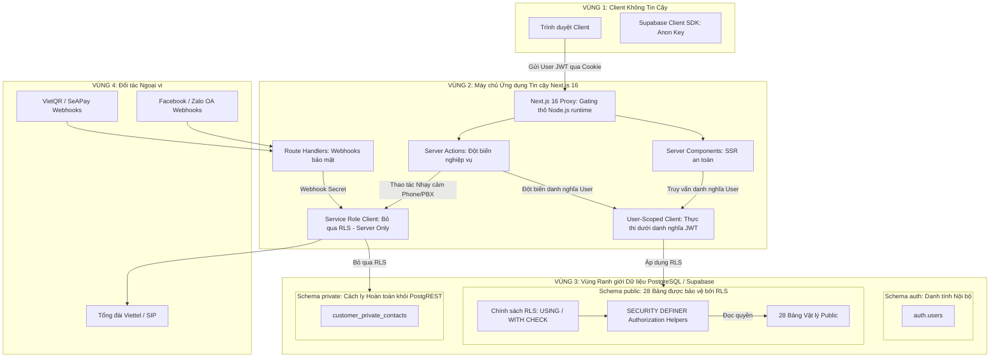
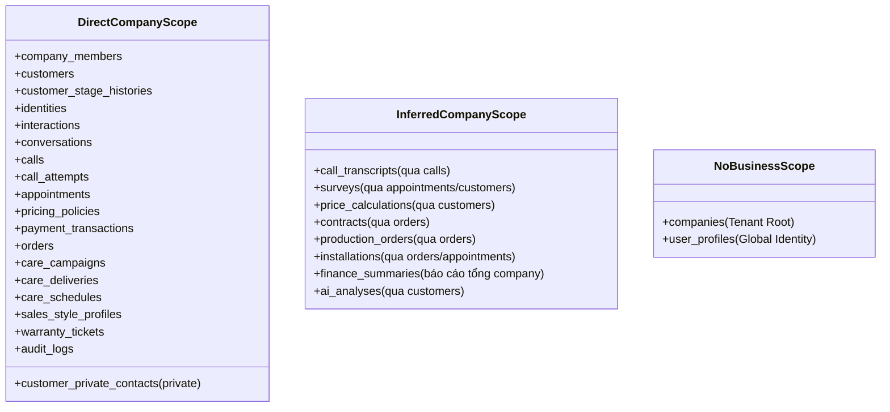

# Supabase RLS Design

> **Tài liệu Thiết kế Kiến trúc Phân quyền Cấp Dòng (Row Level Security - RLS) & Ranh giới Dữ liệu**
> **Dự án:** AI CRM đa kênh cho doanh nghiệp sản xuất cửa chống ngập theo đơn đặt hàng.
> **Trạng thái:** FULL DESIGN FREEZE — Toàn bộ các quyết định RLS (01–05), Auth (01–05), Schema (01–09) và Storage (01) đã được chốt và đóng băng (DECIDED / FROZEN); thiết kế kiến trúc hoàn thiện, sẵn sàng unblock cho Migration 001.
> **Tham chiếu hợp đồng bất biến:**
> - [`docs/PROJECT_MASTER.md`](file:///Users/hoangthuy/ai-crm-cua-chong-ngap/docs/PROJECT_MASTER.md) (Quy tắc Nghiệp vụ Tổng thể)
> - [`docs/DATA_CONTRACT.md`](file:///Users/hoangthuy/ai-crm-cua-chong-ngap/docs/DATA_CONTRACT.md) (Quy ước Dữ liệu Chung)
> - [`docs/SUPABASE_SCHEMA_DESIGN.md`](file:///Users/hoangthuy/ai-crm-cua-chong-ngap/docs/SUPABASE_SCHEMA_DESIGN.md) (Lược đồ Cơ sở Dữ liệu Vật lý)
> - [`docs/AUTH_DESIGN.md`](file:///Users/hoangthuy/ai-crm-cua-chong-ngap/docs/AUTH_DESIGN.md) (Kiến trúc Xác thực & Phân quyền Ứng dụng)

---

## 1. Scope and Security Goals

### 1.1. Vị trí trong lộ trình phát triển
Hệ thống tuân thủ nghiêm ngặt tiến trình kiến trúc:
```text
DATA_CONTRACT → SUPABASE SCHEMA DESIGN → AUTH DESIGN → RLS DESIGN → MIGRATIONS
```
Tài liệu này là thiết kế kiến trúc chuẩn mực cho pha **RLS DESIGN**, xác lập toàn bộ các quy tắc bảo vệ cấp dòng dữ liệu trong PostgreSQL trước khi triển khai các tệp migration SQL thực thi.

### 1.2. Giới hạn phạm vi nghiêm ngặt (Strict Scope)
- **Tài liệu Thiết kế Thuần túy (Design Document Only):**
  - Không tạo tệp migration SQL trong bước này.
  - Không áp dụng hoặc kích hoạt RLS trên môi trường Supabase trực tiếp.
  - Không sửa đổi cấu trúc bảng trong `SUPABASE_SCHEMA_DESIGN.md`.
  - Không triển khai mã nguồn Auth, Server Actions hoặc Route Handlers trong Next.js.
  - Không cài đặt thêm bất kỳ thư viện (packages) nào vào dự án.
  - Không sửa đổi các tài liệu hợp đồng đã đóng băng (`PROJECT_MASTER.md`, `DATA_CONTRACT.md`, `SUPABASE_SCHEMA_DESIGN.md`, `AUTH_DESIGN.md`).
- **Ghi chú về mã lệnh minh họa:** Toàn bộ các đoạn mã SQL có mặt trong tài liệu này chỉ đóng vai trò đặc tả logic giả định và được dán nhãn rõ ràng:
  `-- DESIGN PSEUDOCODE / NOT MIGRATION SQL`

### 1.3. Mục tiêu an ninh cốt lõi (Security Goals)
1. **Phòng thủ Đa tầng (Defense-in-Depth):** RLS đóng vai trò chốt chặn dữ liệu tối hậu tại chính nhân PostgreSQL. Kể cả khi lớp ứng dụng Next.js gặp lỗ hổng logic hoặc bị tấn công bypass, tầng RLS vẫn bảo đảm người dùng không thể đọc hay can thiệp dữ liệu trái phép.
2. **Không tin cậy Client (Zero Client Trust):** Trình duyệt và Client SDK tuyệt đối không có quyền tự quyết vai trò hay ngữ cảnh công ty. Mọi quyền truy cập phải chứng minh qua định danh JWT hợp lệ (`auth.uid()`) và bản ghi thành viên còn hiệu lực (`company_members.status = 'ACTIVE'`).
3. **Cô lập Doanh nghiệp Tuyệt đối (Tenant Isolation):** Ngăn chặn 100% việc rò rỉ hoặc can thiệp dữ liệu chéo giữa các doanh nghiệp (Cross-Company Leakage/IDOR), chuẩn bị sẵn sàng cho kiến trúc Multi-Tenant.
4. **Bảo vệ Dữ liệu Nhạy cảm Tối mật:** Cách ly tuyệt đối số điện thoại khách hàng khỏi tài khoản `SALE` và `TECHNICIAN`.
5. **Ủy quyền theo Phân công Hiện trường (Assignment-Scoped Technician Access):** Kỹ thuật viên chỉ được tiếp cận công việc và khách hàng mà mình đang được phân công hợp lệ.
6. **Bảo toàn Dữ liệu Lịch sử & Kiểm toán:** Chặn xóa cứng (hard DELETE) các thực thể nghiệp vụ quan trọng và bảo vệ tính bất biến của hợp đồng đã ký, báo giá đã chốt và nhật ký kiểm toán (`audit_logs`).
7. **Triệt tiêu Vòng lặp Đệ quy (RLS Recursion Prevention):** Thiết kế các hàm kiểm tra quyền độc lập, an toàn, không gây hiện tượng vòng lặp vô tận khi thẩm tra bảng neo quyền `company_members`.

---

## 2. RLS Trust Model

Hệ thống thiết lập 4 vùng tin cậy độc lập (Defense-in-Depth Trust Boundaries):



### Nguyên tắc Vàng của Chuỗi Danh tính
```text
auth.uid() (Supabase Auth JWT)
    ↓ (1:1)
public.user_profiles (status = 'ACTIVE')
    ↓ (1:N)
public.company_members (status = 'ACTIVE' + role IN ('BOSS_ADMIN', 'SALE', 'TECHNICIAN'))
    ↓ (N:1)
public.companies (Tenant Boundary)
```

> [!IMPORTANT]
> **BẤT BIẾN AN NINH TỐI CAO:**
> Việc người dùng đăng nhập thành công vào Supabase Auth (`auth.uid()` tồn tại) **TUYỆT ĐỐI KHÔNG TỰ ĐỘNG CẤP QUYỀN TRUY CẬP** vào bất kỳ dữ liệu doanh nghiệp nào.
> Mọi quyền truy cập dữ liệu nghiệp vụ bắt buộc phải đồng thời thỏa mãn:
> 1. `user_profiles.status = 'ACTIVE'`
> 2. `company_members.status = 'ACTIVE'` trong đúng `company_id` của dòng dữ liệu mục tiêu.

### 2.1. Chuỗi Ủy quyền Canonical

Mọi policy, trusted server endpoint và application authorization phải thực hiện cùng một chuỗi kiểm tra theo đúng thứ tự logic:

```text
authenticated?
  → user ACTIVE?
  → company membership ACTIVE?
  → same company as target row?
  → role allowed?
  → resource-specific authorization condition?
```

Đối với `TECHNICIAN`, điều kiện cuối bắt buộc là tồn tại phân công kỹ thuật viên hiện hành cho Job/tài nguyên mục tiêu. Không được bỏ qua bất kỳ bước nào chỉ vì đường ghi dùng Service Role hoặc chạy trên trusted server.

---

## 3. Authentication and Authorization Inputs

Các chính sách RLS chỉ được phép dựa vào các dữ kiện an ninh đã được kiểm chứng dưới đây:

| Dữ kiện Đầu vào | Nguồn gốc / Cơ chế Trích xuất | Độ tin cậy | Mục đích sử dụng trong RLS |
| :--- | :--- | :---: | :--- |
| **`auth.uid()`** | Trích xuất trực tiếp từ chữ ký số mật mã của Supabase Auth JWT (`sub` claim). | **TUYỆT ĐỐI** | Nhận diện duy nhất người dùng đang thực hiện truy vấn. |
| **`user_profiles.status`** | Truy vấn bảng `public.user_profiles WHERE id = auth.uid()`. | **TUYỆT ĐỐI** | Xác định tài khoản ứng dụng toàn cục có đang bị khóa hay không. |
| **`company_members.company_id`** | Bản ghi thành viên gắn với `auth.uid()` trong bảng `public.company_members`. | **TUYỆT ĐỐI** | Xác định ranh giới Tenant mà người dùng thuộc về. |
| **`company_members.role`** | Cột `role` lưu trong `public.company_members` (`BOSS_ADMIN`, `SALE`, `TECHNICIAN`). | **TUYỆT ĐỐI** | Xác định thẩm quyền nghiệp vụ theo hợp đồng `AccessPolicy`. |
| **`company_members.status`** | Cột `status` trong `public.company_members` (`ACTIVE`, `INACTIVE`). | **TUYỆT ĐỐI** | Xác định tư cách thành viên còn hiệu lực hay đã bị thu hồi. |

### Các Nguồn Đầu vào BỊ NGHIÊM CẤM Tuyệt đối
1. **Client-supplied role:** Cấm dùng tham số role gửi từ client (query params, body JSON, custom headers).
2. **`raw_user_meta_data`:** Cấm dùng metadata của Supabase Auth để cấp quyền (vì người dùng có thể tự sửa qua client API nếu không khóa cấu hình).
3. **`app_metadata`:** Không lưu trữ vai trò doanh nghiệp trong JWT `app_metadata` do tính chất không thu hồi tức thì (stale JWT).
4. **Tenant Header:** Không tin cậy header `x-company-id` khi chưa kiểm tra chéo với cơ sở dữ liệu.
5. **Biến toàn cục giả định `auth.current_company_id()`:** Cấm tạo và dựa dẫm vào biến toàn cục của session để suy diễn Company.

---

## 4. Company / Tenant Isolation

### 4.1. Nguyên tắc cô lập theo từng dòng dữ liệu mục tiêu
Dù hệ thống ở pha triển khai hiện tại chỉ có 1 Company hoạt động, RLS **bắt buộc phải được thiết kế an toàn tuyệt đối cho kiến trúc Đa Doanh nghiệp (Multi-Tenant Safe)**.
Mọi chính sách RLS phải thẩm định quyền dựa trên chính `company_id` của dòng dữ liệu đang được truy vấn hoặc cha trực tiếp của nó:

```text
[Dòng dữ liệu mục tiêu: row.company_id] <── SO SÁNH ──> [Tư cách thành viên của auth.uid(): member.company_id]
```

### 4.2. Phân loại Phạm vi Công ty (Company Scope Classification)

Hệ thống phân chia 29 bảng vật lý thành 3 nhóm phạm vi:



1. **DIRECT COMPANY SCOPE (18 bảng public + 1 bảng private):**
   - Chứa cột `company_id uuid NOT NULL REFERENCES companies(id)`.
   - RLS kiểm tra trực tiếp: `is_active_member(company_id)` hoặc `has_company_role(company_id, '<ROLE>')`.
2. **INFERRED COMPANY SCOPE (8 bảng public):**
   - Về mặt lý thuyết ở `DATA_CONTRACT.md`, công ty được suy diễn qua quan hệ cha.
   - Về mặt vật lý ở `SUPABASE_SCHEMA_DESIGN.md`, các bảng này đều đã được thiết kế sẵn cột `company_id uuid NOT NULL` kèm theo **Composite Foreign Keys** trỏ về bảng cha (`UNIQUE (company_id, ...)`).
   - RLS kiểm tra trực tiếp trên `company_id` của bảng đó nhằm đạt hiệu năng tối ưu (index scan), đồng thời các ràng buộc khóa ngoại phức hợp bảo đảm `company_id` của bản ghi con không bao giờ lệch với bản ghi cha.
3. **NO BUSINESS COMPANY SCOPE (2 bảng):**
   - `companies`: Gốc phân vùng Tenant. Chỉ thành viên của chính công ty đó mới được xem thông tin công ty mình.
   - `user_profiles`: Hồ sơ người dùng toàn cục. Phân quyền theo nguyên tắc hồ sơ cá nhân và ngữ cảnh đồng nghiệp tối thiểu.

---

## 5. RLS Helper Function Contracts

Để tối ưu hóa hiệu năng, giảm trùng lặp mã lệnh SQL và tránh việc lặp lại các truy vấn kiểm tra phức tạp trong từng policy, hệ thống thiết kế tập hợp các hàm trợ giúp (RLS Helper Functions) được tối ưu hóa cao:

### 5.1. Hàm `is_active_member(target_company_id uuid)`
- **Mục đích an ninh:** Kiểm tra xem người dùng đang gửi truy vấn (`auth.uid()`) có phải là thành viên `ACTIVE` của công ty mục tiêu và tài khoản ứng dụng `user_profiles` có đang `ACTIVE` hay không.
- **Tham số:** `target_company_id uuid` (ID công ty của dòng dữ liệu mục tiêu).
- **Giá trị trả về:** `boolean` (`true` nếu hợp lệ, `false` trong mọi trường hợp khác).
- **Mã giả định thiết kế:**
  ```sql
  -- DESIGN PSEUDOCODE / NOT MIGRATION SQL
  CREATE OR REPLACE FUNCTION public.is_active_member(target_company_id uuid)
  RETURNS boolean
  LANGUAGE sql
  STABLE
  SECURITY DEFINER
  SET search_path = ''
  AS $$
    SELECT EXISTS (
      SELECT 1
      FROM public.company_members cm
      JOIN public.user_profiles up ON up.id = cm.user_id
      WHERE cm.user_id = auth.uid()
        AND cm.company_id = target_company_id
        AND cm.status = 'ACTIVE'
        AND up.status = 'ACTIVE'
    );
  $$;
  ```

### 5.2. Hàm `has_company_role(target_company_id uuid, required_role text)`
- **Mục đích an ninh:** Kiểm tra xem người dùng có vai trò cụ thể (`required_role`) và đang hoạt động (`ACTIVE`) trong công ty mục tiêu hay không.
- **Tham số:**
  - `target_company_id uuid`: ID công ty của dòng dữ liệu.
  - `required_role text`: Vai trò yêu cầu (`'BOSS_ADMIN'`, `'SALE'`, `'TECHNICIAN'`).
- **Giá trị trả về:** `boolean`.
- **Mã giả định thiết kế:**
  ```sql
  -- DESIGN PSEUDOCODE / NOT MIGRATION SQL
  CREATE OR REPLACE FUNCTION public.has_company_role(target_company_id uuid, required_role text)
  RETURNS boolean
  LANGUAGE sql
  STABLE
  SECURITY DEFINER
  SET search_path = ''
  AS $$
    SELECT EXISTS (
      SELECT 1
      FROM public.company_members cm
      JOIN public.user_profiles up ON up.id = cm.user_id
      WHERE cm.user_id = auth.uid()
        AND cm.company_id = target_company_id
        AND cm.role = required_role
        AND cm.status = 'ACTIVE'
        AND up.status = 'ACTIVE'
    );
  $$;
  ```

### 5.3. Hàm `is_assigned_technician(target_appointment_id uuid)`
- **Mục đích an ninh:** Kiểm tra xem người dùng có phải là Kỹ thuật viên đang được phân công hợp lệ và trong trạng thái vòng đời có thể hành động (currently actionable lifecycle state) cho lịch hẹn cụ thể hay không.
- **Tham số:** `target_appointment_id uuid` (ID của lịch hẹn khảo sát hoặc lắp đặt).
- **Giá trị trả về:** `boolean`.
- **Ràng buộc ngữ nghĩa phân công hiện hành (Current Assignment Semantics):**
  - **Không ngộ nhận vĩnh viễn:** Điều kiện `assignee_id = auth.uid()` đơn lẻ **hoàn toàn không đồng nghĩa với quyền truy cập hiện hành vĩnh viễn**. Quyền của kỹ thuật viên hiện trường bắt buộc phải thỏa mãn đồng thời 3 yếu tố:
    1. Bản ghi `company_members` có `role = 'TECHNICIAN'` và `status = 'ACTIVE'` tại Company của lịch hẹn.
    2. Tồn tại quan hệ phân công trực tiếp tới lịch hẹn mục tiêu: `appointments.assignee_id = auth.uid()`.
    3. Lịch hẹn và nhiệm vụ phân công phải đang ở **trạng thái vòng đời còn hiệu lực hành động** (active/actionable lifecycle state).
  - **Trạng thái canonical đã khóa:** Phân công hiện hành chỉ gồm `ASSIGNED`, `ACCEPTED`, `IN_PROGRESS`. Các trạng thái `COMPLETED`, `CANCELLED`, `REJECTED` kết thúc ngay quyền truy cập dựa trên phân công.
  - **Bất biến lịch sử:** Trường `surveys.completed_by` tiếp tục giữ vai trò là **chứng cứ lịch sử**, tuyệt đối không tự động biến thành căn cứ ủy quyền hiện hành.
  - **Suy diễn quyền Lắp đặt & Bảo hành:**
    - Đối với `installations`: Kỹ thuật viên tiếp cận thông qua lịch hẹn lắp đặt liên kết hợp lệ (`installations.appointment_id → appointments.assignee_id = auth.uid()`).
    - Đối với `warranty_tickets`: Kỹ thuật viên tiếp cận thông qua `warranty_tickets.assigned_to = auth.uid()` kết hợp tư cách `TECHNICIAN ACTIVE` trong cùng Company.
- **Mã giả định thiết kế:**
  ```sql
  -- DESIGN PSEUDOCODE / NOT MIGRATION SQL
  CREATE OR REPLACE FUNCTION public.is_assigned_technician(target_appointment_id uuid)
  RETURNS boolean
  LANGUAGE sql
  STABLE
  SECURITY DEFINER
  SET search_path = ''
  AS $$
    SELECT EXISTS (
      SELECT 1
      FROM public.appointments a
      JOIN public.company_members cm ON cm.user_id = a.assignee_id AND cm.company_id = a.company_id
      JOIN public.user_profiles up ON up.id = cm.user_id
      WHERE a.id = target_appointment_id
        AND a.assignee_id = auth.uid()
        AND cm.role = 'TECHNICIAN'
        AND cm.status = 'ACTIVE'
        AND up.status = 'ACTIVE'
        AND a.status IN ('ASSIGNED', 'ACCEPTED', 'IN_PROGRESS')
    );
  $$;
  ```

### 5.4. Các hàm trợ giúp chuyên biệt độc lập (Independent Helper Contracts)
Để triệt tiêu hoàn toàn nguy cơ đệ quy và chuỗi phụ thuộc (Dependency Chains), hệ thống **ưu tiên sử dụng trực tiếp `has_company_role(target_company_id, '<ROLE>')` trong các policies**, loại bỏ các alias gọi lồng nhau:
1. **Sử dụng trực tiếp trong Policies:**
   - Kiểm tra Sếp: Dùng trực tiếp `has_company_role(company_id, 'BOSS_ADMIN')`.
   - Kiểm tra Sale: Dùng trực tiếp `has_company_role(company_id, 'SALE')`.
2. **`is_self_membership(target_member_id uuid)`:**
   - Hàm độc lập hoàn toàn, truy vấn trực tiếp không qua hàm trung gian:
   ```sql
   -- DESIGN PSEUDOCODE / NOT MIGRATION SQL
   CREATE OR REPLACE FUNCTION public.is_self_membership(target_member_id uuid)
   RETURNS boolean
   LANGUAGE sql
   STABLE
   SECURITY DEFINER
   SET search_path = ''
   AS $$
     SELECT EXISTS (
       SELECT 1
       FROM public.company_members cm
       WHERE cm.id = target_member_id
         AND cm.user_id = auth.uid()
     );
   $$;
   ```

---

## 6. SECURITY DEFINER Hardening

Việc sử dụng `SECURITY DEFINER` là bắt buộc để hàm trợ giúp có thể đọc bảng neo quyền `company_members` mà không bị chặn bởi chính sách RLS hạn chế của bảng này. Để ngăn chặn nguy cơ leo thang đặc quyền (Privilege Escalation), toàn bộ các hàm phải tuân thủ nghiêm ngặt mô hình làm cứng tối đa:

1. **Kiểm soát `search_path` và Schema Qualification:**
   - Việc chỉ khai báo `SET search_path = public, pg_temp` không thể tự động coi là triệt tiêu 100% rủi ro nếu quyền ghi trên schema `public` chưa được khóa chặt.
   - Thiết kế chuẩn mực áp dụng:
     - Thiết lập `search_path` rỗng hoặc tối thiểu có kiểm soát (`SET search_path = ''` hoặc `SET search_path = pg_catalog`).
     - Định danh tuyệt đối toàn bộ tên đối tượng: `public.company_members`, `public.user_profiles`, `pg_catalog.now()`.
     - Ở cấp cơ sở dữ liệu, thu hồi quyền tạo đối tượng trên schema công khai: `REVOKE CREATE ON SCHEMA public FROM PUBLIC, anon, authenticated;`.
2. **Kiểu trả về tối thiểu (Minimal Boolean Return):** Các hàm chỉ trả về kiểu `boolean` (`true`/`false`), tuyệt đối không trả về dòng dữ liệu, bảng, con trỏ (cursor) hay chuỗi nhạy cảm.
3. **Phân quyền thực thi tối thiểu (Least Privilege Grants):**
   ```sql
   -- DESIGN PSEUDOCODE / NOT MIGRATION SQL
   REVOKE ALL ON FUNCTION public.is_active_member(uuid) FROM PUBLIC;
   REVOKE ALL ON FUNCTION public.is_active_member(uuid) FROM anon;
   GRANT EXECUTE ON FUNCTION public.is_active_member(uuid) TO authenticated;
   ```
4. **Cấm thực thi SQL động (No Dynamic SQL):** Tuyệt đối không dùng `EXECUTE format(...)` bên trong các hàm kiểm tra quyền.
5. **Thuộc tính hàm:** Khai báo thuộc tính `STABLE` để PostgreSQL có thể cache kết quả trong phạm vi một câu lệnh truy vấn (Query Statement), giúp tăng tốc độ kiểm tra RLS vượt trội khi duyệt nhiều dòng dữ liệu.
6. **Quyền sở hữu hàm (Function Ownership):** Hàm phải thuộc sở hữu của superuser/database owner (`postgres` hoặc `supabase_admin`), không được gán quyền sở hữu cho các role ứng dụng.
7. **Độc lập và Không lồng nhau (No Nested Helper Calls):** Các hàm helper không bao giờ gọi chéo lẫn nhau để loại bỏ nguy cơ phụ thuộc vòng và lỗi stack.

---

## 7. Service Role Boundary

Hệ thống phân định rõ ranh giới giữa truy vấn chịu sự kiểm soát của RLS và truy vấn máy chủ có đặc quyền:

```text
┌──────────────────────────────────────────────────────────────────────────┐
│                      MA TRẬN RANH GIỚI THỰC THI                          │
├──────────────────────────┬───────────────────────┬───────────────────────┤
│ Ngữ cảnh Gọi             │ Trạng thái RLS        │ Trách nhiệm An ninh   │
├──────────────────────────┼───────────────────────┼───────────────────────┤
│ 1. Trình duyệt Client    │ RLS BẮT BUỘC ÁP DỤNG  │ Chặn bởi RLS Policies │
│    (Anon Key + User JWT) │ (Enforced by Engine)  │                       │
├──────────────────────────┼───────────────────────┼───────────────────────┤
│ 2. Next.js Server Client │ RLS BẮT BUỘC ÁP DỤNG  │ Chặn bởi RLS Policies │
│    (User-Scoped Client)  │ (Enforced by Engine)  │                       │
├──────────────────────────┼───────────────────────┼───────────────────────┤
│ 3. Next.js Service Role  │ RLS BỊ BỎ QUA 100%    │ MÁY CHỦ BẮT BUỘC PHẢI │
│    (Service Role Key)    │ (BYPASS RLS)          │ TỰ THẨM ĐỊNH QUYỀN    │
└──────────────────────────┴───────────────────────┴───────────────────────┘
```

> [!WARNING]
> **CẢNH BÁO KIẾN TRÚC SỐNG CÒN:**
> - `SUPABASE_SERVICE_ROLE_KEY` **hoàn toàn bỏ qua mọi chính sách RLS**.
> - Không bao giờ được ngộ nhận rằng việc sử dụng Service Role trên máy chủ là an toàn dưới sự bảo vệ của RLS.
> - Máy chủ chịu trách nhiệm an ninh 100% khi sử dụng Service Role Client. Tuy nhiên, **không phải mọi thao tác Service Role đều có hoặc yêu cầu `verified_user_id`**. Hệ thống phân định rạch ròi 3 ngữ cảnh ủy quyền máy chủ:

### 7.1. Ba Ngữ cảnh Thẩm quyền của Service Role (Three Service Role Contexts)

#### Ngữ cảnh A: Thao tác Máy chủ Đặc quyền do Người dùng Khởi xướng (User-Initiated Privileged Server Operation)
- **Ví dụ nghiệp vụ:**
  - Sếp mở Modal xem số điện thoại thật (`viewBossRawPhoneAction`).
  - SALE bấm gọi điện Click-to-Call qua tổng đài PBX (`initiateSaleCallAction`).
  - Sếp quản trị mời/hủy kích hoạt thành viên (`inviteMemberAction`, `deactivateMemberAction`).
- **Yêu cầu kiểm soát an ninh bắt buộc (Strict Pre-Authorization):**
  1. Xác thực danh tính người dùng cuối qua phiên máy chủ, trích xuất `verified_user_id = auth.uid()`.
  2. Phân giải Company mục tiêu từ tài nguyên/route đã được kiểm tra, không tin cậy Company do client tự khai báo.
  3. Thẩm tra `user_profiles.status = 'ACTIVE'`.
  4. Thẩm tra `company_members.status = 'ACTIVE'` trong đúng Company.
  5. Thẩm tra `company_members.role` được phép cho hành động.
  6. Thẩm tra tài nguyên mục tiêu thuộc đúng Company/scope và thỏa mãn điều kiện quyền riêng của tài nguyên (ví dụ phân công kỹ thuật hiện hành).
  7. Chỉ sau khi toàn bộ chuỗi kiểm tra vượt qua mới sử dụng Service Role Client hoặc hàm `SECURITY DEFINER` nội bộ để đọc/ghi, đồng thời ghi `audit_logs` nếu hành động nhạy cảm.

Service Role bypass RLS 100% và vì vậy không bao giờ được coi là authorization mechanism.

#### Ngữ cảnh B: Webhook từ Đối tác Ngoại vi (Provider Webhook)
- **Ví dụ nghiệp vụ:**
  - Webhook biến động số dư từ Ngân hàng (VietQR, SeAPay).
  - Webhook trạng thái cuộc gọi / CDR từ Tổng đài (Viettel PBX, SIP).
  - Webhook tin nhắn đến từ Mạng xã hội (Zalo OA, Facebook Messenger).
- **Đặc thù danh tính:** **HOÀN TOÀN KHÔNG CÓ `verified_user_id` của người dùng cuối.** Tuyệt đối không giả mạo hoặc gán ép danh tính người dùng tùy tiện.
- **Yêu cầu kiểm soát an ninh bắt buộc:**
  1. Xác thực chữ ký số mật mã của nhà cung cấp (`HMAC-SHA256`, Webhook Secret / Signature Header). Từ chối 100% nếu chữ ký sai hoặc thiếu.
  2. Kiểm tra chống trùng lặp sự kiện (Idempotency / Event Deduplication) qua `event_id` hoặc mã giao dịch đối tác.
  3. Phân giải `company_id` và tài nguyên nghiệp vụ mục tiêu từ ánh xạ đối tác đáng tin cậy đã được cấu hình trước (ví dụ: số tài khoản ngân hàng thụ hưởng → `company_id`, hotline tổng đài SIP → `company_id`, Official Account ID → `company_id`).
  4. Xác thực mối quan hệ nghiệp vụ cùng công ty (Same-Company Business Relationships) trước khi liên kết dữ liệu (ví dụ: `matched_order_id` phải có `company_id` khớp với `company_id` của giao dịch).
  5. Thực hiện ghi dữ liệu giới hạn phạm vi (Bounded Service Role Write) vào đúng bảng được chỉ định (`payment_transactions`, `calls`, `interactions`).

#### Ngữ cảnh C: Tiến trình Nền / Hệ thống Tự động (Background / System Worker)
- **Ví dụ nghiệp vụ:**
  - Worker AI phân tích hội thoại và bóc băng cuộc gọi (`ai_analyses`, `call_transcripts`).
  - Bộ lập lịch và gửi tin nhắn chăm sóc tự động (Care Scheduler & Delivery Engine).
  - Tiến trình đồng bộ tổng hợp số liệu tài chính định kỳ (`finance_summaries`).
- **Đặc thù danh tính:** Chạy tự động theo lịch hoặc hàng đợi (Queue/Cron), **KHÔNG CÓ danh tính người dùng cuối trực tiếp**. Tuyệt đối không phát minh danh tính người dùng giả mạo.
- **Yêu cầu kiểm soát an ninh bắt buộc:**
  1. Xác thực danh tính tiến trình nền tin cậy (Trusted Worker Identity / Job Secret / Private Runtime).
  2. Giới hạn phạm vi tài nguyên công ty rõ ràng (Explicit Bounded Company/Resource Scope) cho từng công việc xử lý.
  3. Tuân thủ phân loại dữ liệu và ủy quyền dữ liệu nguồn (Source-Data Authorization): chỉ đọc và tổng hợp dữ liệu thuộc phạm vi công việc được giao, không trích xuất trái phép dữ liệu nhạy cảm.
  4. Thực hiện các thao tác ghi giới hạn phạm vi theo đúng hợp đồng thiết kế.

---

## 8. Policy Naming Convention

Để bảo đảm tính nhất quán, dễ kiểm toán và hỗ trợ việc viết migrations tự động hóa không nhầm lẫn, toàn bộ các chính sách RLS phải tuân thủ cấu trúc đặt tên chuẩn mực:

```text
<table_name>_<command>_<target_role_or_condition>
```

- `<table_name>`: Tên bảng vật lý (ví dụ: `customers`, `pricing_policies`, `company_members`).
- `<command>`: Lệnh SQL được kiểm soát: `select`, `insert`, `update`, `delete`.
- `<target_role_or_condition>`: Đối tượng áp dụng hoặc điều kiện đặc trưng (ví dụ: `boss_admin`, `sale`, `assigned_technician`, `self`, `active_member`).

**Ví dụ thực tế:**
- `customers_select_active_company_member`
- `pricing_policies_select_boss_admin`
- `pricing_policies_insert_boss_admin`
- `appointments_select_assigned_technician`
- `company_members_select_boss_admin`
- `company_members_select_self`
- `contracts_update_sale_upload_signed`

---

## 9. USING vs WITH CHECK Strategy & Column-Level Boundaries

### 9.1. Ngữ nghĩa của `USING` và `WITH CHECK` trong PostgreSQL
Hệ thống áp dụng chính xác ngữ nghĩa của hai mệnh đề kiểm soát RLS trong PostgreSQL:

| Mệnh đề RLS | Thời điểm Đánh giá | Dữ liệu Đánh giá | Lệnh SQL Áp dụng | Mục đích Bảo mật |
| :--- | :--- | :--- | :--- | :--- |
| **`USING`** | Đánh giá **trước khi thao tác**. | Dòng dữ liệu hiện có (**OLD row**). | `SELECT`, `UPDATE`, `DELETE` | Quyết định người dùng được phép *nhìn thấy* hoặc *chạm vào* những dòng nào. |
| **`WITH CHECK`** | Đánh giá **sau khi áp dụng thay đổi**, trước khi ghi đĩa. | Dòng dữ liệu mới dự kiến ghi (**NEW row**). | `INSERT`, `UPDATE` | Quyết định dữ liệu mới có thỏa mãn *ranh giới an toàn* hay không. |

### 9.2. Cơ chế Chống Tấn công Chuyển Đổi Tenant (Cross-Company UPDATE Protection)

> [!CAUTION]
> **GIỚI HẠN BẢN CHẤT CỦA RLS:**
> - Mệnh đề `USING` kiểm soát khả năng nhìn thấy dòng hiện tại (**OLD row**).
> - Mệnh đề `WITH CHECK` kiểm tra tính hợp lệ của dòng mới dự kiến ghi (**NEW row**).
> - **RLS đơn lẻ TUYỆT ĐỐI KHÔNG THỂ so sánh giữa `OLD` và `NEW`** (trong biểu thức `WITH CHECK`, PostgreSQL chỉ tham chiếu đến giá trị của dòng mới `NEW`, không có cú pháp so sánh trực tiếp `NEW.company_id = OLD.company_id`).
> - Biểu thức dạng `company_id = customers.company_id` bên trong `WITH CHECK` thực chất chỉ là phép đồng nhất tầm thường (`NEW.company_id = NEW.company_id`), hoàn toàn vô hiệu trong việc chống đổi tenant!
> - **Kịch bản tấn công:** Một người dùng là thành viên `ACTIVE` hợp lệ ở cả **Công ty A** và **Công ty B**. Nếu chỉ dựa vào RLS `WITH CHECK (is_active_member(company_id))`, người này có thể gửi payload cập nhật `company_id` từ A sang B. PostgreSQL kiểm tra thấy người này là thành viên của B nên sẽ cho phép ghi, dẫn đến việc đánh cắp hoặc di dời dữ liệu trái phép giữa 2 công ty!

**Giải pháp Kiến trúc Chuẩn mực:**
Để bảo vệ tuyệt đối các định danh phân vùng và khóa quan hệ sở hữu cốt lõi:
- `company_id` (Tenant Identity)
- `customer_id` (Khách hàng sở hữu)
- `order_id` (Đơn hàng sở hữu)
- `appointment_id` (Lịch hẹn liên kết)
- `user_id` (Chủ thể tài khoản)
- `assignee_id` (Người được phân công)
- các khóa quan hệ/sở hữu bất biến khác

Hệ thống bắt buộc phải sử dụng sự kết hợp đa tầng giữa RLS và các cơ chế bổ trợ:
1. **RLS Policy:** Kiểm soát quyền tiếp cận dòng cũ (`USING`) và thẩm định ranh giới hợp lệ của dòng mới (`WITH CHECK`).
2. **Immutable-Column Trigger (Trigger chống sửa cột bất biến):** Cơ chế chốt chặn ở mức CSDL so sánh `NEW` và `OLD`.
3. **Column-Level UPDATE Grants / Database Roles:** Giới hạn danh sách cột được phép `UPDATE` của vai trò.
4. **Trusted Server / RPC Write Path:** Thực thi đột biến qua các hàm máy chủ đã kiểm tra nghiệp vụ, không mở lệnh `UPDATE` tự do từ client.
5. **Lifecycle / Business Validation Trigger:** Kiểm tra tính hợp lệ của trạng thái vòng đời.

```sql
-- DESIGN PSEUDOCODE / NOT MIGRATION SQL
-- 1. RLS Policy: Kiểm soát dòng cũ và dòng mới
CREATE POLICY customers_update_active_company_member
ON public.customers
FOR UPDATE
TO authenticated
USING (
  -- USING kiểm soát OLD row: Người dùng phải là thành viên ACTIVE của Company sở hữu dòng hiện tại
  is_active_member(company_id)
)
WITH CHECK (
  -- WITH CHECK kiểm soát NEW row: Dòng sau khi sửa phải thuộc Company mà người dùng là thành viên ACTIVE
  is_active_member(company_id)
);

-- 2. Database Trigger: BẢO VỆ TÍNH BẤT BIẾN CỦA KHÓA TENANT & QUAN HỆ (Bắt buộc)
-- Chặn đứng 100% việc dời dòng dữ liệu từ Công ty A sang Công ty B
CREATE OR REPLACE FUNCTION public.enforce_tenant_key_immutability()
RETURNS trigger
LANGUAGE plpgsql
AS $$
BEGIN
  IF NEW.company_id IS DISTINCT FROM OLD.company_id THEN
    RAISE EXCEPTION 'SECURITY_VIOLATION: Mutating company_id is strictly prohibited.';
  END IF;
  RETURN NEW;
END;
$$;
```

### 9.3. Năm Danh mục Thực thi Giới hạn Cấp Cột (Five Column-Level Enforcement Categories)

Do RLS là cơ chế kiểm soát theo cấp dòng (Row-Level Security), RLS **hoàn toàn không thể tự mình ngăn cấm "chỉ cột này được sửa" hoặc "chỉ cột kia được đọc"**. Mọi phát biểu về giới hạn quyền truy cập cấp cột trong tài liệu này bắt buộc phải thuộc một trong 5 danh mục thực thi cụ thể:

| Danh mục | Cơ chế Kỹ thuật | Phạm vi Áp dụng | Giải pháp Kiến trúc |
| :---: | :--- | :--- | :--- |
| **Category A** | **Column-level PostgreSQL GRANT/REVOKE** | `UPDATE`, `INSERT` | Cấu hình quyền cột trực tiếp trong SQL: `GRANT UPDATE (full_name) ON user_profiles TO authenticated;`. |
| **Category B** | **Safe Server-Only Mutation** | `INSERT`, `UPDATE` | Đóng hoàn toàn quyền ghi trực tiếp từ PostgREST (`REVOKE INSERT, UPDATE ... FROM authenticated;`). Đột biến chỉ thực thi qua Server Actions hoặc Route Handlers chạy dưới quyền tin cậy. |
| **Category C** | **Trusted Narrow RPC / Database Function** | `UPDATE` nghiệp vụ | Khóa quyền cập nhật trực tiếp trên bảng, chỉ cấp quyền `EXECUTE` cho một hàm RPC nhận đúng các tham số nghiệp vụ được phép thay đổi. |
| **Category D** | **Safe Projection / View / Server DTO for Reads** | `SELECT` | **CẤM ngộ nhận rằng SELECT projection của client có thể bảo vệ dữ liệu nếu client có quyền SELECT trực tiếp trên base table**. Một chính sách RLS `SELECT` trên base table chỉ được phép tồn tại nếu mọi cột trong bảng đó đều được cố ý ủy quyền cho vai trò đó đọc. Restricted Database View chỉ được dùng cho dataset tự thân an toàn như Safe Staff Directory, lookup hoặc summary không nhạy cảm. Dữ liệu nhạy cảm bắt buộc đi qua **Trusted Server DTO / trusted server endpoint** với explicit field allowlist và full authorization; direct base-table/browser SELECT bị thu hồi.<br><br>*Lưu ý sống còn về Server DTO:* Nếu quyền `SELECT` trên base table đã bị thu hồi (`REVOKE SELECT`) khỏi role `authenticated`, thì một client máy chủ chạy dưới danh nghĩa người dùng (User-Scoped Server Client) cũng sẽ chịu nguyên vẹn hạn chế đó của PostgreSQL engine. Do đó, giải pháp Server DTO bắt buộc phải trích xuất dữ liệu thông qua một **đường dẫn máy chủ có đặc quyền (Trusted Privileged Server Path / Service Role)** sau khi đã tự thẩm tra quyền truy cập trong mã nguồn máy chủ. Tuyệt đối không bao giờ ngụ ý rằng việc chuyển cùng một câu lệnh `SELECT` của user từ trình duyệt sang Server Component có thể tự động qua mặt được các giới hạn phân quyền `GRANT` của cơ sở dữ liệu! |
| **Category E** | **Database Trigger / Constraint for Immutable Fields** | `UPDATE` | Sử dụng Trigger mức hàng so sánh `OLD` và `NEW` (`IF NEW.col IS DISTINCT FROM OLD.col THEN RAISE EXCEPTION ...`), hoặc ràng buộc kiểm tra để bảo đảm các trường bất biến (như hợp đồng đã ký, số tiền cọc, tenant key) không bao giờ bị can thiệp. |

---

## 10. Role Access Principles

### 10.1. Sếp / Quản trị viên Doanh nghiệp (`BOSS_ADMIN`)
- Là vai trò quản trị tối cao **trong phạm vi Company được ủy quyền**.
- Toàn quyền đọc (`SELECT`) mọi dữ liệu công khai của Company: khách hàng, đơn hàng, bảng giá, lịch sử tương tác, báo cáo tài chính tổng, giao dịch ngân hàng và nhật ký kiểm toán.
- Được quyền quản trị các thực thể nghiệp vụ của công ty:
  - Chính sách giá: Sáng tạo và biên tập chính sách giá ở trạng thái `DRAFT`; khi chính sách chuyển `ACTIVE`, các trường công thức và điều kiện bị khóa bất biến cấp CSDL (**Category E**); thay đổi logic giá buộc phải ban hành phiên bản mới (`version N+1`).
  - Quản trị thành viên: Quản trị nhân sự qua luồng mời và kích hoạt máy chủ tin cậy (**Category B**); cấm client direct `INSERT`/`UPDATE` tùy tiện; không được phép vượt qua liên kết kích hoạt danh tính hoặc vi phạm quy tắc duy nhất 1 `SALE ACTIVE`.
  - Quản trị đơn hàng và tài chính: Khởi tạo đơn hàng và đối soát giao dịch ngân hàng qua luồng máy chủ có kiểm toán (**Category B/E**); tuyệt đối không được viết lại các trường dữ liệu nguồn đối tác bất biến.
- **Ranh giới:** Sếp của Công ty A tuyệt đối không thể đọc hay sửa dữ liệu của Công ty B.

### 10.2. Nhân viên Kinh doanh (`SALE`)
- Là nhân sự vận hành thương mại và tương tác trực tiếp với khách hàng.
- Được quyền thao tác dữ liệu CRM theo các luồng máy chủ có kiểm soát:
  - Khách hàng (không có phone) và danh sách liên hệ CRM được phê duyệt.
  - Vận hành Inbox hội thoại: Đọc và phản hồi tin nhắn thông qua **nội dung đã được làm sạch số điện thoại (`public.interactions.sanitized_content`)** khi `sanitization_status = 'SUCCEEDED'`. CẤM truy cập trực tiếp nội dung thô trong `private.interaction_raw_contents` nếu nội dung đó có thể chứa số điện thoại do khách gõ vào.
  - Cuộc gọi: Nhận metadata cuộc gọi; gọi ra qua Click-to-Call bảo mật (tổng đài PBX quay số, trình duyệt SALE không nhận chuỗi phone).
  - Tính giá: Gửi yêu cầu tính giá (**REQUEST/TRIGGER Price Calculation**) qua Server Action để Pricing Engine tính toán; CẤM trực tiếp INSERT bản ghi `price_calculations`.
  - Đơn hàng: Khởi xướng tạo đơn hàng qua luồng máy chủ tin cậy dựa trên PriceCalculation đã duyệt; đọc thông tin thương mại qua trusted Server DTO với explicit field allowlist (Category D).
  - Hợp đồng: Kích hoạt quy trình sinh hợp đồng tự động của hệ thống sau khi cọc được xác nhận; nộp bản hợp đồng đã ký (`signed_file_ref`) qua Safe Server Mutation (Category B).
  - Vận hành hiện trường: Xem tiến độ lệnh sản xuất (`production_orders`) và lịch lắp đặt (`installations`) phục vụ chăm sóc khách hàng.
  - Hồ sơ phong cách: Xem và review hồ sơ phong cách tư vấn của chính mình trong Company (`sales_style_profiles`).
  - Danh bạ nhân sự an toàn cùng Company: chỉ nhận `id`, `display_name`, `role`, `avatar_url` và trạng thái UI không nhạy cảm nếu thật sự cần qua Safe Staff Directory; không đọc trực tiếp bảng profile/membership đầy đủ.
- **CẤM TUYỆT ĐỐI TIẾP CẬN HOẶC THAO TÁC:**
  - Bảng số điện thoại thật `private.customer_private_contacts`.
  - Bản bóc băng thô `call_transcripts.transcript`, tệp ghi âm cuộc gọi gốc trong bucket `call-recordings`, và **nội dung tin nhắn thô trong `private.interaction_raw_contents`** (chống rò rỉ số điện thoại qua dữ liệu phi cấu trúc; SALE chỉ được nhận bản phái sinh đã làm sạch số điện thoại qua `public.interactions.sanitized_content` khi `sanitization_status = 'SUCCEEDED'`).
  - Bảng chính sách/công thức giá gốc `pricing_policies` (chỉ được xem kết quả thương mại đã tính toán).
  - Trực tiếp tạo mới bản ghi tính giá `price_calculations` từ trình duyệt (chỉ Pricing Engine được quyền tạo).
  - Trực tiếp `INSERT` đơn hàng tùy tiện hoặc tự ý sửa đổi `final_amount`, `deposit_status` trên base table `orders` (SALE tuyệt đối không bao giờ được phép tự set `deposit_status = CONFIRMED`).
  - Trực tiếp `INSERT` bản ghi pháp lý `contracts` (hợp đồng sinh tự động từ template sau khi cọc được xác nhận).
  - Trực tiếp tạo mới (`INSERT`) hoặc tự ý sửa đổi (`UPDATE`) nội dung hồ sơ phong cách bán hàng `sales_style_profiles` từ client (hồ sơ do AI analysis pipeline phân tích và sinh tự động theo Data Contract).
  - Bảng giao dịch ngân hàng tổng `payment_transactions` và bảng báo cáo tài chính tổng `finance_summaries`.
  - Quản trị thành viên toàn công ty `company_members` (chỉ xem bản ghi của chính mình).
  - Trực tiếp tạo mới hoặc đột biến trạng thái lệnh sản xuất (`production_orders`) và nghiệm thu lắp đặt (`installations`) từ client.
  - Xuất dữ liệu hàng loạt ra ngoài hệ thống (Export Contacts).

### 10.3. Kỹ thuật viên Hiện trường (`TECHNICIAN`)
- Là nhân sự đo đạc và nghiệm thu lắp đặt tại hiện trường, quyền hạn gắn chặt với **phân công nhiệm vụ trong trạng thái vòng đời có hiệu lực hành động (Actionable Assignment-Scoped)**.
- Chỉ được đọc và cập nhật các công việc cụ thể được phân công:
  - Khảo sát: Lịch hẹn (`appointments`) và Khảo sát (`surveys`) mà mình được phân công (`assignee_id = auth.uid()`).
  - Lắp đặt: Bản ghi `installations` gắn với lịch hẹn lắp đặt hợp lệ mà mình được phân công (`appointment_id → appointments.assignee_id = auth.uid()`).
  - Bảo hành: Bản ghi `warranty_tickets` được giao trực tiếp (`assigned_to = auth.uid()`) kết hợp tư cách thành viên `TECHNICIAN ACTIVE` trong cùng Company.
- Phân công chỉ hiện hành ở `ASSIGNED`, `ACCEPTED`, `IN_PROGRESS`; quyền dẫn xuất tới Job, Customer, Survey và tài nguyên liên quan chấm dứt ở `COMPLETED`, `CANCELLED`, `REJECTED`.
- Không được xem toàn bộ lịch sử Survey của Customer và không được tiếp tục đọc chỉ vì `surveys.completed_by = auth.uid()`. Nếu sản phẩm sau này cần quyền xem lại completed jobs, phải thiết kế permission riêng.
- Được xem địa chỉ khảo sát/lắp đặt, tải ảnh hiện trường, nhập thông số đo đạc, biên bản bàn giao.
- **CẤM TUYỆT ĐỐI TIẾP CẬN:**
  - Bảng số điện thoại thật.
  - Bảng chính sách giá và công thức tính giá.
  - Mọi dữ liệu tài chính, ngân hàng, đặt cọc và hợp đồng.
  - Danh sách khách hàng CRM không được phân công.
  - Tự ý gọi điện trực tiếp cho khách hàng qua hệ thống.

### 10.4. Khách vãng lai và Người dùng chưa đăng nhập (`anon` / `unauthenticated`)
- **TUYỆT ĐỐI CẤM:** Không được phép đọc hoặc ghi bất kỳ dòng dữ liệu nào trên toàn bộ 28 bảng public và bảng private. Mọi chính sách RLS đều áp dụng cho `TO authenticated` hoặc từ chối mặc định.

---

## 11. Table-by-Table RLS Matrix

Dưới đây là ma trận kiểm soát truy cập cấp dòng cho toàn bộ **28 bảng vật lý thuộc schema `public`** (Bảng số điện thoại thuộc schema `private` được đặc tả riêng tại Mục 12):

| STT | Tên Bảng Vật lý | Phạm vi Company | Quyền `SELECT` | Quyền `INSERT` | Quyền `UPDATE` | Quyền `DELETE` | Ghi chú Ranh giới Dữ liệu / Cơ chế Thực thi |
| :---: | :--- | :--- | :--- | :--- | :--- | :--- | :--- |
| 1 | `companies` | Root | Active Member của cty | Cấm (DB Owner) | BOSS_ADMIN | CẤM | Chỉ xem thông tin cty của chính mình |
| 2 | `user_profiles` | No Business | Self; coworker chỉ qua Safe Staff Directory | Cấm (DB Trigger) | Self (`full_name`) | CẤM | Category A/D/E; cấm broad direct SELECT và cấm sửa status qua client |
| 3 | `company_members` | Direct | BOSS_ADMIN + Self | Cấm browser direct INSERT; Lời mời tạo INACTIVE qua Trusted Server Path (Cat B) | Cấm browser direct UPDATE; Sếp quản trị role/status & kích hoạt qua Trusted Server Path (Cat B/E) | CẤM | Không hard DELETE; non-BOSS chỉ xem chính mình; lời mời/kích hoạt/quản trị role & status qua Trusted Server Path có kiểm toán; kiểm tra 1-SALE-active; khóa cứng company_id & user_id (Cat E) |
| 4 | `customers` | Direct | BOSS_ADMIN, SALE | BOSS_ADMIN, SALE | BOSS_ADMIN, SALE | CẤM | Không có cột phone; TECH chỉ xem qua Appointment; Category E khóa tenant |
| 5 | `customer_stage_histories`| Direct | BOSS_ADMIN, SALE | Cấm (DB Trigger) | CẤM | CẤM | Strict Append-Only; trigger ghi nhận tự động |
| 6 | `identities` | Direct | BOSS_ADMIN, SALE | BOSS_ADMIN, SALE | BOSS_ADMIN, SALE | CẤM | Channel phone lưu Keyed HMAC, cấm lưu raw phone |
| 7 | `interactions` | Direct | BOSS_ADMIN (Full); SALE: Chỉ đọc `sanitized_content` khi `sanitization_status = 'SUCCEEDED'` | Cấm (Webhook/Server Inbound; SALE gửi tin qua Server Path)| CẤM | CẤM | Nội dung thô tách vào `private.interaction_raw_contents`; `public.interactions` chỉ chứa safe metadata và `sanitized_content`; SALE cấm raw SELECT; fail-closed |
| 8 | `conversations` | Direct | BOSS_ADMIN, SALE | BOSS_ADMIN, SALE | BOSS_ADMIN, SALE | CẤM | Kỹ thuật viên không có quyền truy cập |
| 9 | `calls` | Direct | BOSS_ADMIN, SALE | Cấm (Server-Only)| Cấm (Server-Only)| CẤM | Metadata cuộc gọi; Server Action/PBX ghi |
| 10 | `call_attempts` | Direct | BOSS_ADMIN, SALE | Cấm (Server-Only)| Cấm (Server-Only)| CẤM | Lưu vết số lần gọi ra; Server Action/PBX ghi |
| 11 | `call_transcripts` | Inferred | BOSS_ADMIN (Audit); SALE cấm direct SELECT, chỉ nhận sanitized derivative `SUCCEEDED` qua Server DTO | Cấm (AI Worker)  | CẤM | CẤM | `sanitization_status` thuộc contract derivative đề xuất, không ngụ ý thêm cột vào base table; mọi trạng thái khác fail closed |
| 12 | `appointments` | Direct | BOSS, SALE, Tech có phân công hiện hành | BOSS_ADMIN, SALE | BOSS, SALE, Tech có phân công hiện hành | CẤM | Phân công hiện hành chỉ gồm `ASSIGNED`, `ACCEPTED`, `IN_PROGRESS`; Category B/C/E |
| 13 | `surveys` | Inferred | BOSS, SALE, Tech có phân công hiện hành | BOSS, Tech có phân công hiện hành | BOSS, Tech có phân công hiện hành | CẤM | Tech chỉ truy cập qua Job hiện hành; `completed_by` không cấp quyền lịch sử; Category B/C/E |
| 14 | `pricing_policies` | Direct | BOSS_ADMIN ONLY | BOSS_ADMIN ONLY | BOSS_ADMIN (Chỉ sửa khi DRAFT; cấm sửa khi ACTIVE — Cat E) | CẤM | **SALE & TECH TUYỆT ĐỐI BỊ CẤM TRUY VẤN**; Khi status = 'ACTIVE' các trường cốt lõi (company_id, version, conditions, price_rules, effective_at) là bất biến cấp CSDL (Cat E trigger); đổi logic giá phải tạo version mới |
| 15 | `price_calculations` | Inferred | BOSS_ADMIN, SALE | Cấm (Pricing Engine Server-Only / Cat B) | CẤM | CẤM | Snapshot bất biến; Pricing Engine tạo sau khi thẩm tra policy/survey/amount; client chỉ trigger |
| 16 | `payment_transactions` | Direct | BOSS_ADMIN ONLY | Cấm (Webhook/Server Bounded Write) | BOSS đối soát qua Trusted Server Path (Cat B/E)| CẤM | Cấm sửa trường đối tác gốc; Sếp chỉ cập nhật đối soát/matching qua luồng máy chủ có kiểm toán |
| 17 | `orders` | Direct | BOSS, SALE qua trusted Server DTO | Cấm browser direct INSERT; Khởi tạo qua Trusted Server Path (Cat B)| Đột biến qua Server Action/RPC (Cat B/C); cấm sửa tenant/tài chính | CẤM | Explicit allowlist; SALE cấm tự set deposit_status = CONFIRMED; final_amount gắn với pricing; quan hệ bất biến (Cat E) |
| 18 | `contracts` | Inferred | BOSS_ADMIN, SALE | Cấm (Hệ thống sinh tự động sau cọc — Cat B)| SALE Upload bản ký qua Server Mutation (Cat B/E); BOSS theo quy trình | CẤM | Hợp đồng sinh tự động từ template sau khi xác nhận cọc; SALE cấm INSERT tùy tiện; bản ký là bất biến |
| 19 | `production_orders` | Inferred | BOSS, SALE (Tiến độ)| KHÔNG CẤP MẶC ĐỊNH| KHÔNG CẤP MẶC ĐỊNH| CẤM | Tạo/sửa lệnh sản xuất thuộc luồng vận hành tin cậy; SALE chỉ đọc tiến độ |
| 20 | `installations` | Inferred | BOSS, SALE, Tech Giao| KHÔNG CẤP MẶC ĐỊNH| BOSS, Tech Giao  | CẤM | Tạo mới thuộc luồng vận hành sau QC; Tech cập nhật dữ liệu nghiệm thu (Category B/C/E) |
| 21 | `finance_summaries` | Inferred | BOSS_ADMIN ONLY | Cấm (System Sync)| Cấm (System Sync)| CẤM | **SALE & TECH TUYỆT ĐỐI BỊ CẤM TRUY VẤN** |
| 22 | `care_campaigns` | Direct | BOSS_ADMIN, SALE | BOSS_ADMIN, SALE | BOSS_ADMIN, SALE | CẤM | Chiến dịch chăm sóc tự động |
| 23 | `care_deliveries` | Direct | BOSS_ADMIN, SALE | Cấm (Care Engine)| Cấm (Care Engine)| CẤM | Trạng thái gửi tin chăm sóc khách hàng; worker ghi nhận |
| 24 | `care_schedules` | Direct | BOSS_ADMIN, SALE | BOSS_ADMIN, SALE | BOSS_ADMIN, SALE | CẤM | Lịch chăm sóc định kỳ định trước |
| 25 | `ai_analyses` | Inferred | BOSS_ADMIN, SALE | Cấm (AI Worker)  | CẤM | CẤM | Báo cáo phân tích AI; cấm sửa đổi; cấm lưu phone |
| 26 | `sales_style_profiles` | Direct | BOSS_ADMIN, SALE (đọc/review trong cty) | Cấm client direct INSERT; Pipeline phân tích phong cách AI tạo độc quyền (Cat B) | Cấm SALE direct UPDATE; chỉ duyệt/sửa qua trusted narrow server operation khi quy trình được đóng băng | CẤM | Profile do AI pipeline phân tích và sinh version; SALE/Boss review nội dung; cấm SALE tự ý sửa nội dung style; thay đổi phong cách sinh version mới theo Data Contract |
| 27 | `warranty_tickets` | Direct | BOSS, SALE, Tech Giao| BOSS_ADMIN, SALE | BOSS, Tech Giao  | CẤM | Tech truy cập qua assigned_to + Active Tech cùng Company; cập nhật xử lý (Category B/C/E) |
| 28 | `audit_logs` | Direct | BOSS_ADMIN ONLY | Cấm (DB/Server)  | CẤM | CẤM | **STRICT APPEND-ONLY; CẤM SỬA/XÓA MỌI TRƯỜNG HỢP** |

---

## 12. Private Phone Data Boundary

### 12.1. Kiến trúc Bảng `private.customer_private_contacts`
- **Vị trí vật lý:** Nằm trong schema `private`.
- **Ranh giới PostgREST:** Schema `private` không được cấu hình trong `db-schemas` của Supabase PostgREST, do đó hoàn toàn vô hình trước các yêu cầu từ Supabase Client SDK của trình duyệt.
- **Ranh giới Phân quyền Cấp thấp (Grants):**
  ```sql
  -- DESIGN PSEUDOCODE / NOT MIGRATION SQL
  REVOKE ALL ON TABLE private.customer_private_contacts FROM PUBLIC;
  REVOKE ALL ON TABLE private.customer_private_contacts FROM anon;
  REVOKE ALL ON TABLE private.customer_private_contacts FROM authenticated;
  ```
- **Chính sách RLS:** Không cấp bất kỳ chính sách RLS công khai nào cho người dùng cuối.

### 12.2. Luồng Sếp xem số điện thoại thật (Audited Boss Phone View)
- Trình duyệt Sếp không gọi trực tiếp cơ sở dữ liệu.
- Phải gọi Server Action `viewBossRawPhoneAction`.
- Máy chủ Next.js xác thực:
  1. `auth.uid()` là `BOSS_ADMIN` active của Company.
  2. Khách hàng thuộc cùng Company.
  3. Ghi bản ghi vào `public.audit_logs` với `action = 'VIEW_RAW_PHONE'`.
  4. Truy xuất `raw_phone` qua Service Role Client hoặc hàm `SECURITY DEFINER` nội bộ và trả về Modal an toàn của Sếp.

### 12.3. Luồng SALE gọi khách không lộ số (Zero-Phone Click-to-Call)
- SALE bấm "GỌI KHÁCH" → Trình duyệt chỉ gửi định danh không nhạy cảm `{ customer_id: "..." }` hoặc `{ interaction_id: "..." }`.
- Máy chủ tin cậy thẩm định đầy đủ quyền SALE active và phân giải Customer mục tiêu cùng Company.
- Máy chủ đọc `raw_phone` trong bộ nhớ đệm an toàn, bắn lệnh quay số sang tổng đài SIP/Viettel PBX qua API Server-to-Server.
- Trình duyệt SALE chỉ nhận kết quả: `{ call_id: "...", status: "CALLING" }`. Không có bất kỳ chuỗi số điện thoại nào lọt về máy khách.
- Với `SALE` và `TECHNICIAN`, cả `raw_phone` lẫn `normalized_phone` bị cấm trong direct database query, Supabase browser response, API JSON, Client Component props, DOM, browser log, analytics payload, transcript đã làm sạch và thông báo lỗi.

### 12.4. Mở rộng Bất biến Zero-Phone cho Dữ liệu Tin nhắn Phi Cấu trúc (Unstructured Message Content Boundary)
- **Cảnh báo từ DATA_CONTRACT:** Bất biến Zero-Phone không chỉ áp dụng cho các cột số điện thoại định danh khách hàng, bóc băng cuộc gọi hay file ghi âm. `DATA_CONTRACT.md` chỉ rõ rằng `Interaction.content` có thể chứa thông tin nhạy cảm. Khách hàng hoàn toàn có thể tự tay gõ số điện thoại trực tiếp vào tin nhắn Facebook, Zalo, hoặc Website Chat.
- **Ranh giới phân tách dữ liệu bắt buộc & Bảo tồn Dữ liệu Gốc:**
  1. **Nội dung Tin nhắn Gốc (Raw Source Interaction Content):** Dữ liệu sự kiện thô khách hàng gửi đến từ Webhook đối tác. Chứa nguy cơ hiện diện số điện thoại thật, địa chỉ nhà riêng. Bắt buộc phải được **BẢO TỒN NGUYÊN VẸN VĨNH VIỄN** trong bảng riêng tư `private.interaction_raw_contents` để phục vụ kiểm toán, đối soát pháp lý, giải quyết tranh chấp và lưu vết lịch sử theo Data Contract. Được bảo vệ như dữ liệu nhạy cảm cấp cao; chỉ `BOSS_ADMIN` hoặc tiến trình máy chủ tin cậy được tiếp cận theo chính sách kiểm toán. **TUYỆT ĐỐI KHÔNG ĐƯỢC PHƠI BÀY TRỰC TIẾP CHO `SALE`**.
  2. **Bản Phái sinh Hiển thị cho SALE (SALE-Facing Sanitized/Redacted Derivative):** Bản phái sinh đã được xử lý làm sạch, che/lọc bỏ chuỗi số điện thoại (ví dụ: thay thế bằng `[SỐ_ĐIỆN_THOẠI_ĐÃ_ẨN]`) trước khi lưu vào `public.interactions.sanitized_content` phục vụ vận hành Inbox.
- **Quy tắc cấp quyền RLS & Phân quyền CSDL:**
  - Tuyệt đối cấm áp dụng cơ chế "làm sạch trước khi lưu mà vứt bỏ/hủy hoại dữ liệu gốc" (no raw discard). Toàn bộ nội dung gốc được lưu trữ nguyên vẹn tại bảng riêng tư `private.interaction_raw_contents`.
  - Cơ chế làm sạch (Redaction / Sanitization Mechanism) đã được phê duyệt và phân tách vật lý:
    - Bảng `public.interactions` chỉ chứa safe metadata và nội dung đã làm sạch `sanitized_content`.
    - Cột `sanitized_content` chỉ được hiển thị cho `SALE` khi `sanitization_status = 'SUCCEEDED'`. Nếu tương tác chứa nội dung văn bản do khách hàng tạo ra (customer-generated text), SALE chỉ có thể nhận nội dung khi `sanitization_status = 'SUCCEEDED'`.
    - Khi `sanitization_status` là `PENDING` hoặc `FAILED`, SALE không nhìn thấy nội dung tin nhắn. Tuyệt đối không fallback về raw content khi sanitization thất bại (**FAIL CLOSED**).
    - `NOT_REQUIRED` chỉ áp dụng cho sự kiện hệ thống phi văn bản/không nhạy cảm; tuyệt đối cấm dùng `NOT_REQUIRED` để bypass sanitizer.
    - Dữ liệu thô trong `private.interaction_raw_contents` nằm ở private schema, cấm truy cập từ browser client, không có RLS policy cho SALE/TECHNICIAN.
  - **Bảo toàn Yêu cầu Vận hành:** Quyết định này tuyệt đối **KHÔNG làm suy giảm khả năng vận hành Inbox của SALE**. Màn hình Inbox của SALE hiển thị nội dung tin nhắn đã được che/làm sạch số điện thoại (`sanitized_content`) thay vì để lộ số điện thoại thô.
  - Kiến trúc lưu trữ/làm sạch đã được khóa tại **RLS DECISION 05** và phản ánh vào physical schema tại `SUPABASE_SCHEMA_DESIGN.md`: Raw Interaction và Sanitized Interaction là hai security zones riêng biệt.

### 12.5. Raw Interaction và Sanitized Interaction — Hai Security Zones Vật lý

- **Raw Interaction (`private.interaction_raw_contents`):**
  - Chứa dữ liệu nguồn nguyên vẹn, bao gồm `raw_content`, `raw_payload`, `source_metadata` (có thể gồm raw transcript, số điện thoại, PII, provider payload, recording reference).
  - Nằm trong `private` schema, hoàn toàn vô hình trước PostgREST API, không accessible trực tiếp từ browser client, không bao giờ trả về SALE API JSON, client props, DOM, browser/client logs.
  - Phân quyền cấp thấp:
    ```sql
    -- DESIGN PSEUDOCODE / NOT MIGRATION SQL
    REVOKE ALL ON TABLE private.interaction_raw_contents FROM PUBLIC;
    REVOKE ALL ON TABLE private.interaction_raw_contents FROM anon;
    REVOKE ALL ON TABLE private.interaction_raw_contents FROM authenticated;
    ```
  - Nội dung nguồn được bảo toàn phục vụ kiểm toán, re-processing và đối soát pháp lý.
- **Sanitized Interaction (`public.interactions`):**
  - Chứa dữ liệu an toàn phục vụ vận hành, gồm các trường: `sanitized_content`, `sanitization_status`, `sanitized_at`, `sanitizer_version` cùng safe metadata (`id`, `company_id`, `customer_id`, `channel`, `direction`, `created_at`, `updated_at`).
  - Trạng thái làm sạch gồm 4 giá trị canonical chuẩn hóa: `PENDING`, `SUCCEEDED`, `FAILED`, `NOT_REQUIRED`.
  - Quy tắc phát hành nội dung cho SALE và Ranh giới Sanitizer:
    - `PENDING` $\rightarrow$ không phát hành nội dung cho SALE.
    - `FAILED` $\rightarrow$ không phát hành nội dung cho SALE; thất bại làm sạch tuyệt đối không bao giờ fallback về raw content (**FAIL CLOSED**).
    - `SUCCEEDED` $\rightarrow$ `sanitized_content` được phép phát hành cho SALE. Nếu một tương tác chứa nội dung văn bản do khách hàng tạo ra (customer-generated textual content), SALE CHỈ ĐƯỢC NHẬN nội dung khi và chỉ khi `sanitization_status = 'SUCCEEDED'`.
    - `NOT_REQUIRED` $\rightarrow$ **chỉ được phép sử dụng cho các sự kiện/tương tác hệ thống không nhạy cảm, phi văn bản hoặc không chứa nội dung văn bản thô do người dùng nhập** mà việc làm sạch là thực sự không cần thiết (ví dụ: system status change event, telephony signaling event). `NOT_REQUIRED` tuyệt đối KHÔNG BAO GIỜ được sử dụng để qua mặt hoặc bỏ qua bộ làm sạch (must never be used to bypass the sanitizer).

---

## 13. User Profiles and Membership Policies

### 13.1. Bảng `user_profiles`
- **Đặc thù:** Bảng danh tính người dùng toàn cục, không có cột `company_id`.
- **Chính sách `SELECT`:**
  - Người dùng được quyền đọc hồ sơ của chính mình: `id = auth.uid()`.
  - Thành viên `SALE` và `TECHNICIAN` cùng Company được đọc **Safe Staff Directory** qua Category D. Allowlist chỉ gồm `id`, `display_name`, `role`, `avatar_url` và trạng thái UI không nhạy cảm nếu thật sự cần. Có thể dùng Restricted Database View nếu dataset tự thân hoàn toàn an toàn, hoặc Server DTO nếu cần logic quyền bổ sung. Tuyệt đối không cho phép duyệt toàn bộ người dùng hệ thống qua direct base-table SELECT.
- **Chính sách `INSERT`:**
  - CẤM gọi từ client. Chỉ được thêm bản ghi tự động thông qua Database Trigger `on_auth_user_created` khi Supabase Auth khởi tạo user.
- **Chính sách `UPDATE`:**
  - Người dùng chỉ được sửa trường `full_name` của chính mình (`id = auth.uid()`).
  - **Cơ chế thực thi cấp cột bắt buộc:**
    - **Category A (Column Grant):** Cấu hình `GRANT UPDATE (full_name) ON public.user_profiles TO authenticated;` và `REVOKE UPDATE (status, id, created_at) ON public.user_profiles FROM authenticated;`.
    - **Category E (Trigger):** Trigger kiểm tra tính bất biến của các cột định danh và trạng thái (`IF NEW.id IS DISTINCT FROM OLD.id OR NEW.status IS DISTINCT FROM OLD.status THEN RAISE EXCEPTION ...`).
    - Cấm client tự cập nhật cột `status`. Việc thay đổi `status = 'INACTIVE'` phải do quản trị viên thực hiện qua quy trình quản trị máy chủ (**Category B**).
- **Chính sách `DELETE`:** CẤM tuyệt đối (`ON DELETE RESTRICT`).

### 13.2. Bảng `company_members`
- **Đặc thù:** Bảng neo thẩm quyền tối cao (Authorization Anchor) của toàn bộ hệ thống.
- **Phân định giữa Quyền năng Nghiệp vụ của Sếp và Quyền Ghi CSDL:**
  - `BOSS_ADMIN` là vai trò nghiệp vụ duy nhất được quản lý nhân sự trong Company của mình.
  - Tuy nhiên, quyền năng này **KHÔNG ĐỒNG NGHĨA VỚI QUYỀN DIRECT INSERT / UPDATE TỪ TRÌNH DUYỆT**. Toàn bộ đột biến dữ liệu thành viên bắt buộc phải qua luồng máy chủ tin cậy (**Category B — Safe Server-Only Mutation / Context A Privileged Path**).
- **Chính sách `SELECT`:**
  - `BOSS_ADMIN`: Được đọc toàn bộ danh sách thành viên trong phạm vi Company của mình: `has_company_role(company_id, 'BOSS_ADMIN')`.
  - `SALE` và `TECHNICIAN`: **Không được cấp quyền đọc toàn bộ base table (No broad direct SELECT)**. Chỉ được đọc membership của chính mình hoặc Safe Staff Directory cùng Company qua Restricted View/Server DTO với explicit allowlist `id`, `display_name`, `role`, `avatar_url` và trạng thái UI không nhạy cảm nếu cần.
  - Safe Staff Directory không được expose personal phone, login email, auth metadata, personal address, private/internal account information hoặc bất kỳ trường nhạy cảm bảo mật nào.
- **Chính sách `INSERT`:**
  - **CẤM HOÀN TOÀN DIRECT CLIENT/BROWSER `INSERT`** (`REVOKE INSERT ON public.company_members FROM authenticated;`).
  - Client trình duyệt của `BOSS_ADMIN` tuyệt đối không được phép gửi lệnh `INSERT` trực tiếp để tạo bản ghi thành viên với trạng thái `ACTIVE` tùy tiện hoặc bỏ qua quy trình liên kết lời mời (invitation binding).
  - Bản ghi thành viên mới **chỉ được tạo thông qua luồng mời thành viên máy chủ tin cậy (Trusted Invitation Workflow)** theo `AUTH_DESIGN.md`:
    1. Sếp khởi xướng gửi lời mời thành viên qua Server Action.
    2. Supabase Admin API mời/tạo tài khoản trong `auth.users` và bảo đảm bản ghi `user_profiles` đã tồn tại.
    3. Tạo bản ghi `company_members` ban đầu bắt buộc ở trạng thái `status = 'INACTIVE'`.
    4. Bản ghi duy trì trạng thái `INACTIVE` cho đến khi người dùng được mời thực hiện quy trình kích hoạt (Activation).
- **Chính sách `UPDATE`:**
  - **CẤM HOÀN TOÀN DIRECT CLIENT/BROWSER `UPDATE`** (`REVOKE UPDATE ON public.company_members FROM authenticated;`).
  - Không cho phép cập nhật trực tiếp tùy ý từ trình duyệt đối với bất kỳ cột nào: `company_id`, `user_id`, `role`, `status`.
  - Quản trị vai trò (`role`) và chuyển trạng thái chấm dứt quyền (`status = 'INACTIVE'`) do Sếp thực hiện bắt buộc phải đi qua luồng máy chủ tin cậy (**Category B**) với đầy đủ thẩm tra tính hợp lệ và ghi nhật ký kiểm toán.
  - Thao tác kích hoạt tư cách thành viên (Membership Activation) bắt buộc phải tuân theo luồng máy chủ tin cậy theo `AUTH_DESIGN.md`:
    1. Xác thực người dùng hiện tại qua `auth.uid()`.
    2. Nạp bản ghi `company_members` đang `INACTIVE` do Sếp đã tạo trước đó.
    3. Thẩm tra nghiêm ngặt `membership.user_id = auth.uid()`, khóa chặt ngữ cảnh Company.
    4. Sử dụng vai trò `membership.role` đã lưu sẵn trong cơ sở dữ liệu, tuyệt đối không nhận `role` từ client.
    5. Tái kiểm tra quy tắc bất biến: nếu vai trò là `SALE`, bảo đảm công ty chưa có nhân sự nào khác đang giữ vai trò `SALE` ở trạng thái `ACTIVE` (One Active SALE Invariant).
    6. Chỉ khi thỏa mãn toàn bộ điều kiện, máy chủ tin cậy mới chuyển trạng thái `status: INACTIVE → ACTIVE`.
    7. Ghi nhận vết kiểm toán an ninh vào `audit_logs`.
  - **Cơ chế thực thi cấp cột bắt buộc:**
    - **Category E (Trigger bất biến):** Trigger bảo vệ tuyệt đối tính bất biến của `company_id` và `user_id` (`IF NEW.company_id IS DISTINCT FROM OLD.company_id OR NEW.user_id IS DISTINCT FROM OLD.user_id THEN RAISE EXCEPTION ...`).
    - Nghiêm cấm mọi hành vi tự ý đổi vai trò hoặc tự kích hoạt tài khoản từ phía client.
- **Chính sách `DELETE`:**
  - **CẤM HOÀN TOÀN THAO TÁC HARD DELETE**. `company_members` là Stateful Non-Deletable Record. Mọi hình thức cho nhân sự nghỉ việc bắt buộc phải dùng cập nhật trạng thái `status = 'INACTIVE'`.

---

## 14. Technician Assignment Policies

### 14.1. Ngữ nghĩa Phân công Hiện hành (Current Actionable Assignment Semantics)

Quyền truy cập của Kỹ thuật viên hiện trường (`TECHNICIAN`) gắn chặt với nhiệm vụ được phân công trong phạm vi vòng đời nghiệp vụ có hiệu lực:

> [!IMPORTANT]
> **NGUYÊN TẮC PHÂN CÔNG HIỆN HÀNH (CURRENT ASSIGNMENT INVARIANT):**
> - Tuyệt đối **KHÔNG ĐƯỢC ngộ nhận rằng `assignee_id = auth.uid()` tự động trao quyền truy cập vĩnh viễn**.
> - Thẩm quyền của kỹ thuật viên hiện trường tại thời điểm thực hiện thao tác bắt buộc phải thỏa mãn đồng thời 3 điều kiện:
>   1. **Tư cách thành viên:** `company_members.role = 'TECHNICIAN'` và `company_members.status = 'ACTIVE'` tại Company mục tiêu.
>   2. **Quan hệ phân công hợp lệ:** Bản ghi mục tiêu liên kết trực tiếp với định danh của kỹ thuật viên (`assignee_id = auth.uid()`).
>   3. **Trạng thái vòng đời có hiệu lực:** Phân công phải thuộc `ASSIGNED`, `ACCEPTED`, `IN_PROGRESS`.
> - `COMPLETED`, `CANCELLED`, `REJECTED` kết thúc quyền truy cập dựa trên phân công. Đây là **RLS DECISION 02 — DECIDED / FROZEN** và phải được dùng thống nhất trong Auth, RLS và application authorization.

### 14.2. Các Luồng Dẫn xuất Thẩm quyền Hiện trường Hợp lệ (Valid Field Authorization Paths)

Hệ thống chỉ công nhận 3 luồng dẫn xuất thẩm quyền hiện trường duy nhất, tuyệt đối không phát minh thêm các đường dẫn phân công khác:

1. **Khảo sát Hiện trường (`appointments` & `surveys`):**
   - Kỹ thuật viên chỉ tiếp cận lịch hẹn khảo sát và bản ghi đo đạc khi:
     - `appointments.assignee_id = auth.uid()`
     - Đang là `TECHNICIAN ACTIVE` tại cùng Company.
     - Lịch hẹn có `status IN ('ASSIGNED', 'ACCEPTED', 'IN_PROGRESS')`.
   ```sql
   -- DESIGN PSEUDOCODE / NOT MIGRATION SQL
   CREATE POLICY surveys_select_assigned_technician
   ON public.surveys
   FOR SELECT
   TO authenticated
   USING (
     has_company_role(company_id, 'TECHNICIAN')
     AND is_assigned_technician(appointment_id)
   );
   ```

2. **Lắp đặt & Nghiệm thu (`installations`):**
   - Bảng `installations` không tự phát minh quan hệ phân công độc lập mà **dẫn xuất thẩm quyền thông qua Lịch hẹn Lắp đặt liên kết hợp lệ**:
     - `installations.appointment_id → appointments.id`
     - `appointments.assignee_id = auth.uid()`
     - Đang là `TECHNICIAN ACTIVE` tại cùng Company của lịch hẹn và công trình.
     - Lịch hẹn lắp đặt có `status IN ('ASSIGNED', 'ACCEPTED', 'IN_PROGRESS')`.

3. **Phiếu Bảo hành Hiện trường (`warranty_tickets`):**
   - Kỹ thuật viên tiếp cận phiếu bảo hành thông qua:
     - `warranty_tickets.assigned_to = auth.uid()`
     - Đang là `TECHNICIAN ACTIVE` tại cùng Company của phiếu bảo hành.

### 14.3. Ranh giới Cấp Cột Dữ liệu Hiện trường (Column-Level Boundaries for Field Work)
- **Quy tắc:** Kỹ thuật viên chỉ được phép cập nhật dữ liệu vận hành hiện trường (số đo kỹ thuật, ảnh chụp, ghi chú đo đạc, biên bản nghiệm thu). Kỹ thuật viên tuyệt đối không có quyền can thiệp giá trị đơn hàng, hợp đồng, trạng thái thanh toán hay khóa tenant.
- **Cơ chế thực thi:**
  - Áp dụng **Category B (Safe Server-Only Mutation)** hoặc **Category C (Trusted Narrow RPC)** cho các thao tác gửi số đo khảo sát và biên bản nghiệm thu.
  - Áp dụng **Category E (Trigger)** tại tầng cơ sở dữ liệu để bảo đảm các khóa quan hệ (`appointment_id`, `customer_id`, `company_id`) là bất biến.

### 14.4. Khóa Cứng: `completed_by` Là Chứng Cứ Lịch Sử, Không Phải Căn Cứ Cấp Quyền
- Cột `surveys.completed_by` chỉ là **bằng chứng lịch sử** ghi nhận ai là người đã nộp số đo trong thực tế.
- Tuyệt đối không dùng điều kiện `surveys.completed_by = auth.uid()` để tự động cấp quyền truy cập hiện tại. Nếu kỹ thuật viên được điều chuyển, quyền truy cập phải đi theo phân công hiện hành.
- **AUTH DECISION 05 — DECIDED / FROZEN:** Kỹ thuật viên không được đọc toàn bộ lịch sử Survey của Customer và không được tiếp tục đọc chỉ vì từng là `completed_by`. Quyền chỉ tồn tại khi có phân công hiện hành; completed jobs muốn xem lại sau này phải có permission riêng.

---

## 15. Pricing Policies

### 15.1. Bảng Chính sách Giá gốc `pricing_policies`
- Chứa toàn bộ công thức tính giá, đơn giá vật tư, hệ số lợi nhuận và quy tắc kinh doanh cốt lõi của doanh nghiệp.
- **Phân quyền RLS & Bảo vệ Tính Bất biến của Chính sách Giá có Hiệu lực (Active Pricing Policy Immutability):**
  - `BOSS_ADMIN` là vai trò nghiệp vụ duy nhất được phép quản lý chính sách giá trong Company của mình. Tuy nhiên, quyền RLS của Sếp **KHÔNG ĐỒNG NGHĨA VỚI QUYỀN GHI ĐÈ TÙY TIỆN MỘT CHÍNH SÁCH GIÁ ĐÃ KÍCH HOẠT**.
  - **Phân biệt rạch ròi theo Vòng đời Chính sách Giá (Lifecycle-Based Immutability):**
    - **Trạng thái Dự thảo (`status = 'DRAFT'`):** Sếp được phép thực hiện các thao tác cập nhật (`UPDATE`) hợp lệ trên các điều kiện và công thức giá để hoàn thiện dự thảo.
    - **Trạng thái Đang có Hiệu lực (`status = 'ACTIVE'`):** Một khi chính sách đã chuyển sang `ACTIVE`, toàn bộ các trường định giá và kiểm toán cốt lõi sau đây là **BẤT BIẾN CẤP CƠ SỞ DỮ LIỆU (Category E — Lifecycle Validation / Immutable-Field Trigger)**:
      - `company_id`
      - `version`
      - `conditions`
      - `price_rules`
      - `effective_at`
  - **Cấm chuyển trạng thái ngược:** Một chính sách đã `ACTIVE` tuyệt đối không được phép chỉnh sửa ngược về `DRAFT` (`IF OLD.status = 'ACTIVE' AND NEW.status = 'DRAFT' THEN RAISE EXCEPTION ...`).
  - **Quy tắc thay đổi logic định giá:** Khi doanh nghiệp điều chỉnh công thức tính giá, đơn giá vật tư hoặc chính sách chiết khấu, Sếp bắt buộc phải tạo một bản ghi chính sách giá mới với số hiệu phiên bản mới (`version N+1`). Tuyệt đối không cho phép ghi đè lên các quy tắc giá lịch sử đang có hiệu lực để bảo đảm tính toàn vẹn và khả năng đối soát độc lập của các bản ghi tính giá (`price_calculations`).
  - `SALE`: **TUYỆT ĐỐI CẤM `SELECT`**. Không cấp bất kỳ policy đọc nào cho role `SALE`.
  - `TECHNICIAN`: **TUYỆT ĐỐI CẤM `SELECT`**.
  - `DELETE`: CẤM tuyệt đối mọi vai trò (khi thay đổi phải ban hành version mới; `FOR DELETE USING (false)`).

### 15.2. Bảng Kết quả Tính giá `price_calculations`
- Lưu trữ kết quả tính toán thương mại phục vụ báo giá cho khách hàng cụ thể.
- **Ranh giới Tạo lập Bản ghi Bắt buộc (Pricing Engine Creation Invariant):**
  - Khác với quyền nghiệp vụ "yêu cầu báo giá", bản ghi `price_calculations` **được tạo độc quyền bởi Pricing Engine** chạy trên máy chủ tin cậy (**Category B — Safe Server-Only Mutation / Service Role**).
  - `BOSS_ADMIN` và `SALE` chỉ được quyền gửi yêu cầu / kích hoạt luồng tính giá (**REQUEST / TRIGGER price calculation**) qua Server Action.
  - **CẤM TUYỆT ĐỐI direct `INSERT` từ client:** Client trình duyệt không bao giờ được phép gửi lệnh INSERT trực tiếp vào `public.price_calculations` để tự bịa ra số tiền (`calculated_amount`), trạng thái, hay dữ liệu đầu vào.
  - **Thẩm tra bắt buộc tại luồng máy chủ tin cậy:**
    1. Kiểm tra tính hợp lệ của mối quan hệ doanh nghiệp / khách hàng / lịch hẹn khảo sát (`company_id`, `customer_id`, `survey_id`).
    2. Xác định và áp dụng chính xác phiên bản chính sách giá đang có hiệu lực (`pricing_policies.version`).
    3. Xử lý đúng hành vi `NEED_INFO` nếu số đo hoặc thông số kỹ thuật chưa đầy đủ.
    4. Tính toán chuẩn xác số tiền thương mại, công thức vật tư và phụ phí trước khi ghi bản ghi.
- **Phân quyền RLS:**
  - `BOSS_ADMIN` & `SALE`: Được quyền `SELECT` các bản ghi thuộc Company của mình để tư vấn và tạo đơn hàng.
  - `TECHNICIAN`: CẤM truy cập.
  - `INSERT`: **TỪ CHỐI CLIENT (DENY DIRECT INSERT)**; chỉ Pricing Engine thực thi qua luồng máy chủ.
  - `UPDATE` / `DELETE`: CẤM tuyệt đối mọi vai trò (kể cả Sếp) vì `price_calculations` là **Bản chụp Bất biến (Immutable Snapshot)**.

---

## 16. Payment and Finance Policies

### 16.1. Bảng Giao dịch Ngân hàng `payment_transactions` & Báo cáo `finance_summaries`
- Chứa lịch sử biến động số dư ngân hàng, sao kê VietQR/SeAPay, doanh thu và dòng tiền toàn công ty.
- **Phân quyền RLS & Giới hạn Ghi Máy chủ:**
  - `BOSS_ADMIN`: Toàn quyền `SELECT` để đối soát và quản trị tài chính.
  - `SALE` & `TECHNICIAN`: **TUYỆT ĐỐI CẤM `SELECT` TRỰC TIẾP**. Không có ngoại lệ.
  - `INSERT`: CẤM gọi từ client. Bản ghi giao dịch ngân hàng chỉ được thêm bởi Webhook đối tác (Ngữ cảnh B Service Role) hoặc luồng đồng bộ đối soát máy chủ.
- **Bảo vệ Bất biến Dữ liệu Gốc của Đối tác (Provider Source Facts Immutability):**
  - Quyền của Sếp trong việc đối soát giao dịch (Reconciliation) **TUYỆT ĐỐI KHÔNG ĐỒNG NGHĨA với quyền viết lại dữ liệu nguồn của đối tác**.
  - Các trường dữ liệu nguồn từ ngân hàng/đối tác là **BẤT BIẾN CẤP CƠ SỞ DỮ LIỆU (Category E — Immutable Trigger)**:
    - Mã tham chiếu giao dịch đối tác (`provider_ref`, mã giao dịch SeAPay/VietQR).
    - Số tiền chuyển khoản gốc (`amount`).
    - Định danh tài khoản/ngân hàng người gửi (`sender_account`, `sender_bank`).
    - Dữ liệu sự kiện giao dịch thô (`raw_payload`).
  - Sếp chỉ được phép cập nhật các trường đối soát và ghép nối đơn hàng (`matched_order_id`, `reconciliation_status`, `reconciled_by`, `reconciled_at`, `notes`) thông qua **Category B (Safe Server-Only Mutation)** có ghi vết kiểm toán (`audit_logs`).

### 16.2. Ranh giới Đột biến & Cấp Cột trên Bảng Đơn hàng `orders`
- **Vấn đề kiến trúc:** Phân biệt rạch ròi giữa *"người dùng nghiệp vụ được phép khởi xướng hành động"* và *"vai trò client trình duyệt có quyền ghi trực tiếp vào bảng CSDL"*.
- **1. Ranh giới Tạo mới Đơn hàng (Order Creation Boundary — Category B):**
  - SALE và BOSS_ADMIN được phép khởi xướng tạo đơn hàng khi đã có bản tính giá hợp lệ.
  - Thao tác tạo đơn hàng thực tế **bắt buộc phải đi qua luồng ghi máy chủ tin cậy (Safe Server-Only Mutation)** sau khi máy chủ thẩm tra bản ghi `price_calculations` đã được duyệt và các điều kiện tiên quyết.
  - **CẤM TUYỆT ĐỐI trình duyệt gọi direct `INSERT` trên base table `orders`** để tự gán: `final_amount`, `payment_reference`, `deposit_status`, `order_status`, cũng như các khóa quan hệ tenant/sở hữu (`company_id`, `customer_id`, `price_calculation_id`).
- **2. Ranh giới Cập nhật Đơn hàng (Order Lifecycle Mutation — Category B, C & E):**
  - Mọi sự chuyển dịch trạng thái vòng đời đơn hàng và cập nhật trường thương mại nhạy cảm phải thông qua **Category B (Safe Server Mutation)** hoặc **Category C (Trusted Narrow RPC)**.
  - **SALE tuyệt đối không bao giờ được phép tự đặt `deposit_status = 'CONFIRMED'`** (xác nhận cọc phải do Sếp đối soát thủ công hoặc Webhook ngân hàng khớp tự động).
  - Cột `final_amount` bắt buộc phải gắn chặt với quy trình tính giá hoặc đàm phán được phê duyệt, không cho phép client tự sửa số tiền.
  - Các khóa quan hệ (`company_id`, `customer_id`, `price_calculation_id`) bị đóng băng vĩnh viễn bằng **Category E (Trigger)**.
- **3. Ranh giới Đọc Dữ liệu Đơn hàng (Read Boundary — Category D):**
  - CẢNH BÁO: Không được tuyên bố SELECT projection của client có thể bảo vệ dữ liệu nếu client vẫn giữ quyền direct SELECT trên base table.
  - **RLS DECISION 04 — DECIDED / FROZEN:** Đóng direct PostgREST/base-table access cho browser đối với `orders` và các dataset nhạy cảm; dữ liệu được phát hành qua **Trusted Server DTO / trusted server endpoint** sử dụng explicit field allowlist sau khi thẩm định đầy đủ quyền.
  - Restricted Database View chỉ được dùng cho dataset tự thân hoàn toàn an toàn như Safe Staff Directory, lookup không nhạy cảm hoặc summary không nhạy cảm; không dùng View như đường mặc định cho customer contact, raw phone, sensitive order fields, pricing operations, contracts, payments/webhooks, raw interaction data, privileged mutations hoặc click-to-call.

---

## 17. Contract and Historical Mutation Policies

### 17.1. Bất biến Hợp đồng đã Ký & Ranh giới Tạo Hợp đồng (Contract Creation & Signed Immutability)
Ma trận RLS mô tả quyền truy cập thực tế tại tầng cơ sở dữ liệu (actual database access), không đơn thuần là khả năng hiển thị giao diện UI:

1. **Khởi tạo Hợp đồng Pháp lý (Contract Creation — System-Only / Category B):**
   - Theo hợp đồng `DATA_CONTRACT.md`, bản ghi `contracts` được **sinh tự động từ mẫu hợp đồng chuẩn có phiên bản (`template_version`) sau khi trạng thái đặt cọc được xác nhận (`deposit_status = 'CONFIRMED'`)**.
   - **CẤM direct `INSERT` từ client:** SALE và trình duyệt tuyệt đối không có quyền gọi trực tiếp lệnh INSERT để tự tạo hợp đồng tùy tiện.
   - Thao tác tạo hợp đồng được thực thi độc quyền bởi tiến trình máy chủ tin cậy (**Trusted Contract-Generation Workflow Only**) dựa trên đơn hàng và bản tính giá đã duyệt.

2. **Quy trình Nộp Bản Hợp đồng đã Ký của SALE (SALE Signed-Contract Upload Path):**
   - SALE chỉ được cấp quyền tải lên tệp hợp đồng đã ký (`signed_file_ref`) theo đúng chuỗi ủy quyền chặt chẽ:
     ```text
     authenticated SALE
       → Thuộc cùng Company với Đơn hàng (same-company Order)
       → Hợp đồng phải là phiên bản hiện hành hợp lệ (valid current Contract revision)
       → Gọi qua Safe Server Mutation (Category B)
       → Tải tệp lên Supabase Storage và lưu signed_file_ref
       → Trigger cấp CSDL bảo đảm tính bất biến các trường cốt lõi (Category E)
       → Ghi vết kiểm toán (audit_logs)
     ```
   - SALE cấm mọi thao tác `UPDATE` tùy tiện khác ngoài việc nộp `signed_file_ref`.

3. **Bất biến Hợp đồng Đã ký (Signed Contract Immutability — Category E):**
   - Tại tầng PostgreSQL, trigger `enforce_signed_contract_immutability` kiểm tra: một khi bản ghi hợp đồng đã có `signed_file_ref IS NOT NULL`, toàn bộ các cột pháp lý cốt lõi (`contract_value`, `revision_no`, `template_version`, `signed_at`, `order_id`, `company_id`) bị **khóa cứng vĩnh viễn**. Bất kỳ lệnh `UPDATE` nào làm thay đổi các trường này đều bị hủy bỏ với `RAISE EXCEPTION`.
   - Mọi sự thay đổi về giá trị hoặc điều khoản sau khi ký bắt buộc phải tạo bản ghi phụ lục hợp đồng / revision mới (`N+1`), tuyệt đối không sửa đè lên hợp đồng cũ.

### 17.2. Chính sách `DELETE` trên toàn hệ thống
- Tuyệt đối cấm cấp quyền `DELETE` cho người dùng cuối trên toàn bộ các bảng thuộc Nhóm A, B, C, D (Xem Mục 2.5 `SUPABASE_SCHEMA_DESIGN.md`).
- Việc từ chối quyền `DELETE` tại RLS (`FOR DELETE USING (false)`) là biện pháp phòng thủ chiều sâu bắt buộc.

---

## 18. Audit Log Policies

### 18.1. Chính sách Chỉ Thêm Tuyệt Đối (Strict Append-Only)
- Bảng `public.audit_logs` là nơi lưu trữ toàn bộ vết kiểm toán an ninh tối mật của hệ thống:
  - `SELECT`: **CHỈ DUY NHẤT `BOSS_ADMIN`** được quyền đọc nhật ký kiểm toán trong Company của mình.
  - `INSERT`: Nghiêm cấm client thông thường gọi lệnh `INSERT` trực tiếp. Toàn bộ bản ghi kiểm toán phải được ghi qua Database Triggers hoặc Server Actions chạy dưới quyền tin cậy.
  - `UPDATE`: **TỪ CHỐI TUYỆT ĐỐI (DENY ALL)**. Không một ai (kể cả Sếp) có quyền chỉnh sửa nhật ký kiểm toán đã ghi.
  - `DELETE`: **TỪ CHỐI TUYỆT ĐỐI (DENY ALL)**.

### 18.2. Quy tắc Làm sạch Dữ liệu Kiểm toán (Sanitization Invariant)
Trigger và Server Action tuyệt đối không được ghi các dữ liệu sau vào cột `metadata` của `audit_logs`:
- Chuỗi số điện thoại thô (`raw_phone`) hoặc số chuẩn hóa (`normalized_phone`).
- Mật khẩu, mã băm mật khẩu, Access Token, Refresh Token, Service Role Key, Webhook Secrets.

---

## 19. AI Data Access Policies

### 19.1. Ranh giới Phân tích AI `ai_analyses`
- Bảng `ai_analyses` lưu trữ kết quả phân tích hội thoại, phân loại khách hàng tiềm năng, chấm điểm chốt đơn do Agent AI tạo ra.
- **Quy tắc RLS:**
  - `SELECT`: Cho phép `BOSS_ADMIN` và `SALE` đọc các phân tích liên quan đến khách hàng thuộc Company của mình.
  - `INSERT`/`UPDATE`: Cấm client gọi trực tiếp. Chỉ các tiến trình nền AI (Background AI Workers / Edge Functions) chạy bằng Service Role Key mới có quyền ghi kết quả phân tích.
  - **Ràng buộc bằng chứng nguồn (`source_ref`):** Mọi bằng chứng nguồn được AI trích dẫn bắt buộc phải thuộc cùng `company_id` với khách hàng được phân tích.
  - **Không rò rỉ dữ liệu nhạy cảm qua AI:** Kết quả phân tích của AI tuyệt đối không chứa số điện thoại thật hoặc thông tin tài khoản ngân hàng chi tiết.

### 19.2. Hồ sơ Phong cách Tư vấn `sales_style_profiles`
- **Đặc thù Nghiệp vụ theo DATA_CONTRACT:**
  - `SalesStyleProfile` được phân tích, khởi tạo và đánh số phiên bản tự động bởi AI/style analysis pipeline nhằm mô phỏng văn phong giao tiếp của nhân viên kinh doanh.
  - Hồ sơ phong cách chỉ được AI sử dụng để tái tạo phong cách giao tiếp, không phải là nơi lưu trữ cấu hình tùy tiện của client.
- **Quy tắc Phân quyền RLS:**
  - `SELECT`: Cho phép `BOSS_ADMIN` và nhân viên `SALE` tương ứng đọc và xem lại hồ sơ phong cách trong phạm vi Company (`company_id`).
  - `INSERT`: **CẤM HOÀN TOÀN DIRECT CLIENT `INSERT`** (`REVOKE INSERT ON public.sales_style_profiles FROM authenticated;`). Bản ghi chỉ được tạo lập độc quyền bởi AI/style analysis pipeline hoặc luồng hệ thống tin cậy (**Category B — Safe Server-Only Mutation / System Workflow**).
  - `UPDATE`: **CẤM TUYỆT ĐỐI NHÂN VIÊN SALE TỰ Ý SỬA ĐỔI NỘI DUNG TỪ CLIENT**. Không cấp quyền direct `UPDATE` cho `SALE` trên base table.
    - Trường hợp hệ thống trong tương lai cần quy trình phê duyệt hoặc điều chỉnh hồ sơ của người dùng, thao tác này bắt buộc phải thực thi qua luồng máy chủ tin cậy hẹp (**Category B/C — Trusted Narrow Server Operation**) tác động trên các trường phê duyệt rõ ràng một khi quy trình này được đóng băng.
    - Tuyệt đối không phát minh các cột mới trong tài liệu RLS này khi chưa có phê duyệt schema.
  - **Phiên bản mới khi thay đổi phong cách:** Khi có sự điều chỉnh lớn hoặc học lại phong cách giao tiếp mới, hệ thống tự động sinh ra một bản ghi hồ sơ mới với số hiệu phiên bản mới (`version N+1`) theo quy định của Data Contract, bảo toàn lịch sử văn phong đã sử dụng trước đó.
  - `DELETE`: CẤM tuyệt đối mọi vai trò.

---

## 20. Supabase Storage Authorization Handoff

Cơ sở dữ liệu chỉ lưu đường dẫn tệp (`object_path`). Toàn bộ tệp nhị phân được lưu trữ trong **5 Buckets riêng tư (`public = false`)** của Supabase Storage. Tài liệu này bàn giao các nguyên tắc phân quyền cấp Storage:

```text
┌─────────────────────────┬─────────────────────────┬───────────────────────────────┐
│ Tên Bucket Private      │ Thẩm quyền Đọc (READ)   │ Thẩm quyền Tải lên (UPLOAD)   │
├─────────────────────────┼─────────────────────────┼───────────────────────────────┤
│ 1. survey-photos        │ BOSS, SALE, Tech Giao   │ Kỹ thuật viên được giao việc  │
│ 2. call-recordings      │ BOSS_ADMIN;             │ Tổng đài / PBX Webhook (Server│
│                         │ SALE: KHÔNG CẤP MẶC ĐỊNH│ Service Role Bounded Write)   │
│ 3. contracts            │ BOSS_ADMIN, SALE        │ Server (PDF) / SALE (Bản ký)  │
│ 4. installation-handover│ BOSS, SALE, Tech Giao   │ Kỹ thuật viên được giao việc  │
│ 5. warranty-evidence    │ BOSS, SALE, Tech Giao   │ Kỹ thuật viên / Khách hàng    │
└─────────────────────────┴─────────────────────────┴───────────────────────────────┘
```

### 20.1. Bảo vệ Tuyệt đối Số Điện Thoại trong Tệp Ghi âm (`call-recordings`)
- **Nguy cơ rò rỉ:** DATA_CONTRACT cảnh báo rõ ràng rằng nội dung đàm thoại và tệp ghi âm cuộc gọi có thể chứa số điện thoại đọc bằng miệng, địa chỉ nhà riêng và thông tin cá nhân tối mật.
- **Quy tắc cấp quyền:**
  - `BOSS_ADMIN`: Được phép nghe/tải tệp ghi âm thô theo chính sách bảo mật và kiểm toán được duyệt.
  - `SALE`: **KHÔNG ĐƯỢC ĐỌC TỆP GHI ÂM GỐC**. SALE chỉ được đọc sanitized transcript qua trusted Server DTO khi `sanitization_status = 'SUCCEEDED'`.
  - `PENDING`, `FAILED`, `NOT_PROCESSED` bắt buộc deny/omit; tuyệt đối không fallback sang raw transcript hoặc raw recording nếu sanitization thất bại.
  - Metadata cuộc gọi (thời lượng, thời điểm, trạng thái gọi) vẫn hiển thị cho SALE trên giao diện CRM.

### 20.2. Quy tắc Thẩm quyền Storage Đa Doanh nghiệp (Multi-Company Storage Scoping)

> [!CAUTION]
> **CẢNH BÁO TẤN CÔNG ĐA DOANH NGHIỆP TRÊN STORAGE:**
> - Tuyệt đối **không được mô tả việc kiểm tra Storage là so sánh tiền tố đường dẫn với "company_id của người dùng"**, bởi vì một người dùng có thể là thành viên hợp lệ của nhiều Company khác nhau!
> - Việc client gửi header hoặc chọn company trong phiên (session-selected company) **hoàn toàn không phải là chứng cứ an ninh**.

Mọi yêu cầu cấp Signed URL hoặc tải lên tệp trong Storage bắt buộc phải thẩm định theo chuỗi 5 bước tuần tự:
1. **Trích xuất `target_company_id` từ đường dẫn:**
   - Cấu trúc đường dẫn chuẩn mực: `<target_company_id>/<entity_id>/<filename>`.
   - Phân tích và lấy giá trị `target_company_id` từ segment đầu tiên (`path_tokens[1]`).
2. **Thẩm định Tư cách Thành viên & Vai trò đối với ĐÚNG `target_company_id` đó:**
   - Kiểm tra `auth.uid()` có bản ghi `company_members.status = 'ACTIVE'` và vai trò hợp lệ trong chính `target_company_id` được trích xuất.
3. **Thẩm định Thực thể Sở hữu (`entity_id` Validation):**
   - Xác thực `entity_id` (ví dụ `appointment_id`, `contract_id`, `ticket_id`) thực sự thuộc về `target_company_id` trong cơ sở dữ liệu.
4. **Thẩm định Phân công Hiện trường (Đối với `TECHNICIAN`):**
   - Nếu người yêu cầu là `TECHNICIAN`, bắt buộc kiểm tra xem kỹ thuật viên đó có đang được phân công hợp lệ và trong trạng thái vòng đời có hiệu lực hành động cho thực thể `entity_id` đó hay không.
5. **Chỉ khi toàn bộ 4 bước trên thỏa mãn:**
   - Máy chủ hoặc Storage Policy mới phát hành Signed URL ngắn hạn theo chuẩn đã chốt tại **STORAGE DECISION 01 — DECIDED / FROZEN**:
     - `survey-photos`: 3600 giây (60 phút)
     - `installation-docs`: 3600 giây (60 phút)
     - `contracts`: 1800 giây (30 phút)
     - `call-recordings`: 900 giây (15 phút) — *lưu ý: chỉ cấp cho BOSS_ADMIN; SALE và TECHNICIAN tuyệt đối bị cấm truy cập*.
   - Hoặc cho phép ghi tệp vào bucket theo đúng quyền hạn vai trò.

---

## 21. Webhook and Provider Paths

Các luồng tiếp nhận sự kiện từ đối tác ngoại vi (Provider Webhooks) hoạt động theo **Ngữ cảnh B của Service Role**:
- **Zalo OA & Facebook Messenger Webhooks:** Tiếp nhận tin nhắn gửi về `app/api/webhooks/conversations/*`.
- **Ngân hàng VietQR & SeAPay Webhooks:** Tiếp nhận biến động số dư gửi về `app/api/webhooks/payments/*`.
- **Tổng đài SIP / Viettel PBX Webhooks:** Tiếp nhận trạng thái cuộc gọi gửi về `app/api/webhooks/calls/*`.

### Nguyên tắc Bảo mật Bắt buộc cho Provider Webhooks
1. **Không yêu cầu hoặc giả mạo `verified_user_id`:** Các sự kiện webhook đến từ hệ thống đối tác ngoại vi, không gắn với bất kỳ phiên JWT người dùng cuối nào. Tuyệt đối không phát minh hoặc gán ghép `user_id` giả mạo.
2. **Thẩm thực Chữ ký Mật mã (Cryptographic Authentication):**
   - Bắt buộc kiểm tra chữ ký số mật mã (`HMAC-SHA256` payload signature hoặc Provider Webhook Secret).
   - Từ chối ngay lập tức (HTTP 401/403) mọi yêu cầu thiếu chữ ký hoặc chữ ký không khớp.
3. **Chống Trùng lặp Sự kiện (Event Deduplication / Idempotency):**
   - Lưu vết và kiểm tra mã sự kiện đối tác (`event_id`, mã tham chiếu giao dịch ngân hàng, mã cuộc gọi tổng đài) để chống tấn công phát lại (Replay Attacks) hoặc webhook gửi lặp.
4. **Phân giải Công ty & Tài nguyên Mục tiêu từ Ánh xạ Tin cậy (Trusted Provider Mapping):**
   - Phân giải `company_id` từ bảng ánh xạ cấu hình máy chủ đáng tin cậy (ví dụ: số tài khoản ngân hàng nhận tiền → `company_id`; số hotline tổng đài nhận cuộc gọi → `company_id`; Zalo Official Account ID → `company_id`).
5. **Thẩm định Quan hệ Nghiệp vụ Cùng Doanh nghiệp (Same-Company Business Validation):**
   - Khi liên kết dữ liệu đối tác với bản ghi nội bộ (ví dụ: khớp giao dịch ngân hàng với `matched_order_id`), máy chủ phải kiểm tra rằng đơn hàng mục tiêu có `orders.company_id` khớp chính xác với `company_id` của giao dịch.
6. **Thực thi Ghi Bounded Service Role:**
   - Sau khi thỏa mãn toàn bộ các bước kiểm tra trên, sử dụng Service Role Client để ghi dữ liệu vào các bảng tương ứng (`payment_transactions`, `calls`, `interactions`).

---

## 22. RLS Recursion Prevention

### 22.1. Vấn đề Đệ quy Vô tận Cổ điển (The Classic Infinite Loop Problem)
Khi thiết kế chính sách RLS cho bảng `company_members`:
- Policy trên bảng `company_members` gọi hàm `has_company_role()`.
- Hàm `has_company_role()` thực hiện câu lệnh `SELECT FROM company_members`.
- Câu lệnh `SELECT` này lại kích hoạt chính sách RLS của `company_members`.
- Kết quả: **Lỗi đệ quy vô hạn (Infinite Recursion Error)** dẫn đến sập truy vấn hoặc cạn kiệt tài nguyên cơ sở dữ liệu.

### 22.2. Giải pháp Triệt tiêu Đệ quy
Hệ thống giải quyết triệt để vấn đề này bằng mô hình **SECURITY DEFINER độc lập không đệ quy**:

```mermaid
graph TD
    UserQuery[Truy vấn từ User: SELECT FROM company_members] --> RLSEval[PostgreSQL đánh giá RLS Policy]
    RLSEval --> DirectCheck{Kiểm tra Điều kiện Policy}
    DirectCheck -->|Điều kiện 1: Xem chính mình| SelfCheck[user_id = auth.uid()]
    DirectCheck -->|Điều kiện 2: Sếp xem cả cty| SecDefCall["has_company_role(company_id, 'BOSS_ADMIN')"]
    SecDefCall --> SecDefExec[Hàm chạy dưới quyền DB Owner: SECURITY DEFINER]
    SecDefExec --> InternalQuery[SELECT 1 FROM company_members cm JOIN user_profiles up ON up.id = cm.user_id WHERE cm.user_id = auth.uid() AND cm.company_id = target_company_id AND cm.role = 'BOSS_ADMIN' AND cm.status = 'ACTIVE' AND up.status = 'ACTIVE']
    InternalQuery -.->|Chạy dưới quyền Owner, BỎ QUA RLS của company_members| DirectTableRead[Đọc trực tiếp Index]
    DirectTableRead --> ReturnResult[Trả về true / false]
    ReturnResult --> RLSEval
    SelfCheck --> AllowSelf[Cho phép đọc bản ghi chính mình]
```

1. **Thẩm định Danh tính Bản thân Không cần Hàm:** Chính sách cho phép thành viên đọc bản ghi của chính mình sử dụng biểu thức trực tiếp: `USING (user_id = auth.uid())` mà không gọi bất kỳ hàm ngoài nào.
2. **Hàm `has_company_role()` mang cờ `SECURITY DEFINER`:** Khi hàm được thực thi, PostgreSQL chuyển quyền sang quyền của người tạo hàm (DB Owner). Truy vấn nội bộ bên trong hàm được thực thi mà không bị kích hoạt lại chính sách RLS của người dùng gọi hàm trên bảng `company_members`.
3. **Triệt tiêu Hoàn toàn Chuỗi Phụ thuộc (No Helper Dependency Chains):** Hệ thống không sử dụng các hàm alias bao bọc (như `is_boss_admin` hay `is_sale` gọi lồng `has_company_role`). Mọi policy đều gọi trực tiếp hàm cơ sở `has_company_role(company_id, '<ROLE>')`, loại bỏ hoàn toàn nguy cơ đệ quy và phụ thuộc vòng.

---

## 23. Threat Review

Bảng đánh giá rủi ro an ninh toàn diện và giải pháp thiết kế RLS triệt tiêu nguy cơ:

| STT | Mối đe dọa (Threat) | Mức độ & Tác động | Giải pháp Triệt tiêu Kiến trúc (RLS Mitigation) |
| :---: | :--- | :---: | :--- |
| **1** | **Truy cập chéo IDOR giữa các Công ty** | **NGHIÊM TRỌNG** | Mọi policy đều gắn chặt với `is_active_member(company_id)` trên chính ID của dòng mục tiêu. |
| **2** | **Chèn bản ghi sang Công ty khác (Cross-Tenant INSERT)** | **NGHIÊM TRỌNG** | Mệnh đề `WITH CHECK (is_active_member(company_id))` chặn việc thêm dữ liệu vào công ty khác. |
| **3** | **Đổi `company_id` khi UPDATE để chuyển dữ liệu chéo Tenant** | **NGHIÊM TRỌNG** | RLS `USING` kiểm soát dòng cũ, `WITH CHECK` kiểm soát dòng mới nhưng RLS đơn lẻ không so sánh được `OLD` vs `NEW`. Bắt buộc kết hợp **Category E (Trigger chống sửa `company_id`)** và Category A/B để chặn đứng 100% việc dời dữ liệu từ Công ty A sang B của user có 2 membership. |
| **4** | **Tự leo thang đặc quyền hoặc bypass quy trình mời thành viên (`company_members`)** | **THẢM HỌA** | Bảng `company_members` cấm client direct `INSERT` và `UPDATE`. Mọi thao tác mời, kích hoạt danh tính (`auth.uid()`), quản lý vai trò và chuyển trạng thái bắt buộc thực thi qua luồng máy chủ tin cậy (Category B); khóa cứng `company_id` & `user_id` (Category E). |
| **5** | **Tự kích hoạt lại tài khoản INACTIVE** | **CAO** | Mọi hàm helper và policy đều bắt buộc kiểm tra `status = 'ACTIVE'` ở cả user profile và membership. |
| **6** | **Bypass bất biến 1 SALE duy nhất** | **TRUNG BÌNH** | Được bảo vệ kép: Database Partial Unique Index và quy trình Server Action tái thẩm định. |
| **7** | **Tấn công Đệ quy RLS (Recursion Loop)** | **CAO** | Sử dụng hàm `SECURITY DEFINER` độc lập, không lồng nhau, tối ưu index và dùng điều kiện `user_id = auth.uid()` trực tiếp. |
| **8** | **Tấn công Search Path Injection trong hàm `SECURITY DEFINER`** | **CAO** | Thiết lập `search_path` rỗng/tối thiểu (`SET search_path = ''` hoặc `pg_catalog`), định danh schema tuyệt đối (`public.<table>`), DB Owner kiểm soát hàm, `REVOKE CREATE ON SCHEMA public FROM PUBLIC, anon, authenticated;`, thu hồi quyền `PUBLIC EXECUTE`. |
| **9** | **Rò rỉ Service Role Key ra Client** | **THẢM HỌA** | Không bao giờ gắn tiền tố `NEXT_PUBLIC_`, chỉ lưu trong runtime Node.js của Server. |
| **10**| **Service Role thao tác thiếu kiểm tra quyền (Bypass RLS không kiểm soát)** | **NGHIÊM TRỌNG** | Phân định rạch ròi 3 ngữ cảnh: (A) User-initiated: buộc xác thực `verified_user_id` và quyền tài nguyên; (B) Provider Webhook: xác thực chữ ký HMAC, deduplication và ánh xạ Company tin cậy (không đòi hỏi `verified_user_id` giả mạo); (C) Background Worker: xác thực job identity và giới hạn phạm vi tài nguyên. |
| **11**| **Rò rỉ số điện thoại thật cho SALE/TECH qua bảng khách hàng** | **NGHIÊM TRỌNG** | Tách số điện thoại sang schema `private`. Bảng `customers` ở schema `public` không có cột phone. |
| **12**| **Rò rỉ số điện thoại qua nội dung bóc băng ghi âm hoặc tệp âm thanh (Phone leakage through transcript/recording content)** | **NGHIÊM TRỌNG** | Áp dụng bất biến Zero-Phone; cấm `SALE` truy cập raw transcript và raw recording; chỉ phát hành sanitized transcript qua Server DTO khi trạng thái `SUCCEEDED`, mọi trạng thái khác fail closed (RLS Decision 03). |
| **13**| **Rò rỉ số điện thoại qua nội dung tin nhắn hội thoại (`interactions.content`) hoặc dữ liệu phi cấu trúc** | **NGHIÊM TRỌNG** | Tách Raw Interaction và Sanitized Interaction thành hai security zones; cấm SALE direct raw SELECT; chỉ phát hành derivative `SUCCEEDED`, không fallback raw (RLS Decision 05). |
| **14**| **Rò rỉ tài chính nhạy cảm cho SALE** | **CAO** | Bảng `payment_transactions` và `finance_summaries` cấm hoàn toàn quyền `SELECT` của SALE. |
| **15**| **Ghi đè hoặc làm sai lệch dữ liệu nguồn của đối tác ngân hàng khi đối soát** | **NGHIÊM TRỌNG** | Dữ liệu đối tác (`provider_ref`, `amount`, `sender_account`) là bất biến cấp CSDL bằng Trigger Category E; Sếp chỉ cập nhật đối soát qua luồng máy chủ tin cậy (Category B). |
| **16**| **SALE đọc trộm quy tắc bảng giá gốc** | **CAO** | Bảng `pricing_policies` cấm hoàn toàn quyền `SELECT` của SALE. SALE chỉ đọc `price_calculations`. |
| **17**| **Client tự tạo hoặc làm sai lệch kết quả tính giá (`price_calculations`)** | **CAO** | Bảng `price_calculations` cấm client direct INSERT. Bản ghi do Pricing Engine tạo độc quyền (Category B) sau khi thẩm định policy version và số đo khảo sát. |
| **18**| **Kỹ thuật viên can thiệp việc ngoài phân công hoặc hết hạn tác nghiệp**| **CAO** | RLS bắt buộc kiểm tra đồng thời toàn bộ chuỗi canonical và phân công ở `ASSIGNED`, `ACCEPTED`, `IN_PROGRESS`; `COMPLETED`, `CANCELLED`, `REJECTED` kết thúc quyền (RLS Decision 02). |
| **19**| **Rò rỉ cột nhạy cảm qua lệnh `SELECT *` từ client** | **CAO** | Thừa nhận RLS chỉ là ranh giới cấp dòng; từ chối direct SELECT trên base table nhạy cảm và dùng trusted Server DTO với explicit allowlist. Restricted View chỉ dành cho dataset tự thân an toàn như Safe Staff Directory. |
| **20**| **Tự ý tạo hoặc sửa đổi hợp đồng trái phép** | **NGHIÊM TRỌNG** | Bảng `contracts` cấm client direct INSERT; hợp đồng sinh tự động từ hệ thống sau khi xác nhận cọc; bản ký là bản chụp bất biến (Category E trigger). |
| **21**| **Tự ý tạo đơn hàng hoặc sửa đổi tiền/cọc (`orders`) từ trình duyệt** | **NGHIÊM TRỌNG** | Base table `orders` cấm client direct INSERT; tạo đơn qua luồng máy chủ từ PriceCalculation đã duyệt; SALE cấm tự set `deposit_status = CONFIRMED`; trigger Category E khóa các trường cốt lõi. |
| **22**| **Giả mạo phân công kỹ thuật viên** | **CAO** | Chỉ có `BOSS_ADMIN` hoặc `SALE` mới có quyền gán `assignee_id`. Kỹ thuật viên không thể tự gán việc. |
| **23**| **Dùng chứng cứ lịch sử `completed_by` để xem trộm**| **TRUNG BÌNH** | Không dùng `completed_by` làm căn cứ ủy quyền hiện tại. Quyền gắn với phân công lịch hẹn hợp lệ trong vòng đời có hiệu lực. |
| **24**| **Sửa hoặc xóa nhật ký kiểm toán (Audit Tampering)** | **NGHIÊM TRỌNG** | Bảng `audit_logs` cấm tuyệt đối quyền `UPDATE` và `DELETE` đối với mọi vai trò. |
| **25**| **Dò đoán đường dẫn tệp riêng tư trong Storage (Cross-Tenant Storage Access)** | **CAO** | Trích xuất `target_company_id` từ path và xác thực quyền đối với chính Company đó; không tin cậy company trong session; phân phối qua Signed URL ngắn hạn (TTL 15–60p). |
| **26**| **Rò rỉ số điện thoại qua kết quả phân tích AI** | **CAO** | Kiểm duyệt dữ liệu đầu vào của AI; Agent AI không được lưu số điện thoại vào bảng `ai_analyses`. |
| **27**| **Ghi đè hoặc làm sai lệch chính sách giá đang có hiệu lực (`pricing_policies` ACTIVE)** | **NGHIÊM TRỌNG** | Khi policy ở trạng thái `ACTIVE`, các trường `company_id`, `version`, `conditions`, `price_rules`, `effective_at` là bất biến cấp CSDL bằng Trigger Category E; cấm chuyển ngược về DRAFT; thay đổi giá buộc ban hành version mới (`version N+1`). |
| **28**| **SALE tự ý sửa đổi hoặc ghi đè hồ sơ phong cách tư vấn AI (`sales_style_profiles`)** | **CAO** | Bảng `sales_style_profiles` cấm client direct INSERT và UPDATE. Hồ sơ do AI pipeline phân tích và sinh tự động; thay đổi phong cách sinh version mới theo Data Contract. |

---

## 24. RLS Decisions

Dưới đây là các quyết định kiến trúc phân quyền cấp dòng đã được phân tích thấu đáo và khóa cứng:

1. **Quyết định 1 — RLS dựa trên Dòng Dữ liệu Mục tiêu, Không dùng Biến Toàn cục:**
   - Mọi chính sách RLS thẩm định quyền theo `row.company_id`. Loại bỏ hoàn toàn ý tưởng tạo hàm biến toàn cục `auth.current_company_id()`.
2. **Quyết định 2 — Phân tách Schema Vật lý Bảo vệ Số Điện Thoại:**
   - Không dựa vào RLS để che số điện thoại trong schema `public`. Bảng `customer_private_contacts` nằm trong schema `private` và không phơi bày qua API PostgREST.
3. **Quyết định 3 — Bảng `pricing_policies` Độc quyền cho `BOSS_ADMIN` (Chính sách ACTIVE Khóa Bất biến Cấp CSDL) và `price_calculations` do Pricing Engine Tạo Độc quyền:**
   - Khóa hoàn toàn quyền đọc trực tiếp bảng giá gốc đối với `SALE` và `TECHNICIAN`.
   - `BOSS_ADMIN` quản lý chính sách giá nhưng không được ghi đè chính sách đã ban hành: khi `status = 'ACTIVE'`, toàn bộ các trường `company_id`, `version`, `conditions`, `price_rules`, `effective_at` bị khóa cứng bất biến cấp CSDL (**Category E**). Cấm chuyển ngược về `DRAFT`. Thay đổi giá buộc tạo bản ghi phiên bản mới (`version N+1`).
   - Bản ghi `price_calculations` được tạo độc quyền bởi Pricing Engine trên máy chủ (**Category B**); cấm client direct INSERT. SALE và Sếp chỉ REQUEST/TRIGGER tính giá.
4. **Quyết định 4 — Bảng Tài chính & Ngân hàng Độc quyền cho Sếp & Dữ liệu Nguồn Đối tác Bất biến:**
   - `payment_transactions` và `finance_summaries` chỉ dành riêng cho Sếp. SALE chỉ đọc thông tin thương mại cần thiết trên `orders` qua Category D.
   - Dữ liệu nguồn từ đối tác ngân hàng (`provider_ref`, `amount`, `sender_account`) bị đóng băng vĩnh viễn cấp cơ sở dữ liệu (**Category E**); Sếp chỉ đối soát qua luồng máy chủ có kiểm toán.
5. **Quyết định 5 — Kỹ thuật viên Phân quyền theo Phân công Hiện hành trong Vòng đời có Hiệu lực Hành động:**
   - Kỹ thuật viên chỉ truy cập công việc được giao khi đồng thời thỏa mãn: user `ACTIVE` + `TECHNICIAN ACTIVE` trong cùng Company + quan hệ phân công (`assignee_id = auth.uid()`) + trạng thái `ASSIGNED`, `ACCEPTED` hoặc `IN_PROGRESS`.
   - Tuyệt đối không dùng trường lịch sử `surveys.completed_by` làm căn cứ cấp quyền tự động.
   - Dẫn xuất quyền lắp đặt qua lịch hẹn lắp đặt liên kết (`installations.appointment_id → appointments`); dẫn xuất bảo hành qua `warranty_tickets.assigned_to = auth.uid()` cùng Company.
6. **Quyết định 6 — Cấm Triệt để Quyền Xóa Cứng (Hard DELETE) trên Dữ liệu Nghiệp vụ:**
   - Các bảng nghiệp vụ cốt lõi và bảng thành viên `company_members` nghiêm cấm hoàn toàn thao tác hard DELETE. Mọi hành động chấm dứt quyền phải dùng cập nhật trạng thái (`status = 'INACTIVE'`).
7. **Quyết định 7 — Triệt tiêu Đệ quy Bảng `company_members` bằng `SECURITY DEFINER` và Hàm Độc lập:**
   - Hàm trợ giúp kiểm tra quyền chạy dưới danh nghĩa DB Owner, tách biệt khỏi chu kỳ RLS của người dùng cuối, kết hợp điều kiện đọc chính mình trực tiếp `user_id = auth.uid()`.
   - Không tạo chuỗi phụ thuộc lồng nhau giữa các hàm helper (không dùng alias wrapper).
8. **Quyết định 8 — RLS là Ranh giới Cấp Dòng, Phải Kết hợp 5 Danh mục Thực thi Cấp Cột (Categories A-E):**
   - Thừa nhận rõ ràng giới hạn kỹ thuật của RLS trong PostgreSQL. Cấm tuyên bố rằng application SELECT projection bảo vệ được base table nếu client giữ quyền direct SELECT.
   - Nếu quyền `SELECT` trên base table bị thu hồi khỏi `authenticated`, giải pháp Server DTO bắt buộc phải trích xuất dữ liệu qua đường dẫn máy chủ có đặc quyền (**Trusted Privileged Server Path / Service Role**) sau khi tự thẩm tra quyền trong code, hoặc qua View an toàn.
9. **Quyết định 9 — Phân định Ba Ngữ cảnh Thẩm quyền Service Role (User-Initiated, Provider Webhook, Background Worker):**
   - Khóa cứng nguyên tắc an ninh: Service Role bypass 100% RLS.
   - Không ép buộc `verified_user_id` giả mạo cho Provider Webhooks và Background Workers. Mỗi ngữ cảnh có cơ chế thẩm thực riêng (chữ ký HMAC, ánh xạ tin cậy, bounded write).
10. **Quyết định 10 — Hợp đồng Sinh Tự động Sau Cọc & Bản ký là Bản chụp Bất biến:**
    - Bản ghi pháp lý `contracts` được sinh tự động từ template chuẩn sau khi cọc được xác nhận (**Category B**); cấm client direct INSERT.
    - SALE chỉ nộp bản hợp đồng đã ký (`signed_file_ref`) qua quy trình máy chủ tin cậy; bản ký là bản chụp bất biến (Category E trigger).
11. **Quyết định 11 — Bảo vệ Số Điện Thoại trong Toàn bộ Dữ liệu Phi Cấu trúc và Bảo toàn Vĩnh viễn Dữ liệu Nguồn Gốc:**
    - Mở rộng bất biến Zero-Phone cho mọi nội dung phi cấu trúc (bóc băng, ghi âm, tin nhắn hội thoại).
    - **Bảo toàn dữ liệu nguồn gốc:** Nội dung sự kiện thô ban đầu (`raw source interaction`) luôn được bảo tồn nguyên vẹn 100% trong vùng lưu trữ an toàn phục vụ kiểm toán, bằng chứng pháp lý và truy vết lịch sử; tuyệt đối không chấp nhận giải pháp làm sạch phá hủy dữ liệu gốc.
    - Cấm `SALE` truy cập trực tiếp bản thô `call_transcripts.transcript`, bucket `call-recordings`, và nội dung tin nhắn thô `interactions.content` nơi có thể chứa số điện thoại.
    - SALE vận hành Inbox bằng bản phái sinh tin nhắn đã được làm sạch số điện thoại qua Trusted Projection / Category D.
12. **Quyết định 12 — Thẩm quyền Supabase Storage An toàn Đa Doanh nghiệp:**
    - Trích xuất `target_company_id` từ segment đầu của đường dẫn tệp và kiểm tra quyền của người dùng đối với chính Company mục tiêu đó. Tuyệt đối không so sánh với company trong session.
13. **Quyết định 13 — Bảo vệ Tính Bất biến của Tenant Key và Khóa Quan hệ khi UPDATE:**
    - RLS đơn lẻ không so sánh được `OLD` vs `NEW`. Phải sử dụng Trigger cấp cơ sở dữ liệu (Category E) để bảo đảm `company_id`, `customer_id`, `order_id`, v.v. không thể bị thay đổi khi UPDATE, ngăn chặn người dùng có nhiều membership di dời dữ liệu giữa 2 công ty.
14. **Quyết định 14 — Ranh giới Tạo mới và Đột biến Đơn hàng `orders`:**
    - Phân biệt quyền khởi xướng nghiệp vụ vs quyền ghi trực tiếp CSDL.
    - Tạo đơn hàng qua luồng máy chủ tin cậy (Category B) từ PriceCalculation đã duyệt; cấm browser direct INSERT.
    - SALE tuyệt đối không bao giờ được phép tự set `deposit_status = 'CONFIRMED'`. Khóa quan hệ bất biến bằng Category E trigger.
15. **Quyết định 15 — Quản trị Thành viên `company_members` Buộc Tuân thủ Luồng Lời mời và Kích hoạt Máy chủ Tin cậy:**
    - Cấm client direct `INSERT` và `UPDATE` trên base table `company_members`.
    - Phân định rõ quyền hạn nghiệp vụ của Sếp vs quyền ghi trực tiếp CSDL.
    - Khởi tạo thành viên mới luôn ở trạng thái `INACTIVE` qua luồng mời có kiểm soát.
    - Kích hoạt thành viên thẩm tra định danh `auth.uid()`, khóa chặt Company context, sử dụng role lưu trữ và tái kiểm tra quy tắc duy nhất 1 `SALE ACTIVE` trước khi kích hoạt; ghi nhật ký kiểm toán.
    - Khóa bất biến `company_id` và `user_id` bằng Category E trigger; cấm hard DELETE.
16. **Quyết định 16 — Hồ sơ Phong cách Tư vấn `sales_style_profiles` do Pipeline AI Sinh Tự động:**
    - `sales_style_profiles` do AI/style analysis pipeline phân tích và sinh tự động phục vụ mô phỏng văn phong theo Data Contract; cấm client direct INSERT và UPDATE.
    - SALE và Sếp chỉ đọc/review nội dung trong Company; thay đổi phong cách sinh version mới (`version N+1`).
17. **[RLS DECISION 01 — DECIDED / FROZEN] Safe Staff Directory:**
    - **Decision:** `SALE` và `TECHNICIAN` được xem Safe Staff Directory trong cùng Company.
    - **Authorization/Security Rule:** Explicit allowlist gồm `id`, `display_name`, `role`, `avatar_url` và trạng thái UI không nhạy cảm nếu thật sự cần. Cấm personal phone, login email, auth metadata, personal address, private/internal account information và security-sensitive fields; không expose trực tiếp bảng profile/membership đầy đủ.
    - **Rationale:** Nhân sự cần dữ liệu nhận diện tối thiểu để phân công và phối hợp, nhưng không cần hồ sơ cá nhân hoặc thông tin xác thực đầy đủ.
    - **Implementation Consequence:** Dùng Restricted View khi dataset tự thân an toàn; dùng Server DTO khi cần logic quyền bổ sung. Cả hai chỉ phát hành các trường allowlist.
18. **[RLS DECISION 02 — DECIDED / FROZEN] Active Technician Assignment Predicate:**
    - **Decision:** Phân công hiện hành chỉ gồm `ASSIGNED`, `ACCEPTED`, `IN_PROGRESS`; `COMPLETED`, `CANCELLED`, `REJECTED` là các trạng thái không hiện hành.
    - **Authorization/Security Rule:** Quyền tới Job, Customer, Survey và tài nguyên liên quan bắt buộc qua chuỗi canonical: authenticated + user `ACTIVE` + membership `ACTIVE` + same Company + role `TECHNICIAN` + active assignment. Historical completion không phải active assignment.
    - **Rationale:** Một định nghĩa duy nhất ngăn từng table hoặc API tự diễn giải khác nhau và giữ quyền ở mức tối thiểu cần thiết cho công việc hiện tại.
    - **Implementation Consequence:** Auth helpers, RLS policies và application authorization phải dùng đúng cùng tập trạng thái; quyền kết thúc ngay khi assignment chuyển sang trạng thái không hiện hành.
19. **[RLS DECISION 03 — DECIDED / FROZEN] SALE Transcript và Recording:**
    - **Decision:** SALE chỉ được nhận sanitized transcript; raw transcript và raw recording không thuộc phạm vi truy cập của SALE.
    - **Authorization/Security Rule:** Chỉ phát hành qua trusted Server DTO khi `sanitization_status = 'SUCCEEDED'`. Cấm raw transcript, raw conversation text, raw recording, unsanitized interaction content, raw provider payload hoặc content chứa raw customer phone.
    - **Rationale:** Transcript, recording và provider payload có thể mang PII hoặc raw phone ngoài các cột dữ liệu có cấu trúc.
    - **Implementation Consequence:** `PENDING`, `FAILED`, `NOT_PROCESSED` phải deny/omit theo nguyên tắc fail closed; tuyệt đối không fallback raw.
20. **[RLS DECISION 04 — DECIDED / FROZEN] Database View và Server DTO:**
    - **Decision:** Dữ liệu nhạy cảm bắt buộc qua trusted Server DTO/server endpoint; Database View chỉ dùng cho dataset tự thân an toàn.
    - **Authorization/Security Rule:** Server DTO phải dùng explicit field allowlist và đầy đủ chuỗi authorization canonical cho customer contact/raw phone, sensitive order fields, pricing operations, contracts, payments/webhooks, raw interaction data, privileged mutations và click-to-call.
    - **Rationale:** RLS là bảo vệ cấp dòng, còn các dataset nhạy cảm cần kiểm soát phát hành cấp trường và ngữ cảnh nghiệp vụ.
    - **Implementation Consequence:** View chỉ áp dụng cho Safe Staff Directory, lookup không nhạy cảm hoặc summary không nhạy cảm; các nhóm nhạy cảm không được phát hành qua direct base-table/browser access.
21. **[RLS DECISION 05 — DECIDED / FROZEN] Raw và Sanitized Interaction Storage:**
    - **Decision:** Raw Interaction và Sanitized Interaction là hai security zones riêng biệt. Raw private/restricted (`private.interaction_raw_contents`) và được bảo toàn; sanitized là derivative an toàn (`public.interactions.sanitized_content`) dành cho SALE.
    - **Authorization/Security Rule:** Raw không được tới SALE frontend/API/props/DOM/client logs. Nếu tương tác chứa văn bản do khách hàng tạo ra (customer-generated text), SALE CHỈ ĐƯỢC NHẬN nội dung khi `sanitization_status = 'SUCCEEDED'`. `NOT_REQUIRED` chỉ được áp dụng cho các sự kiện/tương tác hệ thống phi văn bản/không nhạy cảm mà việc làm sạch là thực sự không cần thiết; tuyệt đối cấm dùng `NOT_REQUIRED` để qua mặt bộ làm sạch (must never bypass sanitizer). `PENDING` và `FAILED` tuyệt đối không có nội dung cho SALE (`FAILED NEVER FALLS BACK TO RAW`).
    - **Rationale:** Tách nguồn gốc phục vụ kiểm toán khỏi dữ liệu SALE-safe vừa bảo toàn bằng chứng vừa ngăn PII lan sang client.
    - **Implementation Consequence:** Physical schema đã hoàn thiện tại `SUPABASE_SCHEMA_DESIGN.md`: `public.interactions` chứa `sanitized_content`, `sanitization_status`, `sanitized_at`, `sanitizer_version`; `private.interaction_raw_contents` chứa `raw_content`, `raw_payload`, `source_metadata`. Trạng thái canonical: `PENDING`, `SUCCEEDED`, `FAILED`, `NOT_REQUIRED`. `FAILED NEVER FALLS BACK TO RAW`.

---

## 25. Decision Resolution Register and Design Freeze Status

### 25.1. Các Quyết định Kiến trúc Toàn diện Đã Chốt (DECIDED / FROZEN)

Toàn bộ các Open Decisions liên đới đã được phê duyệt chính thức và đóng băng:

1. **AUTH DECISIONS 01–05 — DECIDED / FROZEN:**
   - **OD01:** MFA AAL2 bắt buộc cho `BOSS_ADMIN` trên môi trường Production (ưu tiên TOTP); backup recovery qua secondary enrolled factor hoặc admin-assisted.
   - **OD02:** Thời hạn hiệu lực thư mời / activation link là 24 giờ. Hết hạn Boss gửi lại thư mời mới; record `company_members` giữ `INACTIVE`.
   - **OD03:** Đổi mật khẩu phân tầng: User tự đổi revoke `scope = others`; Admin/Boss reset hoặc Security Incident revoke `scope = global`.
   - **OD04:** Session lifetime: Access JWT 1 giờ, multi-session được phép; không hard-code refresh token 7 ngày; server-side re-check cho quyền nhạy cảm.
   - **OD05:** Không có quyền đọc lịch sử Survey dựa trên `completed_by`; chỉ cấp quyền khi có phân công hiện trường đang hiệu lực (`active appointment assignment`).

2. **SCHEMA DECISIONS 01–09 — DECIDED / FROZEN:**
   - **OD01:** Số điện thoại chuẩn hóa canonical E.164 (`+84XXXXXXXXX`), tạo HMAC hash nhất quán. Raw phone lưu riêng tại `private.customer_private_contacts`.
   - **OD02:** `surveys.appointment_id uuid NOT NULL`, bảo đảm toàn vẹn liên kết với lịch hẹn phân công, chống orphan survey.
   - **OD03:** Mã hiển thị dùng PostgreSQL Native Sequence (`customer_code_seq`, `order_code_seq`) sinh mã format `KH-000001`, `DH-000001`.
   - **OD04:** Idempotency thanh toán: `UNIQUE (company_id, provider, provider_ref)`; tài khoản ngân hàng chỉ lưu dạng masked.
   - **OD05:** Idempotency chăm sóc khách hàng: Thêm `idempotency_key text NOT NULL`, `UNIQUE(company_id, idempotency_key)`, state machine đơn luồng.
   - **OD06:** `installations.crew jsonb` là descriptive snapshot; thợ phụ không cấp tài khoản DB, không derive RLS từ JSON.
   - **OD07:** Định danh phân loại lưu trữ CSDL chuẩn hóa tiếng Anh `UPPER_SNAKE_CASE` canonical; nhãn tiếng Việt chỉ dùng hiển thị UI.
   - **OD08:** Vòng đời Survey single-shot completion: chỉ tạo bản ghi khi nhấn hoàn thành (`completed_by`, `completed_at NOT NULL`), không lưu draft trên server DB.
   - **OD09:** Định danh nhà cung cấp thoại: `calls.provider` (default 'MANUAL') và `calls.provider_call_id`, partial unique index chống trùng lặp webhook.

3. **STORAGE DECISION 01 — DECIDED / FROZEN:**
   - Thời gian sống (TTL) của Signed URLs:
     - `survey-photos`: 3600 giây (60 phút)
     - `installation-docs`: 3600 giây (60 phút)
     - `contracts`: 1800 giây (30 phút)
     - `call-recordings`: 900 giây (15 phút) — SALE/TECHNICIAN cấm truy cập raw recording.

4. **RLS DECISIONS 01–05 — DECIDED / FROZEN:**
   - **OD01:** Safe Staff Directory cùng Company với explicit field allowlist.
   - **OD02:** Canonical active assignment (`ASSIGNED`, `ACCEPTED`, `IN_PROGRESS`); các trạng thái kết thúc chấm dứt quyền.
   - **OD03:** Sanitized-only transcript/recording policy cho SALE; cấm nghe raw recording.
   - **OD04:** Server DTO cho dữ liệu nhạy cảm; Database View chỉ cho dataset tự thân an toàn.
   - **OD05:** Phân tách vật lý hai security zones: `public.interactions` (sanitized derivative) và `private.interaction_raw_contents` (raw source data) với nguyên tắc Fail-Closed.

### 25.2. Trạng thái Open Decisions

```text
REMAINING OPEN ARCHITECTURE DECISIONS: 0 (NONE)
STATUS: FULL DESIGN FREEZE
```

Toàn bộ các quyết định kiến trúc cốt lõi liên quan đến Auth, Database Schema, Row Level Security và Storage đã hoàn toàn thống nhất và đóng băng. Dự án chính thức bước vào trạng thái **FULL DESIGN FREEZE**.

---

## 26. Items Required Before RLS Implementation

Trước khi tiến hành viết mã lệnh các tệp migration SQL RLS (`2026091400000X_enable_rls_and_policies.sql`), các hạng mục sau đây bắt buộc phải được hoàn tất:

- [x] **Phê duyệt chính thức tài liệu `docs/SUPABASE_RLS_DESIGN.md`:** Thống nhất ma trận phân quyền 28 bảng public, 2 bảng private (`customer_private_contacts`, `interaction_raw_contents`), các hàm helper và 5 danh mục thực thi cấp cột (Categories A-E).
- [x] **Chốt Auth Decisions 01–05:** MFA AAL2 Boss, TTL invitation 24h, session revocation, session lifetime, Survey completed_by invariant.
- [x] **Chốt Schema Decisions 01–09:** E.164 normalization, survey appointment_id NOT NULL, native sequences, payment idempotency, care idempotency, crew jsonb snapshot, canonical categorical identifiers, single-shot survey, call provider correlation.
- [x] **Chốt Storage Decision 01:** Signed URL TTLs (3600s/1800s/900s) qua Trusted Server.
- [x] **Chốt RLS Decisions 01–05:** Safe Staff Directory; active assignment; sanitized transcript; Server DTO boundary; phân tách vật lý Raw vs Sanitized Interactions.
- [ ] **Thiết lập quyền hạn Database Roles & Grants:** Chuẩn hóa các lệnh `REVOKE` và `GRANT` cơ bản cho các role nội bộ của PostgreSQL (`anon`, `authenticated`, `service_role`).
- [ ] **Kế hoạch Kiểm thử RLS Tự động:** Chuẩn bị kịch bản kiểm thử (Test Suite) cho từng role (`BOSS_ADMIN`, `SALE`, `TECHNICIAN`, `anon`) đối với từng bảng vật lý để bảo đảm không xảy ra rò rỉ dữ liệu, bypass tenant key, hoặc đệ quy vô tận.
