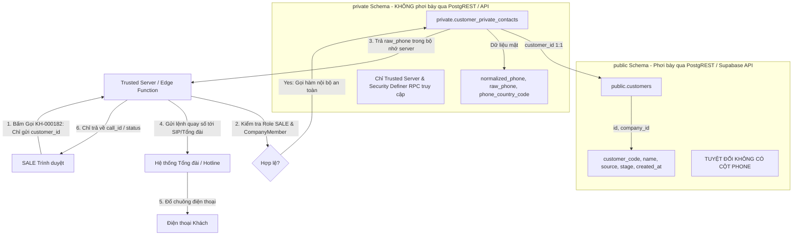

# Supabase Schema Design

Tài liệu thiết kế lược đồ cơ sở dữ liệu vật lý (Physical Schema Blueprint) trên nền tảng PostgreSQL / Supabase cho dự án **AI CRM đa kênh cho doanh nghiệp sản xuất cửa chống ngập theo đơn đặt hàng**.

Tài liệu này kế thừa và hiện thực hóa hai bản hợp đồng kiến trúc bất biến:
- [`PROJECT_MASTER.md`](file:///Users/hoangthuy/ai-crm-cua-chong-ngap/docs/PROJECT_MASTER.md) (Luật nghiệp vụ tổng thể)
- [`DATA_CONTRACT.md`](file:///Users/hoangthuy/ai-crm-cua-chong-ngap/docs/DATA_CONTRACT.md) (Quy ước dữ liệu dùng chung)

---

## 1. Scope and Principles

### 1.1. Phạm vi thiết kế
- **Giai đoạn hiện tại:** `DATA_CONTRACT → SUPABASE SCHEMA DESIGN → AUTH DESIGN → RLS DESIGN → MIGRATIONS`.
- **Mục tiêu tài liệu:** Định nghĩa toàn bộ lược đồ vật lý (physical tables, data types, constraints, indexes, isolation strategy, security boundaries) làm cơ sở chính xác để viết các tệp migration SQL ở bước tiếp theo.
- **Giới hạn nghiêm ngặt:**
  - Không sửa đổi mã nguồn ứng dụng.
  - Không tạo tệp migration SQL trong bước này.
  - Không cấu hình dự án Supabase thật.
  - Không triển khai mã lệnh RLS hay hàm SQL thật (chỉ đặc tả yêu cầu kiến trúc).
  - Không suy diễn hoặc tự ý khóa cứng các danh mục định danh phân loại chưa được phê duyệt chính thức trong `DATA_CONTRACT.md`.

### 1.2. Các nguyên tắc thiết kế cốt lõi
1. **Toàn vẹn ràng buộc khai báo (Declarative Relational Integrity):**
   - Ưu tiên tối đa các ràng buộc vật lý cấp cơ sở dữ liệu (`FOREIGN KEY`, `CHECK`, `UNIQUE`, `NOT NULL`, Partial Unique Indexes, Composite FKs) thay vì phụ thuộc hoàn toàn vào logic ứng dụng.
   - Bất biến nghiệp vụ quan trọng (ví dụ: tối đa 1 SALE active/company; đơn hàng, khảo sát, lắp đặt và bảo hành phải thống nhất cùng một khách hàng và công ty) phải được bảo vệ bằng ràng buộc quan hệ đa tầng.
2. **Bảo vệ tuyệt đối dữ liệu nhạy cảm bằng Schema cách ly (Physical Schema Separation):**
   - Số điện thoại khách hàng (cả `raw_phone` và `normalized_phone`) là dữ liệu nhạy cảm tối mật. Không chỉ dựa vào Row Level Security (RLS) ở schema công khai, bảng liên hệ nhạy cảm được đặt trong schema riêng biệt không phơi bày qua PostgREST (`private.customer_private_contacts`).
   - Tài khoản `SALE` và `TECHNICIAN` không bao giờ được phép đọc bảng liên hệ nhạy cảm này qua bất kỳ API, client query hay server preload nào.
3. **Cô lập Tenant đa doanh nghiệp sẵn sàng (Tenant Isolation Ready):**
   - Dù giai đoạn triển khai ban đầu chỉ có đúng 1 Company và 1 SALE duy nhất, toàn bộ thiết kế khóa ngoại, ràng buộc unique và chiến lược chỉ mục đều được chuẩn hóa theo `company_id`.
   - Tuyệt đối không cho phép truy vấn chéo tenant hoặc tham chiếu quan hệ giữa các công ty khác nhau.
4. **Bảo toàn lịch sử và chính sách đột biến dữ liệu (Historical Data Mutation Policy):**
   - Rõ ràng hóa ranh giới: `ON DELETE RESTRICT` chỉ ngăn chặn việc xóa bản ghi cha khi còn bản ghi con, không ngăn chặn việc xóa chính bản ghi đó. Vì vậy, hệ thống thiết lập chính sách kiểm soát đột biến dữ liệu nghiêm ngặt (Strict Append-Only, Historical Event, Stateful Non-deletable, Immutable Snapshot).
   - Bảng giá (`pricing_policies`), hợp đồng đã ký (`contracts`), kết quả tính giá (`price_calculations`) lưu lại snapshot đầy đủ và có phiên bản bất biến.
5. **Đồng bộ hóa danh tính Supabase Auth:**
   - Hồ sơ người dùng ứng dụng `user_profiles` liên kết chặt chẽ 1:1 với `auth.users` theo chuẩn Supabase Auth (`user_profiles.id = auth.users.id`), nhưng sự tồn tại của `user_profiles` không đồng nghĩa với quyền truy cập dữ liệu doanh nghiệp nếu thiếu bản ghi `company_members` hợp lệ và đang hoạt động.

---

## 2. Global Database Conventions

### 2.1. Định danh và Khóa chính (Primary Keys)
- Tất cả các bảng nghiệp vụ sử dụng kiểu dữ liệu `uuid` làm khóa chính.
- Giá trị mặc định được sinh tự động bằng hàm chuẩn của PostgreSQL: `DEFAULT gen_random_uuid()`.
- **Lý do lựa chọn:**
  - Không đoán trước được ID (ngăn chặn tấn công Insecure Direct Object References - IDOR).
  - Khả năng sinh ID an toàn phía client/server trước khi ghi cơ sở dữ liệu.
  - Tránh xung đột khóa khi hợp nhất hoặc đồng bộ dữ liệu đa chi nhánh/tenant sau này.

### 2.2. Thời gian và Múi giờ (Timestamps)
- Mọi trường lưu thời gian bắt buộc dùng kiểu `timestamptz` (Timestamp with Time Zone).
- Lưu trữ chuẩn hóa ở mức UTC tại cơ sở dữ liệu, ứng dụng chịu trách nhiệm chuyển đổi sang múi giờ hiển thị (ví dụ: `Asia/Ho_Chi_Minh` - UTC+7).
- Các bảng đều có cặp trường thời gian chuẩn:
  - `created_at timestamptz DEFAULT now() NOT NULL` (bất biến, không cập nhật).
  - `updated_at timestamptz DEFAULT now() NOT NULL` (được cập nhật tự động bằng trigger hoặc ghi nhận ứng dụng khi có thay đổi).

### 2.3. Quy ước đặt tên (Naming Conventions)
- **Tên bảng:** Viết thường, phân cách dấu gạch dưới (`snake_case`), danh từ số nhiều (ví dụ: `companies`, `customers`, `orders`, `company_members`, `payment_transactions`).
- **Tên cột:** Viết thường `snake_case`, danh từ số ít hoặc tiền tố rõ nghĩa (ví dụ: `customer_id`, `order_code`, `deposit_status`, `is_verified`).
- **Cột khóa ngoại:** `<singular_entity>_id` tham chiếu đến `id` của bảng liên kết.
- **Cờ logic (Booleans):** Đặt tên dạng vị từ tích cực như `verified`, `enabled`, `is_current`.
- **Tên ràng buộc (Constraints):**
  - Khóa chính: `pk_<table_name>`
  - Khóa ngoại: `fk_<table_name>_<ref_table>_<column>`
  - Ràng buộc duy nhất: `uq_<table_name>_<columns>`
  - Ràng buộc kiểm tra: `chk_<table_name>_<purpose>`
  - Chỉ mục: `idx_<table_name>_<columns>`

### 2.4. Trường phái sinh và Bộ đếm (Derived Counters)
- **Nguyên tắc:** Không lưu trữ dư thừa các số liệu tổng hợp hoặc bộ đếm nếu có thể truy vấn nhanh chóng trong thời gian thực, nhằm tránh hiện tượng bất đồng bộ dữ liệu.
- **Ngoại lệ được chấp thuận kiến trúc:**
  - `conversations.unread_count`: Cần thiết để render giao diện hộp thư thời gian thực cực nhanh cho SALE mà không cần đếm toàn bộ dòng tương tác. Phải có quy trình đối soát định kỳ.
  - `care_campaigns.sent_count`, `delivered_count`, `response_count`, `converted_to_sale_count`: Được cập nhật tổng hợp từ bảng `care_deliveries` và phải luôn đối soát được từ các bản ghi chi tiết này.
  - `finance_summaries`: Bảng tổng hợp tài chính phục vụ Sếp/Admin quản trị và báo cáo, được đồng bộ từ `contracts`, `payment_transactions` và tiến độ lắp đặt.

### 2.5. Chính sách đột biến dữ liệu lịch sử (Historical Data Mutation Policy)
Khóa ngoại với hành vi `ON DELETE RESTRICT` chỉ bảo đảm tính toàn vẹn khi có bảng con tham chiếu, **hoàn toàn không ngăn cản được lệnh `DELETE` trực tiếp trên chính bảng đó nếu không có quan hệ con**. Do đó, toàn bộ 29 bảng vật lý được phân loại vào 4 nhóm chính sách quản lý đột biến dữ liệu:

1. **Nhóm A — Strict Append-Only (Chỉ thêm mới tuyệt đối):**
   - *Bảng áp dụng:* `audit_logs`, `customer_stage_histories`.
   - *Quy tắc:* Tuyệt đối cấm thao tác `UPDATE` và `DELETE` từ ứng dụng. Mọi sự kiện mới chỉ được `INSERT`. Sẽ được bảo vệ bằng việc không cấp quyền `UPDATE`/`DELETE` cho các DB roles của ứng dụng và kích hoạt trigger phòng thủ chặn xóa/sửa.
2. **Nhóm B — Source/Historical Event Records (Bản ghi sự kiện nguồn và lịch sử):**
   - *Bảng áp dụng:* `interactions`, `ai_analyses`, `call_transcripts`.
   - *Quy tắc:* Nội dung gốc không được phép ghi đè ngầm làm mất dấu vết. Mọi sự điều chỉnh (nếu có từ nhà mạng hoặc sửa tin) phải giữ nguyên bản ghi gốc hoặc ghi nhận qua cơ chế version/audit. Cấm `DELETE` cứng từ client.
3. **Nhóm C — Stateful Non-Deletable Records (Bản ghi tiến trình có trạng thái, cấm xóa cứng):**
   - *Bảng áp dụng:* `customers`, `orders`, `payment_transactions`, `care_deliveries`, `calls`, `call_attempts`, `appointments`, `surveys`, `installations`, `warranty_tickets`, `company_members`.
   - *Quy tắc:* Các trường trạng thái (`status`, `stage`, `result`) được phép tịnh tiến theo luồng nghiệp vụ hợp lệ. Tuy nhiên, thao tác `DELETE` dòng vật lý bị nghiêm cấm hoàn toàn trong ứng dụng. Khi ngừng sử dụng hoặc hủy bỏ, chuyển trạng thái sang `CANCELLED`, `INACTIVE` hoặc `LOST`.
4. **Nhóm D — Immutable Snapshots After Finalization/Use (Bản chụp bất biến sau khi phát hành/sử dụng):**
   - *Bảng áp dụng:* `price_calculations`, toàn bộ các bản sửa đổi đã ký của `contracts` (`signed_file_ref IS NOT NULL`, bất kể là phiên bản hiện hành hay đã bị thay thế khi `is_current = false` hoặc `status = 'SUPERSEDED'`), các phiên bản bảng giá đã kích hoạt của `pricing_policies` (`status = 'ACTIVE'`).
   - *Quy tắc:* Khi đã được sử dụng làm căn cứ cho đơn hàng hoặc đã có hiệu lực pháp lý, toàn bộ thông số đầu vào và quy tắc tính toán bị đóng băng vĩnh viễn. Muốn thay đổi phải tạo bản ghi mới (revision mới hoặc policy version mới).
   - *Quy tắc bảo vệ hợp đồng đã ký:* Với các bản ghi `contracts` có `signed_file_ref IS NOT NULL`, các trường cốt lõi sau bắt buộc bất biến tuyệt đối sau khi ký: `revision_no`, `template_version`, `generated_file_ref`, `signed_file_ref`, `contract_value`, `signed_at`, `company_id`, `order_id`. Siêu dữ liệu vòng đời (`is_current`, `status`) chỉ được phép thay đổi qua các bước chuyển trạng thái vòng đời hợp lệ (ví dụ: đánh dấu superseded khi tạo revision N+1 mới).

---

## 3. Security Boundary for Sensitive Customer Data

### 3.1. Bối cảnh và Thách thức kiến trúc
Theo quy tắc tối cao tại `PROJECT_MASTER.md` (Mục 14 & 15) và `DATA_CONTRACT.md`:
- **SALE** và **TECHNICIAN** tuyệt đối **KHÔNG ĐƯỢC PHÉP** tiếp cận số điện thoại thật (`raw_phone`) của khách hàng dưới mọi hình thức:
  - Truy vấn trực tiếp cơ sở dữ liệu (`SELECT`).
  - Dữ liệu trả về qua REST API / Supabase Client SDK / PostgREST.
  - Cấu trúc JSON, dữ liệu tải trước trang (SSR server-preloaded page data), browser state.
  - Tệp xuất dữ liệu (export), logs hệ thống, thông báo lỗi.
- **Tính nhạy cảm của số điện thoại chuẩn hóa (`normalized_phone`):**
  - Số điện thoại chuẩn hóa vẫn là dữ liệu định danh cá nhân trực tiếp (PII), có thể dùng để tra cứu, spam hoặc liên hệ ngoài luồng. Do đó, `normalized_phone` cũng thuộc phạm vi bảo vệ nghiêm ngặt như `raw_phone`, không được phơi bày cho SALE.

### 3.2. Giải pháp kiến trúc: Phân tách Schema vật lý không công khai (Non-Exposed Schema)
Thay vì chỉ đặt bảng liên hệ trong schema `public` rồi dựa hoàn toàn vào RLS (dễ bị rò rỉ nếu phân quyền grant sai sót), hệ thống thiết lập ranh giới phòng thủ chiều sâu (Defense-in-Depth):



1. **Bảng `public.customers` (CRM-Visible Profile):**
   - Chứa thông tin nghiệp vụ cơ bản: `id`, `company_id`, `customer_code`, `name`, `source`, `stage`, `created_at`, `updated_at`.
   - **Hoàn toàn KHÔNG CÓ cột `phone`, `raw_phone` hay `normalized_phone`.**
   - Bất kỳ truy vấn `SELECT * FROM customers` nào từ tài khoản `SALE` hay `TECHNICIAN` đều không thể làm lộ số điện thoại.
2. **Bảng `private.customer_private_contacts` (Protected Contact Store):**
   - Nằm trong schema `private` riêng biệt. PostgREST mặc định chỉ expose schema `public`, do đó bảng này hoàn toàn vô hình trước các truy vấn trực tiếp từ trình duyệt qua Supabase Client SDK.
   - Không cấp bất kỳ quyền (`GRANT`) nào cho các vai trò `anon` hay `authenticated`.
   - Chỉ có dịch vụ máy chủ tin cậy (Next.js Server Actions / API Routes chạy bằng Service Role Key) hoặc các hàm PostgreSQL chuyên biệt (`SECURITY DEFINER`) mới có quyền truy vấn.
3. **Quy tắc cho hàm xử lý cuộc gọi và quyền xem của Sếp:**
   - Các hàm `SECURITY DEFINER` truy cập vào `private.customer_private_contacts` bắt buộc phải thiết lập tường minh `SET search_path = private, pg_temp` và định danh đầy đủ schema của đối tượng để chống tấn công search_path injection.
   - Khi SALE bấm gọi: Hàm chỉ trả về kết quả vận hành (ví dụ: `call_id`, `status = 'INITIATED'`), **tuyệt đối không trả về chuỗi số điện thoại**.
   - Quyền xem số điện thoại thật của `BOSS_ADMIN` phải thông qua API riêng có ghi vết bắt buộc vào `audit_logs`.
4. **Bảo vệ danh tính liên hệ trong bảng `identities` bằng Keyed HMAC:**
   - Trường hợp `channel = 'phone'`: Cột `external_id` **bắt buộc không được lưu chuỗi số điện thoại thô hay số chuẩn hóa**.
   - Phải lưu dạng **Keyed HMAC (HMAC-SHA256 với secret key được quản lý tập trung ở máy chủ tin cậy)**.
   - Secret key của HMAC tuyệt đối không được chuyển xuống trình duyệt, không commit vào repository, không ghi log, và phải có kế hoạch xoay vòng khóa (key rotation).
   - Dữ liệu đầu vào của hàm tính HMAC bắt buộc phải là kết quả của thuật toán chuẩn hóa số điện thoại thống nhất (xem Open Decision 01).
   - Trường `identities.metadata` tuyệt đối cấm chứa `raw_phone` hoặc `normalized_phone`.

---

## 4. Supabase Auth / User Identity Model

### 4.1. Mối quan hệ giữa `auth.users` và `user_profiles`
Hệ thống sử dụng Supabase Auth để quản lý xác thực tài khoản (email, password, sessions, OAuth tokens).
Hồ sơ người dùng ứng dụng được định nghĩa tại bảng `public.user_profiles`:
- **Định danh khóa chính:** `user_profiles.id` mang kiểu `uuid`.
- **Liên kết khóa ngoại:** `user_profiles.id` tham chiếu trực tiếp đến `auth.users.id`.
- **Hành vi xóa (`ON DELETE`):**
  - Khuyến nghị: `ON DELETE RESTRICT`.
  - **Lý do kiến trúc:** Trong hệ thống CRM sản xuất theo đơn, các thực thể kinh doanh cốt lõi (như `interactions.actor_user_id`, `surveys.completed_by`, `audit_logs.user_id`) đều tham chiếu đến `user_profiles.id`. Nếu xóa cứng một user trong `auth.users`, việc xóa lan truyền (`CASCADE`) sẽ phá hủy tính toàn vẹn của lịch sử kiểm toán hoặc để lại dữ liệu mồ côi. Do đó, hệ thống cấm xóa cứng tài khoản người dùng đã có phát sinh giao dịch; khi nhân sự nghỉ việc, tài khoản chỉ được chuyển trạng thái: `user_profiles.status = 'INACTIVE'` và `company_members.status = 'INACTIVE'`.

### 4.2. Cơ chế khởi tạo hồ sơ (Profile Provisioning)
- Khi một người dùng mới được tạo trong `auth.users` qua giao diện quản trị Supabase hoặc API mời thành viên:
  - Một trigger PostgreSQL (`on_auth_user_created`) lắng nghe sự kiện `AFTER INSERT ON auth.users`.
  - Trigger này tự động chèn một bản ghi tương ứng vào `public.user_profiles` với:
    - `id = NEW.id`
    - `full_name = COALESCE(NEW.raw_user_meta_data->>'full_name', 'Thành viên mới')`
    - `status = 'ACTIVE'`

### 4.3. Ranh giới giữa Xác thực (Auth) và Ủy quyền (Authorization)
- Bản thân việc một người dùng tồn tại trong `auth.users` và có `user_profiles` **KHÔNG TỰ ĐỘNG CẤP BẤT KỲ QUYỀN HẠN NÀO** đối với dữ liệu của một doanh nghiệp.
- Mọi quyền truy cập dữ liệu nghiệp vụ bắt buộc phải thông qua bảng trung gian `company_members`:
  - Người dùng phải có liên kết: `user_profiles.id → company_members.user_id`.
  - Bản ghi `company_members` phải thỏa mãn: `company_id = <target_company>` VÀ `status = 'ACTIVE'`.
  - Thuộc tính `company_members.role` (`BOSS_ADMIN`, `SALE`, `TECHNICIAN`) quyết định ma trận quyền logic (theo hợp đồng `AccessPolicy`).

### 4.4. Ràng buộc cứng: Tối đa 1 SALE active trong mỗi Company
Yêu cầu nghiệp vụ bất biến (`PROJECT_MASTER.md` Mục 6):
- Mỗi doanh nghiệp chỉ có tối đa 1 nhân viên SALE hoạt động tại một thời điểm.
- Không chia khách, không phân phối lead cho nhiều sale trong cùng company.
- **Hiện thực hóa cấp cơ sở dữ liệu:** Không chỉ kiểm tra bằng mã nguồn ứng dụng, cơ sở dữ liệu PostgreSQL sử dụng **Chỉ mục bộ phận duy nhất (Partial Unique Index)** để bảo đảm tính toàn vẹn tuyệt đối kể cả khi có race conditions:
```sql
CREATE UNIQUE INDEX uq_company_members_single_active_sale
ON company_members (company_id)
WHERE role = 'SALE' AND status = 'ACTIVE';
```

### 4.5. Chiến lược ràng buộc Thẩm quyền Thành viên và Vai trò (Membership & Role Enforcement)
Trong PostgreSQL, khóa ngoại thông thường `FOREIGN KEY (user_id) REFERENCES user_profiles(id)` chỉ chứng minh được tính định danh toàn cục (Identity), hoàn toàn **KHÔNG CHỨNG MINH ĐƯỢC**:
- Người dùng có phải là thành viên của Company đó hay không.
- Trạng thái thành viên có đang `ACTIVE` hay không.
- Người dùng có đúng vai trò (`role`) nghiệp vụ yêu cầu hay không.

Vì `user_profiles` là bảng dùng chung không gắn cứng với một `company_id`, việc kiểm tra thẩm quyền thành viên và vai trò được thiết kế chặt chẽ qua các **Database Triggers kiểm tra trước khi ghi (`BEFORE INSERT OR UPDATE`)**:
- **Nguyên tắc kích hoạt trigger:** Trigger chỉ kiểm tra khi:
  1. Thao tác `INSERT` có chỉ định người dùng nội bộ.
  2. Thao tác `UPDATE` làm thay đổi trường tham chiếu người dùng (`assigned_to`, `assignee_id`, `completed_by`, `actor_user_id`, `sale_user_id`).
  3. Thao tác `UPDATE` làm thay đổi `company_id` hoặc trường phân loại vai trò (`actor_type`).
  *Trigger tuyệt đối không kiểm tra lại mù quáng trên mọi thao tác UPDATE các trường dữ liệu thông thường khác.*

**Quy tắc kiểm tra cụ thể theo từng thực thể:**
1. **`conversations.assigned_to`:** Khi gán hoặc đổi người phụ trách, kiểm tra người được giao có bản ghi trong `company_members` với `company_id = NEW.company_id`, `role = 'SALE'` và `status = 'ACTIVE'`.
2. **`appointments.assignee_id`:** Khi phân công hoặc đổi kỹ thuật viên, kiểm tra người được giao có bản ghi trong `company_members` với `company_id = NEW.company_id`, `role = 'TECHNICIAN'` và `status = 'ACTIVE'`.
3. **`surveys.completed_by`:** Khi ghi nhận hoàn tất khảo sát, kiểm tra người hoàn tất có bản ghi trong `company_members` với `company_id = NEW.company_id`, `role = 'TECHNICIAN'` và `status = 'ACTIVE'`.
4. **`interactions.actor_user_id`:**
   - Nếu `actor_type = 'SALE'`: `actor_user_id` bắt buộc `NOT NULL` và phải là `CompanyMember` có `role = 'SALE'`, `status = 'ACTIVE'` trong cùng Company tại thời điểm tạo.
   - Nếu `actor_type = 'TECHNICIAN'`: `actor_user_id` bắt buộc `NOT NULL` và phải là `CompanyMember` có `role = 'TECHNICIAN'`, `status = 'ACTIVE'` trong cùng Company tại thời điểm tạo.
   - Nếu `actor_type IN ('CUSTOMER', 'SYSTEM')`: `actor_user_id` bắt buộc phải là `NULL`.
   - Nếu `actor_type = 'AI'`: `actor_user_id` mặc định là `NULL`.
5. **`warranty_tickets.assigned_to`:** Khi gán hoặc đổi kỹ thuật viên bảo hành, kiểm tra người được giao có bản ghi trong `company_members` với `company_id = NEW.company_id`, `role = 'TECHNICIAN'` (hoặc vai trò được ủy quyền) và `status = 'ACTIVE'`.
6. **`sales_style_profiles.sale_user_id`:** Khi tạo hoặc đổi hồ sơ phong cách, kiểm tra người dùng phải là `CompanyMember` có `role = 'SALE'` và `status = 'ACTIVE'` trong cùng Company.
7. **`audit_logs.user_id`:** Đại diện cho danh tính tác nhân lịch sử. Không áp đặt cố định một role `SALE` hay `TECHNICIAN`. Nếu `user_id IS NOT NULL`, kiểm tra người thực hiện là tác nhân hợp lệ của sự kiện theo đường ghi dữ liệu được ủy quyền.

**Bất biến bảo toàn lịch sử (Historical Preservation Invariant):**
- Khi một thành viên sau đó chuyển sang `status = 'INACTIVE'`, toàn bộ các bản ghi lịch sử trong quá khứ (`interactions.actor_user_id`, `surveys.completed_by`, `appointments.assignee_id`, `conversations.assigned_to`, `audit_logs.user_id`) **tuyệt đối không bị xóa, không bị null hóa và không bị cascade**.
- Trạng thái thành viên hiện tại không bao giờ được dùng để viết lại hoặc làm mất dấu vết tác nhân trong lịch sử.

---

## 5. Tenant / Company Isolation Strategy

### 5.1. Phân loại phạm vi công ty (Company Scope Classification)
Mỗi bảng vật lý trong cơ sở dữ liệu được xếp vào một trong ba nhóm chiến lược:

1. **DIRECT COMPANY SCOPE (Phạm vi công ty trực tiếp):**
   - Bảng chứa cột `company_id uuid NOT NULL REFERENCES companies(id)`.
   - Áp dụng cho: `company_members`, `customers`, `private.customer_private_contacts`, `customer_stage_histories`, `identities`, `interactions`, `conversations`, `calls`, `call_attempts`, `appointments`, `surveys`, `pricing_policies`, `price_calculations`, `payment_transactions`, `orders`, `contracts`, `production_orders`, `installations`, `finance_summaries`, `care_campaigns`, `care_deliveries`, `care_schedules`, `ai_analyses`, `sales_style_profiles`, `warranty_tickets`, `audit_logs`.
2. **INFERRED COMPANY SCOPE (Phạm vi công ty suy diễn qua quan hệ cha):**
   - Về mặt lý thuyết ở `DATA_CONTRACT.md`, một số thực thể con như `contracts`, `production_orders`, `installations`, `finance_summaries`, `call_transcripts` có thể suy diễn company qua `order_id` hoặc `call_id`.
   - **Đánh giá thiết kế schema vật lý:** Toàn bộ các bảng này đều được bổ sung cột `company_id NOT NULL` trực tiếp để tối ưu hóa hiệu năng RLS và thiết lập các ràng buộc khóa ngoại phức hợp (`Composite Foreign Keys`) bảo vệ dữ liệu không bị trỏ nhầm công ty.
3. **NO BUSINESS COMPANY SCOPE (Không thuộc phạm vi công ty cụ thể):**
   - Áp dụng duy nhất cho bảng `user_profiles` (vì một tài khoản auth có thể được mời tham gia vào nhiều doanh nghiệp theo thời gian). Bảng `companies` đóng vai trò là gốc phân vùng (Tenant Root).

### 5.2. Kỹ thuật ngăn chặn tham chiếu chéo công ty và chéo khách hàng
Để bảo đảm toàn vẹn ở cấp cơ sở dữ liệu mà không cần viết trigger thủ công:
1. Các bảng cha định nghĩa các khóa ràng buộc duy nhất phức hợp:
   - `customers`: `UNIQUE (company_id, id)`
   - `orders`: `UNIQUE (company_id, id)` và `UNIQUE (company_id, customer_id, id)`
   - `appointments`: `UNIQUE (company_id, customer_id, id)`
   - `surveys`: `UNIQUE (company_id, customer_id, id)`
   - `pricing_policies`: `UNIQUE (company_id, id, version)`
   - `price_calculations`: `UNIQUE (company_id, customer_id, id)`
   - `installations`: `UNIQUE (company_id, customer_id, order_id, id)`
2. Các bảng con sử dụng Composite Foreign Keys tham chiếu tương ứng:
   ```sql
   -- Ví dụ: Đơn hàng bắt buộc phải trỏ đúng phép tính giá của cùng một Khách hàng và Công ty
   FOREIGN KEY (company_id, customer_id, price_calculation_id)
   REFERENCES price_calculations (company_id, customer_id, id)
   ON DELETE RESTRICT;
   ```

---

## 6. Physical Table Catalog

Hệ thống bao gồm **29 bảng vật lý** hoàn chỉnh (28 bảng thuộc schema `public` + 1 bảng `customer_private_contacts` thuộc schema `private`). Thực thể logic `AccessPolicy` được hiện thực hóa qua ma trận phân quyền, hàm kiểm tra và RLS, không tạo bảng vật lý dư thừa.

---

### 6.1. Bảng `companies`
- **Purpose:** Đại diện cho doanh nghiệp sản xuất/kinh doanh, là gốc phân vùng tenant tối cao của toàn bộ hệ thống.
- **Tenant Scope:** Gốc Tenant (Tenant Root).
- **Sensitive Classification:** Dữ liệu cấu hình doanh nghiệp nội bộ.
- **ON DELETE Behavior:** `ON DELETE RESTRICT`.

| Column | Type | Null | Default | Constraint | Notes |
|--------|------|------|---------|------------|-------|
| `id` | `uuid` | NOT NULL | `gen_random_uuid()` | PK | Định danh duy nhất của doanh nghiệp |
| `name` | `text` | NOT NULL | | | Tên pháp lý hoặc tên thương mại của doanh nghiệp |
| `status` | `text` | NOT NULL | `'ACTIVE'` | CHECK (`status IN ('ACTIVE', 'SUSPENDED', 'INACTIVE')`) [PROPOSED] | Trạng thái hoạt động của doanh nghiệp |
| `created_at` | `timestamptz` | NOT NULL | `now()` | | Thời điểm tạo |
| `updated_at` | `timestamptz` | NOT NULL | `now()` | | Thời điểm cập nhật gần nhất |

- **Constraints & Indexes:**
  - PK: `pk_companies` (`id`)
  - Index: `idx_companies_status` (`status`)
- **Invariants:** Mỗi hệ thống hiện tại có đúng 1 Company đang kích hoạt.

---

### 6.2. Bảng `user_profiles`
- **Purpose:** Hồ sơ người dùng ứng dụng gắn với tài khoản đăng nhập Supabase Auth.
- **Tenant Scope:** NO BUSINESS COMPANY SCOPE.
- **Sensitive Classification:** Thông tin cá nhân người dùng nội bộ.
- **ON DELETE Behavior:** `ON DELETE RESTRICT` từ các bảng nghiệp vụ.

| Column | Type | Null | Default | Constraint | Notes |
|--------|------|------|---------|------------|-------|
| `id` | `uuid` | NOT NULL | | PK, FK `auth.users(id)` | Khóa chính khớp 1:1 với tài khoản Supabase Auth |
| `full_name` | `text` | NOT NULL | | | Họ và tên hiển thị trong CRM |
| `status` | `text` | NOT NULL | `'ACTIVE'` | CHECK (`status IN ('ACTIVE', 'INACTIVE')`) [PROPOSED] | Trạng thái hồ sơ người dùng |
| `created_at` | `timestamptz` | NOT NULL | `now()` | | Thời điểm tạo hồ sơ |
| `updated_at` | `timestamptz` | NOT NULL | `now()` | | Thời điểm cập nhật hồ sơ |

- **Constraints & Indexes:**
  - PK: `pk_user_profiles` (`id`)
  - FK: `fk_user_profiles_auth_users` (`id`) REFERENCES `auth.users(id)` ON DELETE RESTRICT
  - Index: `idx_user_profiles_status` (`status`)
- **Invariants:** Không lưu trữ mật khẩu, secret hay quyền hạn trong bảng này.

---

### 6.3. Bảng `company_members`
- **Purpose:** Xác định tư cách thành viên, vai trò (role) và thẩm quyền của người dùng trong một doanh nghiệp cụ thể.
- **Tenant Scope:** DIRECT COMPANY SCOPE.
- **Sensitive Classification:** Cấu hình ủy quyền truy cập (Authorization Anchor).
- **ON DELETE Behavior:** `ON DELETE RESTRICT`.

| Column | Type | Null | Default | Constraint | Notes |
|--------|------|------|---------|------------|-------|
| `id` | `uuid` | NOT NULL | `gen_random_uuid()` | PK | Định danh tư cách thành viên |
| `company_id` | `uuid` | NOT NULL | | FK `companies(id)` | Doanh nghiệp trực thuộc |
| `user_id` | `uuid` | NOT NULL | | FK `user_profiles(id)` | Người dùng tương ứng |
| `role` | `text` | NOT NULL | | CHECK (`role IN ('BOSS_ADMIN', 'SALE', 'TECHNICIAN')`) [FROZEN] | Vai trò trong doanh nghiệp |
| `status` | `text` | NOT NULL | `'ACTIVE'` | CHECK (`status IN ('ACTIVE', 'INACTIVE')`) (`ACTIVE` là [FROZEN]) | Trạng thái thành viên |
| `created_at` | `timestamptz` | NOT NULL | `now()` | | Thời điểm gia nhập |

- **Constraints & Indexes:**
  - PK: `pk_company_members` (`id`)
  - FK: `fk_company_members_company` (`company_id`) REFERENCES `companies(id)` ON DELETE RESTRICT
  - FK: `fk_company_members_user` (`user_id`) REFERENCES `user_profiles(id)` ON DELETE RESTRICT
  - UNIQUE: `uq_company_members_company_user` (`company_id`, `user_id`)
  - Partial Unique Index: `uq_company_members_single_active_sale` UNIQUE (`company_id`) WHERE `role = 'SALE' AND status = 'ACTIVE'`
  - Index: `idx_company_members_lookup` (`user_id`, `company_id`, `status`)
- **Invariants:** Một user chỉ có 1 membership trong 1 company. Mỗi company chỉ có tối đa 1 SALE active (`status = 'ACTIVE'`).

---

### 6.4. Bảng `customers`
- **Purpose:** Hồ sơ khách hàng trung tâm an toàn (CRM Safe Profile), điểm hội tụ mọi hành trình đa kênh.
- **Tenant Scope:** DIRECT COMPANY SCOPE.
- **Sensitive Classification:** Dữ liệu khách hàng định danh (đã loại bỏ số điện thoại thô).
- **ON DELETE Behavior:** `ON DELETE RESTRICT`.

| Column | Type | Null | Default | Constraint | Notes |
|--------|------|------|---------|------------|-------|
| `id` | `uuid` | NOT NULL | `gen_random_uuid()` | PK | Định danh nội bộ của khách hàng |
| `company_id` | `uuid` | NOT NULL | | FK `companies(id)` | Doanh nghiệp sở hữu khách hàng |
| `customer_code` | `text` | NOT NULL | | | Mã khách hàng dễ đọc, ví dụ: `KH-000182` (Cơ chế sinh là Open Decision 03) |
| `name` | `text` | NOT NULL | | | Tên khách hàng |
| `source` | `text` | NOT NULL | | CHECK (`source IN ('FACEBOOK', 'ZALO', 'WEBSITE', 'HOTLINE', 'ADVERTISING', 'MANUAL')`) [PROPOSED] | Nguồn tiếp nhận ban đầu |
| `stage` | `text` | NOT NULL | | | Giai đoạn hành trình hiện tại (Danh mục và giá trị khởi tạo là PROPOSED - xem Open Decision 07) |
| `created_at` | `timestamptz` | NOT NULL | `now()` | | Thời điểm tạo hồ sơ |
| `updated_at` | `timestamptz` | NOT NULL | `now()` | | Thời điểm cập nhật gần nhất |

- **Constraints & Indexes:**
  - PK: `pk_customers` (`id`)
  - FK: `fk_customers_company` (`company_id`) REFERENCES `companies(id)` ON DELETE RESTRICT
  - UNIQUE: `uq_customers_company_code` (`company_id`, `customer_code`)
  - Composite Unique: `uq_customers_company_id` (`company_id`, `id`)
  - Indexes:
    - `idx_customers_company_stage` (`company_id`, `stage`)
    - `idx_customers_company_name_trgm` (Chỉ mục tìm kiếm tên nhanh bằng GIN)
- **Invariants:**
  - Hoàn toàn không chứa trường `phone`, `raw_phone` hay `normalized_phone`.
  - `customer_code` là bất biến sau khi cấp, duy nhất trong Company, không tái sử dụng, không chứa dữ liệu nhạy cảm, cơ chế sinh an toàn trước race condition (chi tiết tại Open Decision 03).

---

### 6.5. Bảng `private.customer_private_contacts`
- **Purpose:** Vùng lưu trữ thông tin liên lạc nhạy cảm tối mật của khách hàng, đặt trong PostgreSQL schema `private` không phơi bày qua Data API/PostgREST.
- **Tenant Scope:** DIRECT COMPANY SCOPE.
- **Sensitive Classification:** DỮ LIỆU TỐI MẬT (Strictly Confidential - Restricted).
- **ON DELETE Behavior:** `ON DELETE RESTRICT`.

| Column | Type | Null | Default | Constraint | Notes |
|--------|------|------|---------|------------|-------|
| `id` | `uuid` | NOT NULL | `gen_random_uuid()` | PK | Định danh bản ghi liên hệ |
| `company_id` | `uuid` | NOT NULL | | FK `companies(id)` | Doanh nghiệp quản lý |
| `customer_id` | `uuid` | NOT NULL | | FK `customers(id)`, UNIQUE | Khách hàng tương ứng (quan hệ 1:1) |
| `normalized_phone` | `text` | NOT NULL | | | Số điện thoại chuẩn hóa phục vụ chống trùng (Thuật toán là Open Decision 01) |
| `raw_phone` | `text` | NOT NULL | | | Số điện thoại thô dùng cho tổng đài |
| `phone_country_code` | `text` | NOT NULL | `'VN'` | | Mã quốc gia |
| `is_verified` | `boolean` | NOT NULL | `false` | | Đã gọi xác thực thành công hay chưa |
| `created_at` | `timestamptz` | NOT NULL | `now()` | | Thời điểm tạo |
| `updated_at` | `timestamptz` | NOT NULL | `now()` | | Thời điểm cập nhật |

- **Constraints & Indexes:**
  - PK: `pk_customer_private_contacts` (`id`)
  - FK Phức hợp: `fk_cpc_customer` (`company_id`, `customer_id`) REFERENCES public.customers(`company_id`, `id`) ON DELETE RESTRICT
  - UNIQUE: `uq_cpc_customer_id` (`customer_id`)
  - UNIQUE theo Tenant: `uq_cpc_company_normalized_phone` (`company_id`, `normalized_phone`)
- **Invariants:**
  - Nằm trong schema `private`, không có quyền cho `anon`/`authenticated`.
  - Cả `raw_phone` và `normalized_phone` đều là dữ liệu bảo mật tối mật. Chỉ máy chủ tin cậy và RPC bảo mật được đọc.

---

### 6.6. Bảng `customer_stage_histories`
- **Purpose:** Lưu trữ dấu vết biến đổi hành trình khách hàng (`Customer.stage`), áp dụng chính sách Strict Append-Only.
- **Tenant Scope:** DIRECT COMPANY SCOPE.
- **Sensitive Classification:** Lịch sử nghiệp vụ nội bộ.
- **ON DELETE Behavior:** `ON DELETE RESTRICT`.

| Column | Type | Null | Default | Constraint | Notes |
|--------|------|------|---------|------------|-------|
| `id` | `uuid` | NOT NULL | `gen_random_uuid()` | PK | Định danh bản ghi lịch sử |
| `company_id` | `uuid` | NOT NULL | | FK `companies(id)` | Doanh nghiệp |
| `customer_id` | `uuid` | NOT NULL | | FK `customers(id)` | Khách hàng được cập nhật |
| `from_stage` | `text` | NULL | | | Trạng thái trước khi đổi (null nếu mới tạo) |
| `to_stage` | `text` | NOT NULL | | | Trạng thái mới áp dụng |
| `actor_type` | `text` | NOT NULL | | CHECK (`actor_type IN ('USER', 'AI', 'SYSTEM')`) [PROPOSED] | Loại tác nhân gây ra thay đổi |
| `changed_by_user_id` | `uuid` | NULL | | FK `user_profiles(id)` | Người thực hiện nếu là user (xem Section 4.5) |
| `reason` | `text` | NOT NULL | | | Lý do chuyển trạng thái |
| `source_ref` | `text` | NULL | | | Tham chiếu nguồn (ví dụ: `call_id`, `order_id`) |
| `changed_at` | `timestamptz` | NOT NULL | `now()` | | Thời điểm có hiệu lực |

- **Constraints & Indexes:**
  - PK: `pk_customer_stage_histories` (`id`)
  - FK Phức hợp: `fk_csh_customer` (`company_id`, `customer_id`) REFERENCES customers(`company_id`, `id`) ON DELETE RESTRICT
  - FK: `fk_csh_user` (`changed_by_user_id`) REFERENCES user_profiles(`id`) ON DELETE RESTRICT
  - Index: `idx_csh_customer_time` (`company_id`, `customer_id`, `changed_at` DESC)
- **Invariants:** Thuộc nhóm Strict Append-Only: cấm `UPDATE` và `DELETE` từ ứng dụng.

---

### 6.7. Bảng `identities`
- **Purpose:** Liên kết khách hàng trung tâm với danh tính trên các kênh liên lạc ngoài (Zalo, Facebook, Web session).
- **Tenant Scope:** DIRECT COMPANY SCOPE.
- **Sensitive Classification:** Dữ liệu định danh kênh ngoài.
- **ON DELETE Behavior:** `ON DELETE RESTRICT`.

| Column | Type | Null | Default | Constraint | Notes |
|--------|------|------|---------|------------|-------|
| `id` | `uuid` | NOT NULL | `gen_random_uuid()` | PK | Định danh bản ghi danh tính |
| `company_id` | `uuid` | NOT NULL | | FK `companies(id)` | Doanh nghiệp |
| `customer_id` | `uuid` | NOT NULL | | FK `customers(id)` | Khách hàng trung tâm liên kết |
| `channel` | `text` | NOT NULL | | CHECK (`channel IN ('ZALO', 'FACEBOOK', 'WEBSITE', 'PHONE')`) [PROPOSED] | Kênh cung cấp danh tính |
| `external_id` | `text` | NOT NULL | | | ID ngoài hệ thống (Zalo UID, FB PSID, Session ID) |
| `verified` | `boolean` | NOT NULL | `false` | | Đã được kiểm chứng chắc chắn hay chưa |
| `metadata` | `jsonb` | NOT NULL | `'{}'::jsonb` | | Metadata nguồn (tên tài khoản, avatar) |
| `created_at` | `timestamptz` | NOT NULL | `now()` | | Thời điểm tạo |
| `updated_at` | `timestamptz` | NOT NULL | `now()` | | Thời điểm cập nhật |

- **Constraints & Indexes:**
  - PK: `pk_identities` (`id`)
  - FK Phức hợp: `fk_identities_customer` (`company_id`, `customer_id`) REFERENCES customers(`company_id`, `id`) ON DELETE RESTRICT
  - UNIQUE: `uq_identities_channel_external` (`company_id`, `channel`, `external_id`)
- **Invariants:** Nếu `channel = 'PHONE'`, `external_id` bắt buộc phải là Keyed HMAC của số điện thoại chuẩn hóa. `metadata` tuyệt đối cấm chứa `raw_phone` hoặc `normalized_phone`.

---

### 6.8. Bảng `interactions`
- **Purpose:** Dòng sự kiện tương tác Customer 360 (tin nhắn, sự kiện cuộc gọi, ghi chú, cập nhật trạng thái).
- **Tenant Scope:** DIRECT COMPANY SCOPE.
- **Sensitive Classification:** Nội dung giao tiếp khách hàng (chứa hội thoại, phản hồi).
- **ON DELETE Behavior:** `ON DELETE RESTRICT`.

| Column | Type | Null | Default | Constraint | Notes |
|--------|------|------|---------|------------|-------|
| `id` | `uuid` | NOT NULL | `gen_random_uuid()` | PK | Định danh tương tác |
| `company_id` | `uuid` | NOT NULL | | FK `companies(id)` | Doanh nghiệp sở hữu |
| `customer_id` | `uuid` | NOT NULL | | FK `customers(id)` | Khách hàng liên quan |
| `conversation_id` | `uuid` | NULL | | FK phức hợp `conversations` | Hội thoại nguồn nếu là tin nhắn inbox (phải cùng Company & Customer) |
| `channel` | `text` | NOT NULL | | CHECK (`channel IN ('ZALO', 'FACEBOOK', 'WEBSITE', 'PHONE', 'AI_VOICE')`) [PROPOSED] | Kênh tương tác |
| `type` | `text` | NOT NULL | | CHECK (`type IN ('MESSAGE', 'CALL_EVENT', 'NOTE', 'STATUS_EVENT', 'APPOINTMENT_EVENT')`) [PROPOSED] | Loại tương tác |
| `direction` | `text` | NOT NULL | | CHECK (`direction IN ('INBOUND', 'OUTBOUND')`) [PROPOSED] | Chiều tương tác |
| `content` | `text` | NOT NULL | | | Nội dung chi tiết tương tác |
| `external_ref` | `text` | NULL | | | Mã tham chiếu nguồn chống ghi trùng |
| `actor_type` | `text` | NOT NULL | | CHECK (`actor_type IN ('CUSTOMER', 'SALE', 'TECHNICIAN', 'AI', 'SYSTEM')`) [PROPOSED] | Loại chủ thể thực hiện |
| `actor_user_id` | `uuid` | NULL | | FK `user_profiles(id)` | Người dùng nội bộ nếu là SALE/TECH (Kiểm tra thẩm quyền qua trigger) |
| `created_at` | `timestamptz` | NOT NULL | `now()` | | Thời điểm tương tác xảy ra |

- **Constraints & Indexes:**
  - PK: `pk_interactions` (`id`)
  - FK Phức hợp Customer: `fk_interactions_customer` (`company_id`, `customer_id`) REFERENCES customers(`company_id`, `id`) ON DELETE RESTRICT
  - FK Phức hợp Conversation: `fk_interactions_conversation` (`company_id`, `customer_id`, `conversation_id`) REFERENCES conversations(`company_id`, `customer_id`, `id`) ON DELETE RESTRICT
  - FK: `fk_interactions_user` (`actor_user_id`) REFERENCES user_profiles(`id`) ON DELETE RESTRICT
  - Partial Unique Index (Idempotency chống trùng sự kiện ngoài):
    `uq_interactions_company_channel_ext_ref` UNIQUE (`company_id`, `channel`, `external_ref`) WHERE `external_ref IS NOT NULL`
  - Indexes:
    - `idx_interactions_timeline` (`company_id`, `customer_id`, `created_at` DESC)
    - `idx_interactions_conversation` (`conversation_id`, `created_at` ASC) WHERE `conversation_id IS NOT NULL`
- **Invariants:**
  - Ràng buộc khai báo: `(company_id, customer_id, conversation_id)` bảo đảm hội thoại bắt buộc thuộc cùng một Company và cùng một Customer.
  - Ràng buộc động qua Trigger:
    - Nếu `type = 'MESSAGE'` và kênh thuộc inbox (`ZALO`, `FACEBOOK`), bắt buộc `conversation_id IS NOT NULL`.
    - Kênh của Interaction bắt buộc phải tương thích với `conversations.channel`.
    - Thẩm quyền `actor_user_id` được kiểm tra theo Section 4.5.

---

### 6.9. Bảng `conversations`
- **Purpose:** Quản lý luồng hội thoại trong Hộp thư tích hợp (Facebook Messenger & Zalo OA).
- **Tenant Scope:** DIRECT COMPANY SCOPE.
- **Sensitive Classification:** Hội thoại kinh doanh.
- **ON DELETE Behavior:** `ON DELETE RESTRICT`.

| Column | Type | Null | Default | Constraint | Notes |
|--------|------|------|---------|------------|-------|
| `id` | `uuid` | NOT NULL | `gen_random_uuid()` | PK | Định danh hội thoại |
| `company_id` | `uuid` | NOT NULL | | FK `companies(id)` | Doanh nghiệp |
| `customer_id` | `uuid` | NOT NULL | | FK `customers(id)` | Khách hàng trò chuyện |
| `channel` | `text` | NOT NULL | | CHECK (`channel IN ('ZALO', 'FACEBOOK')`) [PROPOSED] | Kênh hội thoại |
| `external_conversation_id` | `text` | NOT NULL | | | ID hội thoại phía Zalo/FB |
| `last_message_at` | `timestamptz` | NOT NULL | `now()` | | Thời điểm tin nhắn cuối |
| `unread_count` | `integer` | NOT NULL | `0` | CHECK (`unread_count >= 0`) | Số tin chưa đọc |
| `status` | `text` | NOT NULL | `'OPEN'` | CHECK (`status IN ('OPEN', 'PENDING_SALE', 'AI_HANDLING', 'CLOSED')`) [PROPOSED] | Trạng thái xử lý |
| `assigned_to` | `uuid` | NULL | | FK `user_profiles(id)` | Nhân viên phụ trách (Bắt buộc là active SALE trong cùng Company qua trigger) |
| `created_at` | `timestamptz` | NOT NULL | `now()` | | Thời điểm tạo |
| `updated_at` | `timestamptz` | NOT NULL | `now()` | | Thời điểm cập nhật |

- **Constraints & Indexes:**
  - PK: `pk_conversations` (`id`)
  - FK Phức hợp: `fk_conversations_customer` (`company_id`, `customer_id`) REFERENCES customers(`company_id`, `id`) ON DELETE RESTRICT
  - FK: `fk_conversations_assigned` (`assigned_to`) REFERENCES user_profiles(`id`) ON DELETE RESTRICT
  - UNIQUE: `uq_conversations_channel_ext` (`company_id`, `channel`, `external_conversation_id`)
  - Composite Unique: `uq_conversations_company_customer_id` (`company_id`, `customer_id`, `id`)
  - Index: `idx_conversations_inbox` (`company_id`, `status`, `last_message_at` DESC)
- **Invariants:** `assigned_to` bắt buộc là `CompanyMember.role = 'SALE'` và `status = 'ACTIVE'` trong cùng Company khi gán.

---

### 6.10. Bảng `calls`
- **Purpose:** Bản ghi cuộc gọi thực tế đã hoặc đang thực hiện (Hotline inbound hoặc outbound).
- **Tenant Scope:** DIRECT COMPANY SCOPE.
- **Sensitive Classification:** Dữ liệu thoại nhạy cảm.
- **ON DELETE Behavior:** `ON DELETE RESTRICT`.

| Column | Type | Null | Default | Constraint | Notes |
|--------|------|------|---------|------------|-------|
| `id` | `uuid` | NOT NULL | `gen_random_uuid()` | PK | Định danh cuộc gọi |
| `company_id` | `uuid` | NOT NULL | | FK `companies(id)` | Doanh nghiệp |
| `customer_id` | `uuid` | NOT NULL | | FK `customers(id)` | Khách hàng liên quan |
| `direction` | `text` | NOT NULL | | CHECK (`direction IN ('INBOUND', 'OUTBOUND')`) [PROPOSED] | Chiều cuộc gọi |
| `agent_type` | `text` | NOT NULL | | CHECK (`agent_type IN ('AI', 'SALE')`) [PROPOSED] | Loại tổng đài viên thực hiện |
| `started_at` | `timestamptz` | NOT NULL | `now()` | | Thời điểm bắt đầu cuộc gọi |
| `ended_at` | `timestamptz` | NULL | | | Thời điểm kết thúc cuộc gọi |
| `status` | `text` | NOT NULL | | CHECK (`status IN ('INITIATED', 'RINGING', 'CONNECTED', 'NO_ANSWER', 'BUSY', 'FAILED', 'COMPLETED')`) [PROPOSED] | Trạng thái cuộc gọi |
| `recording_ref` | `text` | NULL | | | Đường dẫn tệp ghi âm private storage |
| `transcript_status` | `text` | NOT NULL | | CHECK (`transcript_status IN ('PENDING', 'PROCESSING', 'COMPLETED', 'FAILED')`) [PROPOSED] | Tiến độ bóc băng |
| `created_at` | `timestamptz` | NOT NULL | `now()` | | Thời điểm tạo |

- **Constraints & Indexes:**
  - PK: `pk_calls` (`id`)
  - FK Phức hợp: `fk_calls_customer` (`company_id`, `customer_id`) REFERENCES customers(`company_id`, `id`) ON DELETE RESTRICT
  - Composite Unique: `uq_calls_company_id` (`company_id`, `id`)
  - Composite Unique: `uq_calls_company_customer_id` (`company_id`, `customer_id`, `id`)
  - Index: `idx_calls_lookup` (`company_id`, `customer_id`, `started_at` DESC)
- **Invariants:** Cuộc gọi Hotline inbound không thuộc chu kỳ gọi lại và không được làm tăng lần thử `CallAttempt`. Provider correlation & webhook idempotency là Open Decision 09.

---

### 6.11. Bảng `call_attempts`
- **Purpose:** Quản lý quy tắc liên hệ lại tối đa 3 lần cho khách để lại số (Outbound Lead Contact Retry Cycle).
- **Tenant Scope:** DIRECT COMPANY SCOPE.
- **Sensitive Classification:** Lịch trình liên hệ vận hành.
- **ON DELETE Behavior:** `ON DELETE RESTRICT`.

| Column | Type | Null | Default | Constraint | Notes |
|--------|------|------|---------|------------|-------|
| `id` | `uuid` | NOT NULL | `gen_random_uuid()` | PK | Định danh lần thử gọi |
| `company_id` | `uuid` | NOT NULL | | FK `companies(id)` | Doanh nghiệp |
| `customer_id` | `uuid` | NOT NULL | | FK `customers(id)` | Khách hàng cần gọi |
| `contact_cycle_id` | `uuid` | NOT NULL | | | Định danh chu kỳ liên hệ logic |
| `attempt_no` | `integer` | NOT NULL | | CHECK (`attempt_no IN (1, 2, 3)`) [FROZEN] | Thứ tự lần gọi (1, 2 hoặc 3) |
| `scheduled_at` | `timestamptz` | NOT NULL | | | Thời điểm lên lịch gọi |
| `called_at` | `timestamptz` | NULL | | | Thời điểm thực tế quay số |
| `result` | `text` | NOT NULL | | CHECK (`result IN ('PENDING', 'NO_ANSWER', 'BUSY', 'ANSWERED', 'FAILED', 'CANCELLED')`) [PROPOSED] | Kết quả lần gọi |
| `call_id` | `uuid` | NULL | | FK phức hợp `calls` | Cuộc gọi thực tế liên kết (phải cùng Company & Customer) |
| `created_at` | `timestamptz` | NOT NULL | `now()` | | Thời điểm tạo |

- **Constraints & Indexes:**
  - PK: `pk_call_attempts` (`id`)
  - FK Phức hợp Customer: `fk_call_attempts_customer` (`company_id`, `customer_id`) REFERENCES customers(`company_id`, `id`) ON DELETE RESTRICT
  - FK Phức hợp Call: `fk_call_attempts_call` (`company_id`, `customer_id`, `call_id`) REFERENCES calls(`company_id`, `customer_id`, `id`) ON DELETE RESTRICT
  - UNIQUE: `uq_call_attempts_cycle_attempt` (`company_id`, `customer_id`, `contact_cycle_id`, `attempt_no`)
  - Index: `idx_call_attempts_scheduler` (`company_id`, `result`, `scheduled_at`) WHERE `result = 'PENDING'`
- **Invariants:**
  - Trong cùng bộ `(company_id, customer_id, contact_cycle_id)`, mỗi số 1, 2, 3 chỉ xuất hiện tối đa 1 lần.
  - **Trạng thái bắt buộc theo Data Contract:** Sau 3 lần gọi không nghe, khách hàng bắt buộc phải được chuyển trạng thái hành trình thành **`KHÔNG LIÊN LẠC ĐƯỢC`**. (Mã định danh lưu trữ cụ thể là Open Decision 07).

---

### 6.12. Bảng `call_transcripts`
- **Purpose:** Nội dung cuộc gọi được chuyển thành văn bản để phục vụ đánh giá, phân tích AI và học phong cách.
- **Tenant Scope:** INFERRED (kèm direct `company_id` để tăng tốc RLS).
- **Sensitive Classification:** DỮ LIỆU NHẠY CẢM (Có thể chứa thông tin cá nhân/địa chỉ phát ngôn).
- **ON DELETE Behavior:** `ON DELETE RESTRICT`.

| Column | Type | Null | Default | Constraint | Notes |
|--------|------|------|---------|------------|-------|
| `id` | `uuid` | NOT NULL | `gen_random_uuid()` | PK | Định danh bản transcript |
| `company_id` | `uuid` | NOT NULL | | FK `companies(id)` | Doanh nghiệp |
| `call_id` | `uuid` | NOT NULL | | FK `calls(id)`, UNIQUE | Cuộc gọi tương ứng (quan hệ 1:1) |
| `transcript` | `text` | NOT NULL | | | Nội dung hội thoại dạng văn bản |
| `speakers` | `jsonb` | NOT NULL | `'[]'::jsonb` | | Danh sách câu thoại theo vai nói |
| `processed_at` | `timestamptz` | NOT NULL | `now()` | | Thời điểm hoàn tất xử lý |
| `language` | `text` | NOT NULL | `'vi'` | | Ngôn ngữ nhận dạng |
| `created_at` | `timestamptz` | NOT NULL | `now()` | | Thời điểm tạo |

- **Constraints & Indexes:**
  - PK: `pk_call_transcripts` (`id`)
  - FK Phức hợp: `fk_call_transcripts_call` (`company_id`, `call_id`) REFERENCES calls(`company_id`, `id`) ON DELETE RESTRICT
  - UNIQUE: `uq_call_transcripts_call_id` (`call_id`)
- **Invariants:** Gắn chặt 1:1 với `Call`. Phải được bảo vệ quyền truy cập chặt chẽ.

---

### 6.13. Bảng `appointments`
- **Purpose:** Quản lý lịch hẹn thực hiện công việc hiện trường (Khảo sát đo đạc hoặc Lắp đặt).
- **Tenant Scope:** DIRECT COMPANY SCOPE.
- **Sensitive Classification:** Thông tin địa chỉ khách hàng (Bảo vệ thông tin cá nhân).
- **ON DELETE Behavior:** `ON DELETE RESTRICT`.

| Column | Type | Null | Default | Constraint | Notes |
|--------|------|------|---------|------------|-------|
| `id` | `uuid` | NOT NULL | `gen_random_uuid()` | PK | Định danh lịch hẹn |
| `company_id` | `uuid` | NOT NULL | | FK `companies(id)` | Doanh nghiệp |
| `customer_id` | `uuid` | NOT NULL | | FK `customers(id)` | Khách hàng được hẹn |
| `type` | `text` | NOT NULL | | CHECK (`type IN ('SURVEY', 'INSTALLATION')`) [PROPOSED] | Loại lịch hẹn |
| `start_time` | `timestamptz` | NOT NULL | | | Thời điểm bắt đầu hẹn |
| `assignee_id` | `uuid` | NOT NULL | | FK `user_profiles(id)` | Kỹ thuật viên phụ trách (Kiểm tra active TECHNICIAN qua trigger) |
| `address` | `text` | NOT NULL | | | Địa chỉ thực hiện đo đạc/lắp đặt |
| `status` | `text` | NOT NULL | | CHECK (`status IN ('ASSIGNED', 'ACCEPTED', 'IN_PROGRESS', 'COMPLETED', 'CANCELLED', 'REJECTED')`) [FROZEN cho vòng đời phân công kỹ thuật] | Trạng thái phân công của công việc hiện trường |
| `created_at` | `timestamptz` | NOT NULL | `now()` | | Thời điểm tạo |
| `updated_at` | `timestamptz` | NOT NULL | `now()` | | Thời điểm cập nhật |

- **Constraints & Indexes:**
  - PK: `pk_appointments` (`id`)
  - FK Phức hợp: `fk_appointments_customer` (`company_id`, `customer_id`) REFERENCES customers(`company_id`, `id`) ON DELETE RESTRICT
  - FK: `fk_appointments_assignee` (`assignee_id`) REFERENCES user_profiles(`id`) ON DELETE RESTRICT
  - Composite Unique: `uq_appointments_company_customer_id` (`company_id`, `customer_id`, `id`)
  - Index: `idx_appointments_technician` (`company_id`, `assignee_id`, `start_time` ASC)
- **Invariants:**
  - `assignee_id` bắt buộc có `CompanyMember.role = 'TECHNICIAN'` và `status = 'ACTIVE'` tại thời điểm gán.
  - Phân công kỹ thuật viên chỉ được coi là hiện hành khi `status IN ('ASSIGNED', 'ACCEPTED', 'IN_PROGRESS')`. Khi chuyển sang `COMPLETED`, `CANCELLED` hoặc `REJECTED`, mọi quyền truy cập dẫn xuất từ phân công đó chấm dứt.
  - Quyền tới Customer, Survey và tài nguyên liên quan của Job phải dẫn xuất từ phân công hiện hành; `Survey.completed_by` chỉ là bằng chứng lịch sử và không duy trì quyền sau khi Job kết thúc.
  - **Bất biến loại lịch hẹn (Appointment Type Immutability):** Khi một lịch hẹn đã được tham chiếu bởi một bản ghi con trong `surveys` hoặc `installations`, trigger chặn không cho phép đổi `type` sang giá trị không tương thích.

---

### 6.14. Bảng `surveys`
- **Purpose:** Kết quả khảo sát đo đạc thực tế tại hiện trường phục vụ tính giá và sản xuất.
- **Tenant Scope:** INFERRED (kèm direct `company_id` để tăng tốc RLS và ràng buộc).
- **Sensitive Classification:** Thông số kỹ thuật hiện trường và hình ảnh nhà khách hàng.
- **ON DELETE Behavior:** `ON DELETE RESTRICT`.

| Column | Type | Null | Default | Constraint | Notes |
|--------|------|------|---------|------------|-------|
| `id` | `uuid` | NOT NULL | `gen_random_uuid()` | PK | Định danh khảo sát |
| `company_id` | `uuid` | NOT NULL | | FK `companies(id)` | Doanh nghiệp |
| `customer_id` | `uuid` | NOT NULL | | FK `customers(id)` | Khách hàng được khảo sát |
| `appointment_id` | `uuid` | NULL | | FK phức hợp `appointments` | Lịch hẹn nguồn (Phải cùng Company & Customer; Nullability là Open Decision 02) |
| `completed_by` | `uuid` | NOT NULL | | FK `user_profiles(id)` | Kỹ thuật viên hoàn tất (Lifecycle là Open Decision 08) |
| `measurements` | `jsonb` | NOT NULL | | | Bộ thông số đo chuẩn (chiều rộng, cao, độ dốc...) |
| `photos` | `jsonb` | NOT NULL | `'[]'::jsonb` | | Danh sách đường dẫn ảnh chụp hiện trường |
| `site_condition` | `text` | NOT NULL | | | Mô tả tình trạng hiện trường (nền, tường...) |
| `notes` | `text` | NULL | | | Ghi chú kỹ thuật bổ sung |
| `completed_at` | `timestamptz` | NULL | | | Thời điểm hoàn tất khảo sát (Lifecycle là Open Decision 08) |
| `created_at` | `timestamptz` | NOT NULL | `now()` | | Thời điểm tạo |
| `updated_at` | `timestamptz` | NOT NULL | `now()` | | Thời điểm cập nhật |

- **Constraints & Indexes:**
  - PK: `pk_surveys` (`id`)
  - FK Phức hợp Customer: `fk_surveys_customer` (`company_id`, `customer_id`) REFERENCES customers(`company_id`, `id`) ON DELETE RESTRICT
  - FK Phức hợp Appointment: `fk_surveys_appointment` (`company_id`, `customer_id`, `appointment_id`) REFERENCES appointments(`company_id`, `customer_id`, `id`) ON DELETE RESTRICT
  - FK: `fk_surveys_completed_by` (`completed_by`) REFERENCES user_profiles(`id`) ON DELETE RESTRICT
  - Composite Unique: `uq_surveys_company_customer_id` (`company_id`, `customer_id`, `id`)
- **Invariants:**
  - Khóa ngoại phức hợp `(company_id, customer_id, appointment_id)` bảo đảm bằng ràng buộc vật lý rằng Survey và Appointment bắt buộc phải cùng thuộc một Company VÀ một Customer.
  - Trigger `chk_survey_appointment_integrity` kiểm tra: nếu có `appointment_id`, Appointment bắt buộc phải có `type = 'SURVEY'`.
  - `completed_by` bắt buộc là `TECHNICIAN` active trong cùng Company khi gán. Vòng đời bản nháp vs hoàn tất là Open Decision 08.

---

### 6.15. Bảng `pricing_policies`
- **Purpose:** Bảng giá chính thức có phiên bản do công ty ban hành; AI tuyệt đối không tự bịa giá.
- **Tenant Scope:** DIRECT COMPANY SCOPE.
- **Sensitive Classification:** Thông tin thương mại cốt lõi của doanh nghiệp.
- **ON DELETE Behavior:** `ON DELETE RESTRICT`.

| Column | Type | Null | Default | Constraint | Notes |
|--------|------|------|---------|------------|-------|
| `id` | `uuid` | NOT NULL | `gen_random_uuid()` | PK | Định danh chính sách giá |
| `company_id` | `uuid` | NOT NULL | | FK `companies(id)` | Doanh nghiệp ban hành |
| `version` | `text` | NOT NULL | | | Mã phiên bản bảng giá (ví dụ: `POL-2026.01`) |
| `conditions` | `jsonb` | NOT NULL | | | Điều kiện áp dụng chính sách |
| `price_rules` | `jsonb` | NOT NULL | | | Ma trận quy tắc tính giá theo kích thước, vật liệu |
| `effective_at` | `timestamptz` | NOT NULL | | | Thời điểm bắt đầu có hiệu lực |
| `status` | `text` | NOT NULL | | CHECK (`status IN ('DRAFT', 'ACTIVE', 'SUPERSEDED', 'RETIRED')`) [PROPOSED] | Trạng thái phiên bản |
| `created_at` | `timestamptz` | NOT NULL | `now()` | | Thời điểm tạo |
| `updated_at` | `timestamptz` | NOT NULL | `now()` | | Thời điểm cập nhật |

- **Constraints & Indexes:**
  - PK: `pk_pricing_policies` (`id`)
  - FK: `fk_pricing_policies_company` (`company_id`) REFERENCES companies(`id`) ON DELETE RESTRICT
  - UNIQUE: `uq_pricing_policies_version` (`company_id`, `version`)
  - Composite Unique: `uq_pricing_policies_company_id_version` (`company_id`, `id`, `version`) (phục vụ bảo vệ toàn vẹn phiên bản từ `price_calculations`)
  - Index: `idx_pricing_policies_active` (`company_id`, `status`) WHERE `status = 'ACTIVE'`
- **Invariants:**
  - Khi đã kích hoạt (`ACTIVE`), các trường `company_id`, `version`, `conditions`, `price_rules`, `effective_at` là bất biến, không cho phép sửa đổi hoặc quay về trạng thái nháp.

---

### 6.16. Bảng `price_calculations`
- **Purpose:** Kết quả tính giá có thể tái lập, lưu snapshot đầu vào và công thức từ chính sách giá; thuộc nhóm Snapshot bất biến.
- **Tenant Scope:** INFERRED (kèm direct `company_id` để tăng tốc RLS và tính toàn vẹn).
- **Sensitive Classification:** Báo giá và chiết khấu thương mại.
- **ON DELETE Behavior:** `ON DELETE RESTRICT`.

| Column | Type | Null | Default | Constraint | Notes |
|--------|------|------|---------|------------|-------|
| `id` | `uuid` | NOT NULL | `gen_random_uuid()` | PK | Định danh phép tính giá |
| `company_id` | `uuid` | NOT NULL | | FK `companies(id)` | Doanh nghiệp |
| `customer_id` | `uuid` | NOT NULL | | FK `customers(id)` | Khách hàng được báo giá |
| `survey_id` | `uuid` | NULL | | FK phức hợp `surveys` | Khảo sát kỹ thuật nguồn nếu có (phải cùng Company & Customer) |
| `pricing_policy_id` | `uuid` | NOT NULL | | FK phức hợp `pricing_policies` | Chính sách giá áp dụng |
| `policy_version` | `text` | NOT NULL | | FK phức hợp `pricing_policies` | Phiên bản bảng giá (khóa cùng policy_id) |
| `input_data` | `jsonb` | NOT NULL | | | Snapshot toàn bộ thông số đầu vào |
| `amount` | `numeric(15,2)` | NULL | | CHECK (`amount IS NULL OR amount >= 0`) | Tổng giá trị tính toán (Bắt buộc NULL nếu `NEED_INFO`) |
| `status` | `text` | NOT NULL | | CHECK (`status IN ('CALCULATED', 'NEED_INFO', 'EXPIRED', 'SUPERSEDED')`) | Trạng thái phép tính giá (`NEED_INFO` là giá trị bắt buộc cố định [FROZEN]) |
| `missing_fields` | `jsonb` | NOT NULL | `'[]'::jsonb` | | Danh sách trường còn thiếu nếu `NEED_INFO` |
| `created_at` | `timestamptz` | NOT NULL | `now()` | | Thời điểm tính toán |

- **Constraints & Indexes:**
  - PK: `pk_price_calculations` (`id`)
  - FK Phức hợp Customer: `fk_pc_customer` (`company_id`, `customer_id`) REFERENCES customers(`company_id`, `id`) ON DELETE RESTRICT
  - FK Phức hợp Survey: `fk_pc_survey` (`company_id`, `customer_id`, `survey_id`) REFERENCES surveys(`company_id`, `customer_id`, `id`) ON DELETE RESTRICT
  - FK Phức hợp Policy Version: `fk_pc_policy_version` (`company_id`, `pricing_policy_id`, `policy_version`) REFERENCES pricing_policies(`company_id`, `id`, `version`) ON DELETE RESTRICT
  - Composite Unique: `uq_price_calculations_company_customer_id` (`company_id`, `customer_id`, `id`)
  - CHECK Invariant: `chk_pc_need_info_amount` CHECK ((`status = 'NEED_INFO'` AND `amount IS NULL`) OR (`status <> 'NEED_INFO'`))
  - Index: `idx_price_calculations_customer` (`company_id`, `customer_id`, `created_at` DESC)
- **Invariants:**
  - `(company_id, pricing_policy_id, policy_version)` bảo đảm bằng ràng buộc vật lý rằng không thể lưu `pricing_policy_id` của chính sách A với `policy_version` của chính sách B.
  - Khi `status = 'NEED_INFO'`, `amount` bắt buộc phải là `NULL` và `missing_fields` chứa danh sách trường thiếu. AI tuyệt đối không đoán giá.
  - Sau khi tính giá hoặc được đơn hàng tham chiếu, toàn bộ thông số đầu vào và kết quả là bất biến.

---

### 6.17. Bảng `payment_transactions`
- **Purpose:** Bản ghi giao dịch tiền thực tế từ webhook ngân hàng/cổng thanh toán để đối soát cọc và công nợ; thuộc nhóm Stateful Non-Deletable.
- **Tenant Scope:** DIRECT COMPANY SCOPE.
- **Sensitive Classification:** DỮ LIỆU TÀI CHÍNH BẢO MẬT (Chỉ Sếp / Quản trị tài chính được xem).
- **ON DELETE Behavior:** `ON DELETE RESTRICT`.

| Column | Type | Null | Default | Constraint | Notes |
|--------|------|------|---------|------------|-------|
| `id` | `uuid` | NOT NULL | `gen_random_uuid()` | PK | Định danh giao dịch nội bộ |
| `company_id` | `uuid` | NOT NULL | | FK `companies(id)` | Doanh nghiệp thụ hưởng |
| `provider` | `text` | NOT NULL | | | Nhà cung cấp/Ngân hàng (ví dụ: `VIETQR`, `VPBANK`, `MBBANK`) |
| `provider_account` | `text` | NOT NULL | | | Định danh tài khoản/kết nối nhà cung cấp (Dữ liệu tài chính cần bảo vệ) |
| `provider_ref` | `text` | NOT NULL | | | Mã giao dịch phía ngân hàng (FT number) |
| `amount` | `numeric(15,2)` | NOT NULL | | CHECK (`amount > 0`) | Số tiền thực nhận |
| `occurred_at` | `timestamptz` | NOT NULL | | | Thời điểm giao dịch phát sinh ở ngân hàng |
| `transfer_content` | `text` | NOT NULL | | | Nội dung tin nhắn chuyển khoản |
| `matched_order_id` | `uuid` | NULL | | FK phức hợp `orders` | Đơn hàng khớp cọc nếu có (Bắt buộc cùng Company) |
| `match_confidence` | `numeric(3,2)` | NULL | | CHECK (`match_confidence >= 0 AND match_confidence <= 1`) | Độ tin cậy khớp mã (0.00 - 1.00) |
| `status` | `text` | NOT NULL | | CHECK (`status IN ('PENDING', 'MATCHED', 'MANUAL_REVIEW_REQUIRED', 'REJECTED', 'RECONCILED')`) [PROPOSED] | Trạng thái đối soát |
| `created_at` | `timestamptz` | NOT NULL | `now()` | | Thời điểm ghi nhận hệ thống |
| `updated_at` | `timestamptz` | NOT NULL | `now()` | | Thời điểm cập nhật |

- **Constraints & Indexes:**
  - PK: `pk_payment_transactions` (`id`)
  - FK: `fk_pt_company` (`company_id`) REFERENCES companies(`id`) ON DELETE RESTRICT
  - FK Phức hợp Order: `fk_pt_matched_order` (`company_id`, `matched_order_id`) REFERENCES orders(`company_id`, `id`) ON DELETE RESTRICT
  - UNIQUE Idempotency (Chưa khóa cứng - xem Open Decision 04):
    - Đề xuất trừu tượng hóa: liên kết qua `provider_connection_id` thay vì chuỗi số tài khoản thô.
  - Index: `idx_payment_transactions_matched` (`company_id`, `matched_order_id`) WHERE `matched_order_id IS NOT NULL`
  - Index: `idx_payment_transactions_status` (`company_id`, `status`, `occurred_at` DESC)
- **Invariants:**
  - `matched_order_id` liên kết bằng `(company_id, matched_order_id) ON DELETE RESTRICT` ngăn chặn hoàn toàn việc đối soát nhầm sang đơn hàng của công ty khác hoặc xóa đơn hàng khi đã có giao dịch tiền.
  - SALE sẽ bị cấm hoàn toàn quyền xem giao dịch ngân hàng tổng qua chính sách RLS ở pha sau.

---

### 6.18. Bảng `orders`
- **Purpose:** Đơn hàng trung tâm kết nối khách hàng, giá chốt, thanh toán cọc, sản xuất và tài chính.
- **Tenant Scope:** DIRECT COMPANY SCOPE.
- **Sensitive Classification:** Đơn hàng kinh doanh cốt lõi.
- **ON DELETE Behavior:** `ON DELETE RESTRICT`.

| Column | Type | Null | Default | Constraint | Notes |
|--------|------|------|---------|------------|-------|
| `id` | `uuid` | NOT NULL | `gen_random_uuid()` | PK | Định danh đơn hàng |
| `company_id` | `uuid` | NOT NULL | | FK `companies(id)` | Doanh nghiệp |
| `customer_id` | `uuid` | NOT NULL | | FK `customers(id)` | Khách hàng đặt mua |
| `order_code` | `text` | NOT NULL | | | Mã đơn hàng dễ đọc, ví dụ: `DH-000218` (Cơ chế sinh là Open Decision 03) |
| `payment_reference` | `text` | NOT NULL | | | Mã thanh toán duy nhất (ví dụ: `TT-DH000218`) |
| `price_calculation_id` | `uuid` | NOT NULL | | FK phức hợp `price_calculations` | Phép tính giá được chốt (Phải cùng Company & Customer) |
| `deposit_status` | `text` | NOT NULL | | CHECK (`deposit_status IN ('PENDING', 'CONFIRMED', 'REFUNDED')`) [PROPOSED] | Trạng thái đặt cọc |
| `order_status` | `text` | NOT NULL | | CHECK (`order_status IN ('DRAFT', 'DEPOSIT_CONFIRMED', 'CONTRACT_SIGNED', 'IN_PRODUCTION', 'READY_FOR_INSTALL', 'INSTALLING', 'HANDED_OVER', 'COMPLETED', 'CANCELLED')`) [PROPOSED] | Vòng đời đơn hàng |
| `final_amount` | `numeric(15,2)` | NOT NULL | | CHECK (`final_amount >= 0`) | Tổng giá trị đơn hàng sau thương lượng |
| `created_at` | `timestamptz` | NOT NULL | `now()` | | Thời điểm tạo đơn |
| `updated_at` | `timestamptz` | NOT NULL | `now()` | | Thời điểm cập nhật |

- **Constraints & Indexes:**
  - PK: `pk_orders` (`id`)
  - FK Phức hợp Customer: `fk_orders_customer` (`company_id`, `customer_id`) REFERENCES customers(`company_id`, `id`) ON DELETE RESTRICT
  - FK Phức hợp Pricing: `fk_orders_pricing` (`company_id`, `customer_id`, `price_calculation_id`) REFERENCES price_calculations(`company_id`, `customer_id`, `id`) ON DELETE RESTRICT
  - UNIQUE: `uq_orders_company_order_code` (`company_id`, `order_code`)
  - UNIQUE: `uq_orders_company_payment_ref` (`company_id`, `payment_reference`)
  - Composite Unique: `uq_orders_company_id` (`company_id`, `id`)
  - Composite Unique: `uq_orders_company_customer_id` (`company_id`, `customer_id`, `id`)
  - Indexes:
    - `idx_orders_customer` (`company_id`, `customer_id`)
    - `idx_orders_status` (`company_id`, `order_status`)
- **Invariants:**
  - `(company_id, customer_id, price_calculation_id)` bảo đảm bằng ràng buộc vật lý rằng một đơn hàng không bao giờ có thể tham chiếu sang phép tính giá của khách hàng khác.
  - `payment_reference` không được chứa raw phone. Không tự ý đổi trạng thái sang sản xuất nếu chưa ký hợp đồng.

---

### 6.19. Bảng `contracts`
- **Purpose:** Hợp đồng kinh tế của đơn hàng, hỗ trợ quản lý phiên bản sửa đổi (Revision-aware) và bảo toàn bản ký.
- **Tenant Scope:** INFERRED (kèm direct `company_id` để tăng tốc RLS và tính toàn vẹn).
- **Sensitive Classification:** Hồ sơ pháp lý kinh doanh (Bảo mật tài liệu).
- **ON DELETE Behavior:** `ON DELETE RESTRICT`.

| Column | Type | Null | Default | Constraint | Notes |
|--------|------|------|---------|------------|-------|
| `id` | `uuid` | NOT NULL | `gen_random_uuid()` | PK | Định danh hợp đồng |
| `company_id` | `uuid` | NOT NULL | | FK `companies(id)` | Doanh nghiệp |
| `order_id` | `uuid` | NOT NULL | | FK `orders(id)` | Đơn hàng tương ứng (Quan hệ 1:N theo phiên bản) |
| `revision_no` | `integer` | NOT NULL | `1` | CHECK (`revision_no >= 1`) | Số thứ tự phiên bản sửa đổi (1, 2, 3...) |
| `template_version` | `text` | NOT NULL | | | Phiên bản mẫu hợp đồng sử dụng |
| `generated_file_ref` | `text` | NOT NULL | | | Đường dẫn file hợp đồng hệ thống sinh |
| `signed_file_ref` | `text` | NULL | | | Đường dẫn scan bản hợp đồng đã ký |
| `status` | `text` | NOT NULL | | CHECK (`status IN ('GENERATED', 'SENT_TO_CUSTOMER', 'SIGNED', 'REJECTED', 'SUPERSEDED')`) [PROPOSED] | Trạng thái hợp đồng |
| `contract_value` | `numeric(15,2)` | NOT NULL | | CHECK (`contract_value >= 0`) | Giá trị pháp lý thỏa thuận |
| `signed_at` | `timestamptz` | NULL | | | Thời điểm ký xác nhận |
| `is_current` | `boolean` | NOT NULL | `true` | | Cờ đánh dấu phiên bản hiệu lực hiện tại |
| `created_at` | `timestamptz` | NOT NULL | `now()` | | Thời điểm tạo |
| `updated_at` | `timestamptz` | NOT NULL | `now()` | | Thời điểm cập nhật |

- **Constraints & Indexes:**
  - PK: `pk_contracts` (`id`)
  - FK Phức hợp: `fk_contracts_order` (`company_id`, `order_id`) REFERENCES orders(`company_id`, `id`) ON DELETE RESTRICT
  - UNIQUE theo phiên bản: `uq_contracts_order_revision` (`order_id`, `revision_no`)
  - Partial Unique Index (Tối đa 1 bản hợp đồng hiện hành cho mỗi đơn):
    `uq_contracts_order_current` UNIQUE (`order_id`) WHERE `is_current = true`
  - Index: `idx_contracts_status` (`company_id`, `status`)
- **Invariants:**
  - **Bảo đảm tính duy nhất & đồng thời của phiên bản hiện hành (Current Revision Guarantees):**
    - **DATABASE GUARANTEE:** Chỉ mục bộ phận `uq_contracts_order_current` chỉ bảo đảm ở cấp cơ sở dữ liệu có **tối đa một (at most one)** bản ghi hợp đồng hiện hành (`is_current = true`) cho mỗi đơn hàng. Ràng buộc này *không* tự động bảo đảm luôn tồn tại một bản ghi hiện hành.
    - **TRUSTED WRITE-PATH GUARANTEE:** Trong suốt vòng đời hợp đồng đang hoạt động, tầng ghi dữ liệu nghiệp vụ tin cậy (trusted transactional write path) bắt buộc phải bảo đảm tồn tại **chính xác một (exactly one)** bản ghi hợp đồng hiện hành khi quy trình nghiệp vụ yêu cầu một hợp đồng có hiệu lực.
    - **ATOMIC REVISION TRANSITION:** Thao tác tạo revision N+1 và chuyển bản ghi sửa đổi trước đó từ `is_current = true → false` bắt buộc phải thực thi nguyên tử (atomically) trong cùng một database transaction an toàn trước tranh chấp đồng thời (concurrency-safe transaction).
  - Tuyệt đối không ghi đè âm thầm lên bản hợp đồng đã ký. Mọi bản ghi có `signed_file_ref IS NOT NULL` đều là bằng chứng pháp lý bất biến kể cả khi đã bị thay thế (`is_current = false` hoặc `status = 'SUPERSEDED'`). Khi có phụ lục hoặc điều chỉnh, tạo bản ghi mới với `revision_no` tăng tiến.
  - Chỉ khi bản hợp đồng hiện hành có `signed_file_ref IS NOT NULL` và `status = 'SIGNED'` mới được phép chuyển xưởng sản xuất `ProductionOrder`.

---

### 6.20. Bảng `production_orders`
- **Purpose:** Lệnh sản xuất gửi xuống phân xưởng theo thông số kỹ thuật đã duyệt.
- **Tenant Scope:** INFERRED (kèm direct `company_id` để tăng tốc RLS và tính toàn vẹn).
- **Sensitive Classification:** Bản vẽ và thông số kỹ thuật sản xuất.
- **ON DELETE Behavior:** `ON DELETE RESTRICT`.

| Column | Type | Null | Default | Constraint | Notes |
|--------|------|------|---------|------------|-------|
| `id` | `uuid` | NOT NULL | `gen_random_uuid()` | PK | Định danh lệnh sản xuất |
| `company_id` | `uuid` | NOT NULL | | FK `companies(id)` | Doanh nghiệp |
| `order_id` | `uuid` | NOT NULL | | FK `orders(id)`, UNIQUE | Đơn hàng nguồn (quan hệ 1:1) |
| `specs` | `jsonb` | NOT NULL | | | Snapshot thông số kỹ thuật sản xuất |
| `materials` | `jsonb` | NOT NULL | | | Yêu cầu định mức vật tư |
| `status` | `text` | NOT NULL | | CHECK (`status IN ('PENDING_SPECS', 'RELEASED_TO_FACTORY', 'IN_PRODUCTION', 'QC_IN_PROGRESS', 'QC_PASSED', 'QC_FAILED', 'READY_FOR_DISPATCH')`) [PROPOSED] | Tiến độ xưởng |
| `deadline` | `timestamptz` | NOT NULL | | | Hạn hoàn thành xuất xưởng |
| `qc_status` | `text` | NOT NULL | | CHECK (`qc_status IN ('PENDING', 'PASSED', 'REWORK_REQUIRED', 'REJECTED')`) [PROPOSED] | Kiểm định chất lượng |
| `created_at` | `timestamptz` | NOT NULL | `now()` | | Thời điểm tạo lệnh |
| `updated_at` | `timestamptz` | NOT NULL | `now()` | | Thời điểm cập nhật |

- **Constraints & Indexes:**
  - PK: `pk_production_orders` (`id`)
  - FK Phức hợp: `fk_production_orders_order` (`company_id`, `order_id`) REFERENCES orders(`company_id`, `id`) ON DELETE RESTRICT
  - UNIQUE: `uq_production_orders_order_id` (`order_id`)
  - Index: `idx_production_orders_status` (`company_id`, `status`, `deadline` ASC)
- **Invariants:** Không được tạo lệnh nếu bản hợp đồng hiện hành chưa ký. `specs` là bản chụp cố định không bị ghi đè ngầm.

---

### 6.21. Bảng `installations`
- **Purpose:** Quản lý thi công lắp đặt tại công trình, ảnh hiện trường và biên bản bàn giao nghiệm thu; bảo đảm tính toàn vẹn chuỗi khách hàng.
- **Tenant Scope:** INFERRED (kèm direct `company_id` để tăng tốc RLS và tính toàn vẹn).
- **Sensitive Classification:** Hồ sơ nghiệm thu hiện trường.
- **ON DELETE Behavior:** `ON DELETE RESTRICT`.

| Column | Type | Null | Default | Constraint | Notes |
|--------|------|------|---------|------------|-------|
| `id` | `uuid` | NOT NULL | `gen_random_uuid()` | PK | Định danh đợt lắp đặt |
| `company_id` | `uuid` | NOT NULL | | FK `companies(id)` | Doanh nghiệp |
| `customer_id` | `uuid` | NOT NULL | | FK `customers(id)` | Khách hàng (Đảm bảo cùng chuỗi với Order và Appointment) |
| `order_id` | `uuid` | NOT NULL | | FK phức hợp `orders`, UNIQUE | Đơn hàng được lắp đặt (Bắt buộc cùng Company & Customer) |
| `appointment_id` | `uuid` | NOT NULL | | FK phức hợp `appointments` | Lịch hẹn lắp đặt (Bắt buộc cùng Company & Customer) |
| `crew` | `jsonb` | NOT NULL | `'[]'::jsonb` | | Danh sách đội thi công (Mô tả thông tin snapshot - Open Decision 06) |
| `status` | `text` | NOT NULL | | CHECK (`status IN ('SCHEDULED', 'IN_TRANSIT', 'INSTALLING', 'TESTING', 'HANDOVER_PENDING', 'COMPLETED', 'FAILED')`) [PROPOSED] | Trạng thái thi công |
| `photos` | `jsonb` | NOT NULL | `'[]'::jsonb` | | Danh sách ảnh lắp đặt hoàn thiện |
| `handover_ref` | `text` | NULL | | | Đường dẫn biên bản bàn giao nghiệm thu |
| `completed_at` | `timestamptz` | NULL | | | Thời điểm nghiệm thu xong |
| `created_at` | `timestamptz` | NOT NULL | `now()` | | Thời điểm tạo |
| `updated_at` | `timestamptz` | NOT NULL | `now()` | | Thời điểm cập nhật |

- **Constraints & Indexes:**
  - PK: `pk_installations` (`id`)
  - FK Phức hợp Customer: `fk_installations_customer` (`company_id`, `customer_id`) REFERENCES customers(`company_id`, `id`) ON DELETE RESTRICT
  - FK Phức hợp Order: `fk_installations_order` (`company_id`, `customer_id`, `order_id`) REFERENCES orders(`company_id`, `customer_id`, `id`) ON DELETE RESTRICT
  - FK Phức hợp Appointment: `fk_installations_appointment` (`company_id`, `customer_id`, `appointment_id`) REFERENCES appointments(`company_id`, `customer_id`, `id`) ON DELETE RESTRICT
  - UNIQUE: `uq_installations_order_id` (`order_id`)
  - Composite Unique: `uq_installations_company_customer_order_id` (`company_id`, `customer_id`, `order_id`, `id`) (phục vụ FK chuỗi từ `warranty_tickets`)
  - Index: `idx_installations_status` (`company_id`, `status`)
- **Invariants:**
  - Ràng buộc vật lý: `(company_id, customer_id, order_id)` và `(company_id, customer_id, appointment_id)` bảo đảm triệt để rằng Đơn hàng và Lịch lắp đặt bắt buộc phải thuộc cùng một Khách hàng và Công ty.
  - Appointment liên kết bắt buộc có `type = 'INSTALLATION'`.

---

### 6.22. Bảng `finance_summaries`
- **Purpose:** Bản tổng hợp tài chính chuẩn xác theo từng đơn hàng, phân định rạch ròi giá trị hợp đồng, tiền thu, công nợ và doanh thu hoàn thành.
- **Tenant Scope:** INFERRED (kèm direct `company_id` để tăng tốc RLS và tính toàn vẹn).
- **Sensitive Classification:** DỮ LIỆU TÀI CHÍNH TỐI MẬT (Chỉ Sếp / Quản trị tài chính được xem).
- **ON DELETE Behavior:** `ON DELETE RESTRICT`.

| Column | Type | Null | Default | Constraint | Notes |
|--------|------|------|---------|------------|-------|
| `order_id` | `uuid` | NOT NULL | | PK, FK `orders(id)` | Đơn hàng tương ứng (quan hệ 1:1) |
| `company_id` | `uuid` | NOT NULL | | FK `companies(id)` | Doanh nghiệp |
| `contract_value` | `numeric(15,2)` | NOT NULL | `0` | CHECK (`contract_value >= 0`) | Tổng giá trị hợp đồng đã ký |
| `collected_amount` | `numeric(15,2)` | NOT NULL | `0` | CHECK (`collected_amount >= 0`) | Tổng tiền thực tế đã thu và xác nhận |
| `receivable_amount` | `numeric(15,2)` | NOT NULL | `0` | CHECK (`receivable_amount >= 0`) | Công nợ còn phải thu |
| `completed_revenue` | `numeric(15,2)` | NOT NULL | `0` | CHECK (`completed_revenue >= 0`) | Doanh thu hoàn thành được ghi nhận |
| `updated_at` | `timestamptz` | NOT NULL | `now()` | | Thời điểm tổng hợp gần nhất |

- **Constraints & Indexes:**
  - PK: `pk_finance_summaries` (`order_id`)
  - FK Phức hợp: `fk_finance_summaries_order` (`company_id`, `order_id`) REFERENCES orders(`company_id`, `id`) ON DELETE RESTRICT
  - Index: `idx_finance_summaries_company` (`company_id`)
- **Invariants:** Tiền cọc (`collected_amount`) không tự động coi là doanh thu hoàn thành (`completed_revenue`). SALE bị cấm đọc bảng này.

---

### 6.23. Bảng `care_campaigns`
- **Purpose:** Chiến dịch chăm sóc khách hàng tự động hoặc định kỳ qua Zalo / Facebook.
- **Tenant Scope:** DIRECT COMPANY SCOPE.
- **Sensitive Classification:** Kế hoạch và thông điệp tiếp thị/chăm sóc.
- **ON DELETE Behavior:** `ON DELETE RESTRICT`.

| Column | Type | Null | Default | Constraint | Notes |
|--------|------|------|---------|------------|-------|
| `id` | `uuid` | NOT NULL | `gen_random_uuid()` | PK | Định danh chiến dịch |
| `company_id` | `uuid` | NOT NULL | | FK `companies(id)` | Doanh nghiệp |
| `channel` | `text` | NOT NULL | | CHECK (`channel IN ('ZALO', 'FACEBOOK')`) [PROPOSED] | Kênh gửi thông điệp |
| `audience_rule` | `jsonb` | NOT NULL | | | Bộ lọc quy tắc chọn đối tượng gửi |
| `message_template` | `text` | NOT NULL | | | Mẫu tin nhắn đã phê duyệt |
| `started_at` | `timestamptz` | NOT NULL | | | Thời điểm kích hoạt chiến dịch |
| `sent_count` | `integer` | NOT NULL | `0` | CHECK (`sent_count >= 0`) | Tổng số lượt đã gửi |
| `delivered_count` | `integer` | NOT NULL | `0` | CHECK (`delivered_count >= 0`) | Số lượt giao thành công |
| `response_count` | `integer` | NOT NULL | `0` | CHECK (`response_count >= 0`) | Số phản hồi từ khách |
| `converted_to_sale_count` | `integer` | NOT NULL | `0` | CHECK (`converted_to_sale_count >= 0`) | Số lượt khách chuyển sang sale chốt |
| `created_at` | `timestamptz` | NOT NULL | `now()` | | Thời điểm tạo |
| `updated_at` | `timestamptz` | NOT NULL | `now()` | | Thời điểm cập nhật |

- **Constraints & Indexes:**
  - PK: `pk_care_campaigns` (`id`)
  - FK: `fk_care_campaigns_company` (`company_id`) REFERENCES companies(`id`) ON DELETE RESTRICT
  - Composite Unique: `uq_care_campaigns_company_id` (`company_id`, `id`)
  - Index: `idx_care_campaigns_channel` (`company_id`, `channel`, `started_at` DESC)
- **Invariants:** Các bộ đếm phải được đối soát và tính toán lại từ các bản ghi con `care_deliveries`.

---

### 6.24. Bảng `care_deliveries`
- **Purpose:** Bản ghi từng lượt gửi tin chăm sóc tới một khách hàng cụ thể của chiến dịch; thuộc nhóm Stateful Non-Deletable.
- **Tenant Scope:** DIRECT COMPANY SCOPE.
- **Sensitive Classification:** Lịch sử gửi tin khách hàng.
- **ON DELETE Behavior:** `ON DELETE RESTRICT`.

| Column | Type | Null | Default | Constraint | Notes |
|--------|------|------|---------|------------|-------|
| `id` | `uuid` | NOT NULL | `gen_random_uuid()` | PK | Định danh lượt gửi |
| `company_id` | `uuid` | NOT NULL | | FK `companies(id)` | Doanh nghiệp |
| `campaign_id` | `uuid` | NOT NULL | | FK `care_campaigns(id)` | Chiến dịch nguồn |
| `customer_id` | `uuid` | NOT NULL | | FK `customers(id)` | Khách hàng nhận tin |
| `channel` | `text` | NOT NULL | | CHECK (`channel IN ('ZALO', 'FACEBOOK')`) [PROPOSED] | Kênh gửi |
| `external_message_ref` | `text` | NULL | | | Mã tin nhắn phía Zalo/FB đối soát |
| `status` | `text` | NOT NULL | | CHECK (`status IN ('PENDING', 'SENT', 'DELIVERED', 'FAILED', 'RESPONDED', 'CONVERTED_TO_SALE', 'SKIPPED')`) [PROPOSED] | Trạng thái phát tin |
| `sent_at` | `timestamptz` | NULL | | | Thời điểm gửi thực tế |
| `delivered_at` | `timestamptz` | NULL | | | Thời điểm nhận tin thành công |
| `responded_at` | `timestamptz` | NULL | | | Thời điểm khách phản hồi |
| `converted_to_sale_at`| `timestamptz` | NULL | | | Thời điểm chuyển giao cho sale |
| `created_at` | `timestamptz` | NOT NULL | `now()` | | Thời điểm tạo bản ghi |
| `updated_at` | `timestamptz` | NOT NULL | `now()` | | Thời điểm cập nhật |

- **Constraints & Indexes:**
  - PK: `pk_care_deliveries` (`id`)
  - FK Phức hợp: `fk_cd_campaign` (`company_id`, `campaign_id`) REFERENCES care_campaigns(`company_id`, `id`) ON DELETE RESTRICT
  - FK Phức hợp: `fk_cd_customer` (`company_id`, `customer_id`) REFERENCES customers(`company_id`, `id`) ON DELETE RESTRICT
  - Candidate Idempotency Designs (Chưa khóa cứng - xem Open Decision 05):
    - *Send Idempotency:* Ứng viên `(company_id`, `campaign_id`, `customer_id)`.
    - *Provider Webhook Event Idempotency:* Cần được xác định cùng sự kiện phía đối tác.
  - Index: `idx_cd_status` (`company_id`, `status`)
- **Invariants:** Phân biệt rõ ràng giữa Send Idempotency và Provider Webhook Event Idempotency.

---

### 6.25. Bảng `care_schedules`
- **Purpose:** Lịch chăm sóc định kỳ cá nhân hóa cho từng khách hàng (mặc định chu kỳ 1 tháng).
- **Tenant Scope:** DIRECT COMPANY SCOPE.
- **Sensitive Classification:** Lịch trình chăm sóc.
- **ON DELETE Behavior:** `ON DELETE RESTRICT`.

| Column | Type | Null | Default | Constraint | Notes |
|--------|------|------|---------|------------|-------|
| `id` | `uuid` | NOT NULL | `gen_random_uuid()` | PK | Định danh lịch chăm sóc |
| `company_id` | `uuid` | NOT NULL | | FK `companies(id)` | Doanh nghiệp |
| `customer_id` | `uuid` | NOT NULL | | FK `customers(id)` | Khách hàng |
| `channel` | `text` | NOT NULL | | CHECK (`channel IN ('ZALO', 'FACEBOOK')`) [PROPOSED] | Kênh chăm sóc |
| `frequency_months` | `integer` | NOT NULL | `1` | CHECK (`frequency_months >= 1`) | Chu kỳ lặp theo tháng |
| `next_send_at` | `timestamptz` | NOT NULL | | | Thời điểm dự kiến gửi lượt tới |
| `enabled` | `boolean` | NOT NULL | `true` | | Cờ trạng thái hoạt động |
| `stop_reason` | `text` | NULL | | | Lý do dừng (khách từ chối, đã chốt đơn...) |
| `created_at` | `timestamptz` | NOT NULL | `now()` | | Thời điểm tạo |
| `updated_at` | `timestamptz` | NOT NULL | `now()` | | Thời điểm cập nhật |

- **Constraints & Indexes:**
  - PK: `pk_care_schedules` (`id`)
  - FK Phức hợp: `fk_cs_customer` (`company_id`, `customer_id`) REFERENCES customers(`company_id`, `id`) ON DELETE RESTRICT
  - UNIQUE: `uq_cs_customer_channel` (`company_id`, `customer_id`, `channel`)
  - Index: `idx_cs_scheduler` (`company_id`, `enabled`, `next_send_at` ASC) WHERE `enabled = true`
- **Invariants:** Khi khách hàng yêu cầu ngừng hoặc chuyển `enabled = false`, tuyệt đối không tự động bật lại.

---

### 6.26. Bảng `ai_analyses`
- **Purpose:** Kết quả AI phân tích khách hàng có căn cứ, lưu vết bằng chứng, độ tin cậy và phiên bản model; thuộc nhóm Historical Event.
- **Tenant Scope:** INFERRED (kèm direct `company_id` để tăng tốc RLS).
- **Sensitive Classification:** Phân tích hành vi khách hàng nội bộ.
- **ON DELETE Behavior:** `ON DELETE RESTRICT`.

| Column | Type | Null | Default | Constraint | Notes |
|--------|------|------|---------|------------|-------|
| `id` | `uuid` | NOT NULL | `gen_random_uuid()` | PK | Định danh lượt phân tích |
| `company_id` | `uuid` | NOT NULL | | FK `companies(id)` | Doanh nghiệp |
| `customer_id` | `uuid` | NOT NULL | | FK `customers(id)` | Khách hàng được phân tích |
| `source_refs` | `jsonb` | NOT NULL | | | Danh sách ID tương tác/transcript làm bằng chứng (Bắt buộc cùng Company) |
| `summary` | `text` | NOT NULL | | | Tóm tắt khách quan nhu cầu/tình trạng |
| `stage_suggestion` | `text` | NULL | | | Gợi ý giai đoạn hành trình tiếp theo |
| `stop_reason` | `text` | NULL | | | Nhận diện lý do khách dừng/ngập ngừng |
| `objections` | `jsonb` | NOT NULL | `'[]'::jsonb` | | Danh sách các băn khoăn phản đối của khách |
| `next_action` | `text` | NULL | | | Đề xuất hành động tiếp theo cho Sale/Kỹ thuật |
| `confidence` | `numeric(3,2)` | NOT NULL | | CHECK (`confidence >= 0 AND confidence <= 1`) | Điểm độ tin cậy kết luận (0.00 - 1.00) |
| `evidence` | `text` | NOT NULL | | | Đoạn trích bằng chứng cụ thể từ nguồn |
| `model_version` | `text` | NOT NULL | | | Phiên bản AI Model / Prompt pipeline |
| `created_at` | `timestamptz` | NOT NULL | `now()` | | Thời điểm sinh kết quả |

- **Constraints & Indexes:**
  - PK: `pk_ai_analyses` (`id`)
  - FK Phức hợp: `fk_ai_analyses_customer` (`company_id`, `customer_id`) REFERENCES customers(`company_id`, `id`) ON DELETE RESTRICT
  - Index: `idx_ai_analyses_customer` (`company_id`, `customer_id`, `created_at` DESC)
- **Invariants:**
  - Hợp đồng bất biến `DATA_CONTRACT.md` yêu cầu: Mọi nguồn dữ liệu tham chiếu trong `source_refs` **bắt buộc phải thuộc CÙNG MỘT COMPANY** với khách hàng được phân tích. Trigger kiểm tra khi ghi dữ liệu có trách nhiệm phân giải các tham chiếu và kiểm tra tính nhất quán cùng công ty.

---

### 6.27. Bảng `sales_style_profiles`
- **Purpose:** Hồ sơ đúc kết phong cách giao tiếp của nhân viên SALE duy nhất để AI trợ lý trả lời tương đồng.
- **Tenant Scope:** DIRECT COMPANY SCOPE.
- **Sensitive Classification:** Bí quyết giao tiếp và tư vấn bán hàng.
- **ON DELETE Behavior:** `ON DELETE RESTRICT`.

| Column | Type | Null | Default | Constraint | Notes |
|--------|------|------|---------|------------|-------|
| `id` | `uuid` | NOT NULL | `gen_random_uuid()` | PK | Định danh hồ sơ phong cách |
| `company_id` | `uuid` | NOT NULL | | FK `companies(id)` | Doanh nghiệp |
| `sale_user_id` | `uuid` | NOT NULL | | FK `user_profiles(id)` | UserProfile của SALE duy nhất (Kiểm tra active SALE qua trigger) |
| `version` | `text` | NOT NULL | | | Phiên bản hồ sơ phong cách |
| `salutation_rules` | `jsonb` | NOT NULL | | | Quy tắc xưng hô theo ngữ cảnh |
| `sentence_style` | `jsonb` | NOT NULL | | | Cấu trúc, độ dài, nhịp điệu câu văn |
| `question_style` | `jsonb` | NOT NULL | | | Cách thức đặt câu hỏi khai thác nhu cầu |
| `objection_style` | `jsonb` | NOT NULL | | | Văn phong xử lý từ chối và phản bác |
| `closing_style` | `jsonb` | NOT NULL | | | Văn phong dẫn dắt chốt đơn |
| `examples` | `jsonb` | NOT NULL | `'[]'::jsonb` | | Các mẫu câu điển hình đã lọc bỏ dữ liệu nhạy cảm |
| `created_at` | `timestamptz` | NOT NULL | `now()` | | Thời điểm tạo |
| `updated_at` | `timestamptz` | NOT NULL | `now()` | | Thời điểm cập nhật |

- **Constraints & Indexes:**
  - PK: `pk_sales_style_profiles` (`id`)
  - FK: `fk_ssp_company` (`company_id`) REFERENCES companies(`id`) ON DELETE RESTRICT
  - FK: `fk_ssp_user` (`sale_user_id`) REFERENCES user_profiles(`id`) ON DELETE RESTRICT
  - UNIQUE: `uq_ssp_company_version` (`company_id`, `version`)
  - Index: `idx_ssp_lookup` (`company_id`, `sale_user_id`, `created_at` DESC)
- **Invariants:** Phong cách chỉ chi phối ngữ điệu trả lời, tuyệt đối không được phép tự giảm giá hay đưa ra cam kết vượt chính sách.

---

### 6.28. Bảng `warranty_tickets`
- **Purpose:** Phiếu tiếp nhận và xử lý yêu cầu bảo hành/hậu mãi sau khi cửa chống ngập đã lắp đặt và bàn giao; bảo vệ tính toàn vẹn chuỗi liên kết.
- **Tenant Scope:** DIRECT COMPANY SCOPE.
- **Sensitive Classification:** Sự cố kỹ thuật và phàn nàn của khách hàng.
- **ON DELETE Behavior:** `ON DELETE RESTRICT`.

| Column | Type | Null | Default | Constraint | Notes |
|--------|------|------|---------|------------|-------|
| `id` | `uuid` | NOT NULL | `gen_random_uuid()` | PK | Định danh phiếu bảo hành |
| `company_id` | `uuid` | NOT NULL | | FK `companies(id)` | Doanh nghiệp |
| `customer_id` | `uuid` | NOT NULL | | FK `customers(id)` | Khách hàng yêu cầu |
| `order_id` | `uuid` | NOT NULL | | FK phức hợp `orders` | Đơn hàng được bảo hành (Bắt buộc cùng Company & Customer) |
| `installation_id` | `uuid` | NULL | | FK phức hợp `installations` | Lần lắp đặt cụ thể nếu có (Bắt buộc cùng Company, Customer & Order) |
| `issue` | `text` | NOT NULL | | | Mô tả chi tiết vấn đề/hư hại kỹ thuật |
| `status` | `text` | NOT NULL | | CHECK (`status IN ('OPEN', 'ASSIGNED', 'IN_PROGRESS', 'RESOLVED', 'CLOSED', 'REOPENED')`) [PROPOSED] | Trạng thái xử lý |
| `assigned_to` | `uuid` | NULL | | FK `user_profiles(id)` | Kỹ thuật viên phụ trách xử lý (Kiểm tra active TECHNICIAN qua trigger) |
| `opened_at` | `timestamptz` | NOT NULL | `now()` | | Thời điểm mở phiếu |
| `resolved_at` | `timestamptz` | NULL | | | Thời điểm xử lý xong |
| `notes` | `text` | NULL | | | Ghi chú kỹ thuật xử lý hiện trường |
| `created_at` | `timestamptz` | NOT NULL | `now()` | | Thời điểm tạo |
| `updated_at` | `timestamptz` | NOT NULL | `now()` | | Thời điểm cập nhật |

- **Constraints & Indexes:**
  - PK: `pk_warranty_tickets` (`id`)
  - FK Phức hợp Customer: `fk_wt_customer` (`company_id`, `customer_id`) REFERENCES customers(`company_id`, `id`) ON DELETE RESTRICT
  - FK Phức hợp Order: `fk_wt_order` (`company_id`, `customer_id`, `order_id`) REFERENCES orders(`company_id`, `customer_id`, `id`) ON DELETE RESTRICT
  - FK Phức hợp Installation: `fk_wt_installation` (`company_id`, `customer_id`, `order_id`, `installation_id`) REFERENCES installations(`company_id`, `customer_id`, `order_id`, `id`) ON DELETE RESTRICT
  - FK: `fk_wt_assigned` (`assigned_to`) REFERENCES user_profiles(`id`) ON DELETE RESTRICT
  - Index: `idx_warranty_tickets_status` (`company_id`, `status`)
  - Index: `idx_warranty_tickets_assigned` (`company_id`, `assigned_to`, `status`) WHERE `assigned_to IS NOT NULL`
- **Invariants:**
  - Ràng buộc vật lý: `(company_id, customer_id, order_id)` và `(company_id, customer_id, order_id, installation_id)` ngăn ngừa triệt để tình huống Khách hàng A bảo hành Đơn hàng của Khách hàng B, hoặc Đơn hàng A bảo hành Lắp đặt của Đơn hàng B.

---

### 6.29. Bảng `audit_logs`
- **Purpose:** Nhật ký kiểm toán an ninh lưu dấu vết các thao tác nhạy cảm và thay đổi đặc quyền quản trị; áp dụng chính sách Strict Append-Only.
- **Tenant Scope:** DIRECT COMPANY SCOPE.
- **Sensitive Classification:** Nhật ký bảo mật (Security Audit).
- **ON DELETE Behavior:** `ON DELETE RESTRICT`.

| Column | Type | Null | Default | Constraint | Notes |
|--------|------|------|---------|------------|-------|
| `id` | `uuid` | NOT NULL | `gen_random_uuid()` | PK | Định danh bản ghi audit |
| `company_id` | `uuid` | NOT NULL | | FK `companies(id)` | Doanh nghiệp xảy ra sự kiện |
| `user_id` | `uuid` | NULL | | FK `user_profiles(id)` | Người thực hiện (null nếu hệ thống/cron) |
| `action` | `text` | NOT NULL | | | Tên hành động (ví dụ: `VIEW_RAW_PHONE`, `CALL_CUSTOMER`, `UPDATE_ROLE`, `CONFIRM_DEPOSIT`) |
| `resource_type` | `text` | NOT NULL | | | Loại tài nguyên (ví dụ: `CUSTOMER`, `PAYMENT`, `ORDER`, `MEMBER`) |
| `resource_id` | `uuid` | NOT NULL | | | Định danh tài nguyên bị tác động |
| `customer_id` | `uuid` | NULL | | FK phức hợp `customers` | Khách hàng liên quan nếu có (Bắt buộc cùng Company) |
| `result` | `text` | NOT NULL | | CHECK (`result IN ('SUCCESS', 'DENIED', 'FAILED')`) [PROPOSED] | Kết quả thao tác |
| `metadata` | `jsonb` | NOT NULL | `'{}'::jsonb` | | Thông tin ngữ cảnh tối thiểu đã làm sạch |
| `created_at` | `timestamptz` | NOT NULL | `now()` | | Thời điểm xảy ra sự kiện |

- **Constraints & Indexes:**
  - PK: `pk_audit_logs` (`id`)
  - FK: `fk_audit_logs_company` (`company_id`) REFERENCES companies(`id`) ON DELETE RESTRICT
  - FK: `fk_audit_logs_user` (`user_id`) REFERENCES user_profiles(`id`) ON DELETE RESTRICT
  - FK Phức hợp Customer: `fk_audit_logs_customer` (`company_id`, `customer_id`) REFERENCES customers(`company_id`, `id`) ON DELETE RESTRICT
  - Indexes:
    - `idx_audit_logs_company_time` (`company_id`, `created_at` DESC)
    - `idx_audit_logs_resource` (`company_id`, `resource_type`, `resource_id`)
    - `idx_audit_logs_user` (`company_id`, `user_id`, `created_at` DESC)
- **Invariants:**
  - `(company_id, customer_id) ON DELETE RESTRICT` bảo đảm không thể ghi nhật ký chéo công ty và ngăn ngừa việc xóa khách hàng khi có lịch sử kiểm toán.
  - Cấm hoàn toàn chứa raw phone, mật khẩu, access token hoặc payload nhạy cảm trong `metadata`. Cấm `UPDATE`/`DELETE`.

---

## 7. Relationship and Same-Company Enforcement

### 7.1. Cây phân rã quan hệ thực thể (Entity Relationship Tree)

```text
Company (Tenant Root)
│
├── UserProfile (Global Identity via Supabase Auth)
├── CompanyMember (1:N, Role: BOSS_ADMIN, SALE [max 1 active], TECHNICIAN)
│
├── Customer (Central CRM Profile, Safe Fields)
│   ├── private.CustomerPrivateContact (1:1, Protected Phone Store in private schema)
│   ├── CustomerStageHistory (1:N, Strict Append-only Journey)
│   ├── Identity (1:N, Social/Channel identities with Keyed HMAC for phone)
│   ├── Interaction (1:N, Customer 360 Timeline with Idempotency)
│   ├── Conversation (1:N, Inbox Threads)
│   ├── Call (1:N, Phone calls)
│   │   ├── CallAttempt (1:N, 3-attempt cycle)
│   │   └── CallTranscript (1:1, Text & Speakers)
│   ├── Appointment (1:N, Site appointments with Type Immutability)
│   │   └── Survey (1:1 or 1:N, Measurements & Photos)
│   │       └── PriceCalculation (1:N, Fixed policy calculation)
│   ├── Order (1:N, Central commercial contract)
│   │   ├── Contract (1:N, Version-aware revisions with at most 1 current)
│   │   ├── ProductionOrder (1:1, Factory instructions)
│   │   ├── Installation (1:1, Customer-aware On-site setup & handover)
│   │   └── FinanceSummary (1:1, Contract vs Collected vs Revenue)
│   ├── CareSchedule (1:N, Monthly recurring schedule)
│   ├── CareDelivery (1:N, Sent messages from campaigns)
│   ├── AIAnalysis (1:N, Evidence-based insights verified by same company)
│   └── WarrantyTicket (1:N, Order-aware & Installation-aware After-sales support)
│
├── PricingPolicy (1:N, Versioned price matrix with policy-version lock)
├── PaymentTransaction (1:N, Bank transfers & reconciliations with composite Order FK)
├── CareCampaign (1:N, Outbound communication campaigns)
├── SalesStyleProfile (1:N, Tone & personalization profile)
└── AuditLog (1:N, Strict Append-only security and audit trail)
```

### 7.2. Danh mục Khóa ngoại phức hợp (Composite FK Directory)
Toàn bộ các mối quan hệ giữa các thực thể mang phạm vi tenant được bảo đảm tính toàn vẹn bằng các khóa ngoại phức hợp (Composite FKs):

1. **Nhóm quan hệ từ `customers` (`UNIQUE (company_id, id)`):**
   - `private.customer_private_contacts`: `FK (company_id, customer_id) REFERENCES customers(company_id, id) ON DELETE RESTRICT`
   - `customer_stage_histories`: `FK (company_id, customer_id) REFERENCES customers(company_id, id) ON DELETE RESTRICT`
   - `identities`: `FK (company_id, customer_id) REFERENCES customers(company_id, id) ON DELETE RESTRICT`
   - `interactions`: `FK (company_id, customer_id) REFERENCES customers(company_id, id) ON DELETE RESTRICT`
   - `conversations`: `FK (company_id, customer_id) REFERENCES customers(company_id, id) ON DELETE RESTRICT`
   - `calls`: `FK (company_id, customer_id) REFERENCES customers(company_id, id) ON DELETE RESTRICT`
   - `appointments`: `FK (company_id, customer_id) REFERENCES customers(company_id, id) ON DELETE RESTRICT`
   - `surveys`: `FK (company_id, customer_id) REFERENCES customers(company_id, id) ON DELETE RESTRICT`
   - `price_calculations`: `FK (company_id, customer_id) REFERENCES customers(company_id, id) ON DELETE RESTRICT`
   - `orders`: `FK (company_id, customer_id) REFERENCES customers(company_id, id) ON DELETE RESTRICT`
   - `installations`: `FK (company_id, customer_id) REFERENCES customers(company_id, id) ON DELETE RESTRICT`
   - `care_schedules`: `FK (company_id, customer_id) REFERENCES customers(company_id, id) ON DELETE RESTRICT`
   - `care_deliveries`: `FK (company_id, customer_id) REFERENCES customers(company_id, id) ON DELETE RESTRICT`
   - `ai_analyses`: `FK (company_id, customer_id) REFERENCES customers(company_id, id) ON DELETE RESTRICT`
   - `warranty_tickets`: `FK (company_id, customer_id) REFERENCES customers(company_id, id) ON DELETE RESTRICT`
   - `audit_logs`: `FK (company_id, customer_id) REFERENCES customers(company_id, id) ON DELETE RESTRICT`
2. **Nhóm quan hệ từ `orders` (`UNIQUE (company_id, id)` và `UNIQUE (company_id, customer_id, id)`):**
   - `contracts`: `FK (company_id, order_id) REFERENCES orders(company_id, id) ON DELETE RESTRICT`
   - `production_orders`: `FK (company_id, order_id) REFERENCES orders(company_id, id) ON DELETE RESTRICT`
   - `finance_summaries`: `FK (company_id, order_id) REFERENCES orders(company_id, id) ON DELETE RESTRICT`
   - `payment_transactions`: `FK (company_id, matched_order_id) REFERENCES orders(company_id, id) ON DELETE RESTRICT`
   - `installations`: `FK (company_id, customer_id, order_id) REFERENCES orders(company_id, customer_id, id) ON DELETE RESTRICT`
   - `warranty_tickets`: `FK (company_id, customer_id, order_id) REFERENCES orders(company_id, customer_id, id) ON DELETE RESTRICT`
3. **Nhóm quan hệ từ `price_calculations` (`UNIQUE (company_id, customer_id, id)`):**
   - `orders`: `FK (company_id, customer_id, price_calculation_id) REFERENCES price_calculations(company_id, customer_id, id) ON DELETE RESTRICT`
4. **Nhóm quan hệ từ `appointments` (`UNIQUE (company_id, customer_id, id)`):**
   - `surveys`: `FK (company_id, customer_id, appointment_id) REFERENCES appointments(company_id, customer_id, id) ON DELETE RESTRICT`
   - `installations`: `FK (company_id, customer_id, appointment_id) REFERENCES appointments(company_id, customer_id, id) ON DELETE RESTRICT`
5. **Nhóm quan hệ từ `installations` (`UNIQUE (company_id, customer_id, order_id, id)`):**
   - `warranty_tickets`: `FK (company_id, customer_id, order_id, installation_id) REFERENCES installations(company_id, customer_id, order_id, id) ON DELETE RESTRICT`
6. **Nhóm quan hệ từ `conversations` (`UNIQUE (company_id, customer_id, id)`):**
   - `interactions`: `FK (company_id, customer_id, conversation_id) REFERENCES conversations(company_id, customer_id, id) ON DELETE RESTRICT`
7. **Nhóm quan hệ từ `calls` (`UNIQUE (company_id, customer_id, id)` và `UNIQUE (company_id, id)`):**
   - `call_attempts`: `FK (company_id, customer_id, call_id) REFERENCES calls(company_id, customer_id, id) ON DELETE RESTRICT`
   - `call_transcripts`: `FK (company_id, call_id) REFERENCES calls(company_id, id) ON DELETE RESTRICT`
8. **Nhóm quan hệ từ `pricing_policies` (`UNIQUE (company_id, id, version)`):**
   - `price_calculations`: `FK (company_id, pricing_policy_id, policy_version) REFERENCES pricing_policies(company_id, id, version) ON DELETE RESTRICT`
9. **Nhóm quan hệ từ `care_campaigns` (`UNIQUE (company_id, id)`):**
   - `care_deliveries`: `FK (company_id, campaign_id) REFERENCES care_campaigns(company_id, id) ON DELETE RESTRICT`
10. **Nhóm quan hệ từ `surveys` (`UNIQUE (company_id, customer_id, id)`):**
    - `price_calculations`: `FK (company_id, customer_id, survey_id) REFERENCES surveys(company_id, customer_id, id) ON DELETE RESTRICT`

---

## 8. Enum and Status Strategy

### 8.1. Đánh giá: Native PostgreSQL ENUM vs `TEXT + CHECK`
Hệ thống sử dụng kiểu `TEXT` kết hợp với ràng buộc `CHECK (column IN (...))` cho toàn bộ các trạng thái nghiệp vụ nhằm bảo đảm khả năng mở rộng linh hoạt, an toàn khi migration và tương thích hoàn hảo với TypeScript string unions.

### 8.2. Phân định Giá trị Đã khóa (Frozen) vs Giá trị Đề xuất (Proposed)

#### A. Các giá trị bất biến đã khóa chính thức (FROZEN VALUES)
Tuyệt đối không đổi tên hoặc thay đổi ý nghĩa của các giá trị sau:
- **Vai trò người dùng (`company_members.role`):**
  `'BOSS_ADMIN'`, `'SALE'`, `'TECHNICIAN'`
- **Trạng thái thành viên Active (`company_members.status`):**
  `'ACTIVE'` (Khóa cứng để phục vụ Partial Unique Index và kiểm tra thẩm quyền)
- **Trạng thái phép tính giá khi thiếu dữ liệu (`price_calculations.status`):**
  `'NEED_INFO'`
- **Thứ tự lần gọi thử (`call_attempts.attempt_no`):**
  `1, 2, 3`
- **Trạng thái phân công kỹ thuật viên (`appointments.status`):**
  - Còn hiệu lực truy cập: `'ASSIGNED'`, `'ACCEPTED'`, `'IN_PROGRESS'`.
  - Kết thúc hiệu lực truy cập: `'COMPLETED'`, `'CANCELLED'`, `'REJECTED'`.
- **Ý nghĩa trạng thái kết thúc chu kỳ gọi thử thất bại:**
  Hợp đồng nghiệp vụ bắt buộc chuyển trạng thái khách thành: **`KHÔNG LIÊN LẠC ĐƯỢC`**. (Mã định danh chuỗi lưu trữ cụ thể như `KHONG_LIEN_LAC_DUOC` hay `UNREACHABLE` là đề xuất chờ phê duyệt tại Open Decision 07).

#### B. Danh mục định danh phân loại đề xuất (PROPOSED VALUES - Xem Open Decision 07)
Các danh mục dưới đây là phương án đề xuất kỹ thuật; mã chuỗi lưu trữ chính thức sẽ được phê duyệt trước khi tạo migration:

```sql
-- 1. Trạng thái Công ty [PROPOSED]
status IN ('ACTIVE', 'SUSPENDED', 'INACTIVE')

-- 2. Trạng thái Hồ sơ người dùng [PROPOSED]
status IN ('ACTIVE', 'INACTIVE')

-- 3. Trạng thái Thành viên Công ty [PROPOSED ngoại trừ ACTIVE là FROZEN]
status IN ('ACTIVE', 'INACTIVE')

-- 4. Nguồn Khách hàng [PROPOSED]
source IN ('FACEBOOK', 'ZALO', 'WEBSITE', 'HOTLINE', 'ADVERTISING', 'MANUAL')

-- 5. Giai đoạn Hành trình Khách hàng (Customer.stage) [PROPOSED CODES]
-- Phải phản ánh đúng trạng thái nghiệp vụ "KHÔNG LIÊN LẠC ĐƯỢC" và "ĐÃ CỌC"
stage IN (
  'LEAD_NEW',
  'CONTACT_CYCLE_1',
  'CONTACT_CYCLE_2',
  'CONTACT_CYCLE_3',
  'UNREACHABLE',             -- Nghiệp vụ "KHÔNG LIÊN LẠC ĐƯỢC"
  'SURVEY_REQUESTED',
  'SURVEY_SCHEDULED',
  'SURVEY_COMPLETED',
  'PRICE_CALCULATED',
  'NEED_INFO',               -- [FROZEN]
  'PRICE_OFFERED',
  'NEGOTIATING',
  'ORDER_CREATED',
  'DEPOSIT_CONFIRMED',       -- Nghiệp vụ "ĐÃ CỌC"
  'CONTRACT_SIGNED',
  'IN_PRODUCTION',
  'READY_FOR_INSTALL',
  'INSTALLING',
  'HANDOVER_COMPLETED',
  'WARRANTY_ACTIVE',
  'LOST',
  'CARE_NURTURING'
)

-- 6. Kênh giao tiếp [PROPOSED]
channel IN ('ZALO', 'FACEBOOK', 'WEBSITE', 'PHONE', 'AI_VOICE')

-- 7. Chiều tương tác / cuộc gọi [PROPOSED]
direction IN ('INBOUND', 'OUTBOUND')

-- 8. Tác nhân tương tác (Actor Types) [PROPOSED]
actor_type IN ('CUSTOMER', 'SALE', 'TECHNICIAN', 'AI', 'SYSTEM')

-- 9. Loại tương tác [PROPOSED]
type IN ('MESSAGE', 'CALL_EVENT', 'NOTE', 'STATUS_EVENT', 'APPOINTMENT_EVENT')

-- 10. Trạng thái cuộc gọi [PROPOSED]
status IN ('INITIATED', 'RINGING', 'CONNECTED', 'NO_ANSWER', 'BUSY', 'FAILED', 'COMPLETED')

-- 11. Kết quả lần gọi thử (CallAttempt) [PROPOSED]
result IN ('PENDING', 'NO_ANSWER', 'BUSY', 'ANSWERED', 'FAILED', 'CANCELLED')

-- 12. Loại lịch hẹn [PROPOSED]
type IN ('SURVEY', 'INSTALLATION')

-- 13. Trạng thái phân công kỹ thuật viên [FROZEN]
status IN ('ASSIGNED', 'ACCEPTED', 'IN_PROGRESS', 'COMPLETED', 'CANCELLED', 'REJECTED')

-- 14. Trạng thái bảng giá [PROPOSED]
status IN ('DRAFT', 'ACTIVE', 'SUPERSEDED', 'RETIRED')

-- 15. Trạng thái phép tính giá [PROPOSED (riêng NEED_INFO là FROZEN)]
status IN ('CALCULATED', 'NEED_INFO', 'EXPIRED', 'SUPERSEDED')

-- 16. Trạng thái giao dịch thanh toán [PROPOSED]
status IN ('PENDING', 'MATCHED', 'MANUAL_REVIEW_REQUIRED', 'REJECTED', 'RECONCILED')

-- 17. Trạng thái tiền cọc [PROPOSED]
deposit_status IN ('PENDING', 'CONFIRMED', 'REFUNDED')

-- 18. Trạng thái vòng đời đơn hàng [PROPOSED]
order_status IN ('DRAFT', 'DEPOSIT_CONFIRMED', 'CONTRACT_SIGNED', 'IN_PRODUCTION', 'READY_FOR_INSTALL', 'INSTALLING', 'HANDED_OVER', 'COMPLETED', 'CANCELLED')

-- 19. Trạng thái hợp đồng [PROPOSED]
status IN ('GENERATED', 'SENT_TO_CUSTOMER', 'SIGNED', 'REJECTED', 'SUPERSEDED')

-- 20. Trạng thái sản xuất xưởng [PROPOSED]
status IN ('PENDING_SPECS', 'RELEASED_TO_FACTORY', 'IN_PRODUCTION', 'QC_IN_PROGRESS', 'QC_PASSED', 'QC_FAILED', 'READY_FOR_DISPATCH')

-- 21. Trạng thái kiểm định chất lượng (QC) [PROPOSED]
qc_status IN ('PENDING', 'PASSED', 'REWORK_REQUIRED', 'REJECTED')

-- 22. Trạng thái thi công lắp đặt [PROPOSED]
status IN ('SCHEDULED', 'IN_TRANSIT', 'INSTALLING', 'TESTING', 'HANDOVER_PENDING', 'COMPLETED', 'FAILED')

-- 23. Trạng thái lượt gửi chăm sóc (CareDelivery) [PROPOSED]
status IN ('PENDING', 'SENT', 'DELIVERED', 'FAILED', 'RESPONDED', 'CONVERTED_TO_SALE', 'SKIPPED')

-- 24. Trạng thái phiếu bảo hành [PROPOSED]
status IN ('OPEN', 'ASSIGNED', 'IN_PROGRESS', 'RESOLVED', 'CLOSED', 'REOPENED')

-- 25. Kết quả kiểm toán an ninh [PROPOSED]
result IN ('SUCCESS', 'DENIED', 'FAILED')
```

---

## 9. Index Strategy

Chỉ mục cơ sở dữ liệu được thiết kế bám sát các luồng nghiệp vụ thực tế của CRM, loại bỏ các chỉ mục trùng lặp hoàn toàn với ràng buộc `UNIQUE`:

### 9.1. Chỉ mục cô lập Tenant & Hiệu năng RLS
- Các bảng con lớn (`interactions`, `audit_logs`, `customer_stage_histories`): B-Tree index trên `(company_id, created_at DESC)`.
- Các bảng tìm kiếm nhanh (`customers`): B-Tree index trên `(company_id, customer_code)`.

### 9.2. Chỉ mục tìm kiếm khách hàng của nhân viên SALE
- SALE tìm khách bằng mã: Sử dụng index do `uq_customers_company_code` (`company_id`, `customer_code`) tự động sinh.
- SALE tìm khách bằng tên tiếng Việt: Sử dụng chỉ mục GIN kết hợp extension `pg_trgm`:
  ```sql
  CREATE INDEX idx_customers_name_trgm ON customers USING gin (name gin_trgm_ops);
  ```

### 9.3. Chỉ mục đối soát và Idempotency
- Đối soát cuộc gọi: Sử dụng index do `uq_cpc_company_normalized_phone` (`company_id`, `normalized_phone`) tự động sinh trên `private.customer_private_contacts`.
- Webhook Facebook/Zalo: Sử dụng index do `uq_identities_channel_external` (`company_id`, `channel`, `external_id`) tự động sinh trên `identities`.
- Chống trùng tương tác ngoài:
  ```sql
  CREATE UNIQUE INDEX uq_interactions_company_channel_ext_ref
  ON interactions (company_id, channel, external_ref)
  WHERE external_ref IS NOT NULL;
  ```
- Khóa tìm kiếm đơn hàng khi đối soát cọc: `uq_orders_company_payment_ref` (`company_id`, `payment_reference`).

### 9.4. Chỉ mục bộ phận cho Scheduler & Tác vụ nền (Partial Indexes)
- Quét lịch hẹn kỹ thuật:
  ```sql
  CREATE INDEX idx_appointments_pending ON appointments (company_id, assignee_id, start_time)
  WHERE status IN ('ASSIGNED', 'ACCEPTED');
  ```
- Quét lịch gọi lại:
  ```sql
  CREATE INDEX idx_call_attempts_pending ON call_attempts (company_id, scheduled_at)
  WHERE result = 'PENDING';
  ```
- Quét lịch gửi chăm sóc định kỳ:
  ```sql
  CREATE INDEX idx_care_schedules_active ON care_schedules (company_id, next_send_at)
  WHERE enabled = true;
  ```
- Duy nhất 1 SALE active:
  ```sql
  CREATE UNIQUE INDEX uq_company_members_single_active_sale
  ON company_members (company_id)
  WHERE role = 'SALE' AND status = 'ACTIVE';
  ```

---

## 10. Sensitive Storage Strategy

### 10.1. Phân vùng Bucket trong Supabase Storage
Cơ sở dữ liệu chỉ lưu trữ đường dẫn tham chiếu siêu dữ liệu (`bucket_id/object_path`), tuyệt đối không lưu tệp nhị phân (`binary/blob`) trực tiếp trong PostgreSQL.

Hệ thống thiết lập **5 Buckets chuyên dụng**, toàn bộ đều cấu hình **`public = false` (Private Buckets)**:
1. **`survey-photos` (Private):** Chứa ảnh chụp hiện trường đo đạc, cửa ra vào, mặt tiền nhà khách hàng.
2. **`call-recordings` (Private):** Chứa tệp âm thanh ghi âm cuộc gọi của khách hàng với tổng đài AI hoặc nhân viên SALE.
3. **`contracts` (Private):** Chứa bản PDF hợp đồng do hệ thống sinh và bản scan hợp đồng đã có chữ ký/con dấu của khách.
4. **`installation-handover` (Private):** Chứa ảnh chụp nghiệm thu hoàn thiện và biên bản bàn giao có chữ ký hai bên.
5. **`warranty-evidence` (Private):** Chứa video/ảnh phản ánh lỗi rò rỉ nước, cong vênh cửa từ khách hàng gửi về.

### 10.2. Cơ chế phân phối an toàn (Signed URL Delivery)
- Trình duyệt client không bao giờ có link tĩnh vĩnh viễn tới các tệp nhạy cảm.
- Khi người dùng cần xem ảnh hoặc tài liệu, Backend kiểm tra quyền và sinh Signed URL có thời hạn ngắn (TTL từ 15 đến 60 phút).

---

## 11. Schema Decisions

Dưới đây là các quyết định thiết kế đã được phân tích thấu đáo và chốt giải pháp:

1. **Phân tách vật lý vùng lưu số điện thoại vào Schema `private`:**
   - *Quyết định:* Bảng `customers` ở schema `public` hoàn toàn không có cột số điện thoại. Bảng `customer_private_contacts` được đưa vào schema `private`, không phơi bày qua PostgREST / Supabase Data API.
   - *Lý do:* Giải quyết triệt để bài toán rò rỉ số điện thoại (`raw_phone` và `normalized_phone`) cho SALE/TECHNICIAN qua truy vấn `SELECT *` hay REST API mà cơ chế RLS đơn lẻ không bảo đảm hoàn toàn.
2. **Ép buộc tối đa 1 SALE active bằng Partial Unique Index:**
   - *Quyết định:* `CREATE UNIQUE INDEX ... ON company_members (company_id) WHERE role = 'SALE' AND status = 'ACTIVE'`.
   - *Lý do:* Ngăn chặn tuyệt đối tình trạng vi phạm luật "1 Sale duy nhất" từ cấp DB, loại trừ khả năng race conditions khi thêm/sửa nhân sự.
3. **Mô hình hóa Supabase Auth với UserProfile:**
   - *Quyết định:* `user_profiles.id = auth.users.id`, liên kết qua khóa ngoại với `ON DELETE RESTRICT`.
   - *Lý do:* Giữ toàn vẹn lịch sử kiểm toán của nhân sự ngay cả khi tài khoản auth bị khóa hoặc ngừng kích hoạt.
4. **Bảo vệ toàn vẹn chuỗi quan hệ bằng Khóa ngoại phức hợp (Composite FKs):**
   - *Quyết định:* Sử dụng khóa ngoại phức hợp đa cột (`company_id, customer_id, ...`) trên toàn bộ chuỗi nghiệp vụ: Order ↔ PriceCalculation, Installation ↔ Order & Appointment, WarrantyTicket ↔ Order & Installation.
   - *Lý do:* Đảm bảo tính toàn vẹn cùng công ty (Same-Company) và cùng khách hàng (Same-Customer) một cách khai báo (declarative), triệt tiêu nguy cơ trỏ nhầm dữ liệu giữa các khách hàng khác nhau.
5. **Hợp đồng phiên bản hóa (Contract Versioning):**
   - *Quyết định:* Bảng `contracts` lưu trữ theo `revision_no`, với ràng buộc duy nhất `UNIQUE (order_id, revision_no)` và partial index `UNIQUE (order_id) WHERE is_current = true` (bảo đảm cấp cơ sở dữ liệu có *tối đa một - at most one* hợp đồng hiện hành; tầng ghi nghiệp vụ tin cậy bảo đảm *chính xác một - exactly one* trong vòng đời hiệu lực qua transaction nguyên tử chuyển đổi revision).
   - *Lý do:* Đáp ứng yêu cầu Data Contract không được ghi đè bản hợp đồng đã ký, bảo toàn lịch sử pháp lý bất biến của mọi bản ký và lưu vết đầy đủ phụ lục/chỉnh sửa an toàn đồng thời.
6. **Bất biến bảng giá và Snapshot tính giá:**
   - *Quyết định:* `pricing_policies` versioned và đóng băng khi kích hoạt qua khóa ngoại `(company_id, pricing_policy_id, policy_version)`. `price_calculations` lưu lại snapshot bất biến.
   - *Lý do:* Đảm bảo tính tái lập 100% của mọi báo giá trong lịch sử, ngăn chặn việc AI đoán giá hay bảng giá mới làm sai lệch số liệu đơn cũ.
7. **Không tạo bảng vật lý cho `AccessPolicy`:**
   - *Quyết định:* Không tạo bảng `access_policies`.
   - *Lý do:* Phù hợp với chỉ đạo tại `DATA_CONTRACT.md`. Ma trận quyền là bất biến trong giai đoạn này và được triển khai qua các hàm helper PostgreSQL, middleware ủy quyền và chính sách RLS.
8. **Các bất biến bắt buộc của `customer_code` và `order_code`:**
   - *Quyết định:* Khóa cứng các bất biến cốt lõi: mã phải ổn định, có tiền tố dễ đọc (`KH-`, `DH-`), duy nhất trong phạm vi Company, không tái sử dụng, không chứa dữ liệu nhạy cảm, và cơ chế sinh phải an toàn trước race conditions dưới tải đồng thời. (Cơ chế kỹ thuật cụ thể là Open Decision 03).
9. **Chính sách kiểm soát đột biến dữ liệu lịch sử:**
   - *Quyết định:* Phân định 4 nhóm dữ liệu (Strict Append-Only, Historical Event, Stateful Non-Deletable, Immutable Snapshot) và ghi nhận cơ chế thực thi cho giai đoạn Migration/RLS.
10. **[SCHEMA DECISION — DECIDED / FROZEN] Vòng đời Phân công Kỹ thuật viên Canonical:**
   - *Decision:* Phân công hiện hành dùng duy nhất `ASSIGNED`, `ACCEPTED`, `IN_PROGRESS`; các trạng thái `COMPLETED`, `CANCELLED`, `REJECTED` kết thúc quyền truy cập dẫn xuất từ phân công.
   - *Authorization/Security Rule:* Quyền của TECHNICIAN tới Job, Customer, Survey và tài nguyên liên quan phải đồng thời kiểm tra user `ACTIVE`, membership `ACTIVE`, cùng Company, role `TECHNICIAN` và phân công hiện hành.
   - *Rationale:* Quyền tối thiểu chỉ tồn tại trong thời gian tác nghiệp; không biến dữ liệu lịch sử thành quyền truy cập lâu dài.
   - *Implementation Consequence:* Auth, RLS và application authorization phải dùng cùng một định nghĩa. Nếu sau này cần xem lại Job đã hoàn tất, phải có permission riêng; `completed_by` không phải active assignment.

---

## 12. Security Decisions

Các quyết định bảo mật sống còn của hệ thống:

1. **Quy trình bấm gọi không lộ số (Zero-Phone-Exposure Outbound Calling):**
   - SALE bấm nút "GỌI KHÁCH" trên UI → Trình duyệt chỉ gửi định danh không nhạy cảm `{ customer_id: "..." }` hoặc `{ interaction_id: "..." }`.
   - Máy chủ tin cậy nhận yêu cầu, xác thực caller là SALE active trong Company và phân giải Customer mục tiêu cùng Company.
   - Máy chủ lấy `raw_phone` từ `private.customer_private_contacts` trong phiên bảo mật riêng và chuyển thẳng số tới tổng đài qua API Server-to-Server.
   - Phản hồi trả về SALE chỉ chứa `{ call_id: "...", status: "CALLING" }`. Không có bất kỳ dấu vết số điện thoại nào lọt về trình duyệt hay console log.
   - Với `SALE` và `TECHNICIAN`, cả `raw_phone` lẫn `normalized_phone` bị cấm trong direct database query, Supabase browser response, API JSON, Client Component props, DOM, browser log, analytics payload, sanitized transcript và error message. Nội dung chứa số điện thoại phải fail closed, không được gắn nhãn sanitized rồi phát hành.
2. **Ẩn danh hóa số điện thoại trong bảng `identities` bằng Keyed HMAC:**
   - Trường `external_id` khi nhận diện kênh điện thoại bắt buộc lưu bằng Keyed HMAC (HMAC-SHA256 với server secret key).
   - Tuyệt đối không lưu raw phone hoặc normalized phone trong `identities.metadata`.
3. **Cô lập dữ liệu tài chính cấp cơ sở dữ liệu:**
   - Bảng `payment_transactions` và `finance_summaries` được thiết kế với yêu cầu RLS ở pha sau chỉ cho phép `BOSS_ADMIN` đọc trực tiếp.
   - SALE chỉ được đọc các trường thương mại cần thiết trên `orders` (`final_amount`, `deposit_status`, `order_status`) qua chính sách RLS sẽ cấu hình ở pha sau.
4. **Nguyên tắc quyền tối thiểu cho Kỹ thuật viên (Technician Least Privilege):**
   - TECHNICIAN sẽ chỉ được truy cập các dòng trong `appointments`, `surveys`, Customer và tài nguyên liên quan được dẫn xuất từ phân công hiện hành có trạng thái `ASSIGNED`, `ACCEPTED` hoặc `IN_PROGRESS` (sẽ triển khai qua chính sách RLS ở pha sau).
   - Quyền dựa trên phân công chấm dứt ở `COMPLETED`, `CANCELLED`, `REJECTED`; việc từng hoàn tất Survey không tự tạo quyền đọc lịch sử.
   - Hoàn toàn không có quyền xem số điện thoại, bảng giá, hợp đồng và tài chính tổng.
5. **Làm sạch dữ liệu kiểm toán (Sanitized Audit Logs):**
   - Trigger và API ghi `audit_logs` sẽ được thiết kế để tự động lọc bỏ các trường nhạy cảm (`raw_phone`, token, secret, mật khẩu).
   - Dữ liệu `metadata` trong audit log chỉ lưu ID tham chiếu và các cờ trạng thái tóm tắt.

---

## 13. Open Decisions

Các điểm kiến trúc chưa được khóa cứng trong `PROJECT_MASTER.md` hoặc `DATA_CONTRACT.md`, cần được thống nhất chính thức trước khi triển khai Migration 001:

1. **[OPEN DECISION 01] Quy chuẩn thuật toán chuẩn hóa số điện thoại (Phone Normalization Algorithm):**
   - *Vấn đề:* Hiện tại hợp đồng quy định số điện thoại phải được chuẩn hóa trước khi đối soát, nhưng chưa chốt định dạng chuẩn:
     - Phương án A (Khuyến nghị): Chuẩn quốc tế E.164 (ví dụ: `+84912345678`).
     - Phương án B: Chuẩn nội địa 10 chữ số bắt đầu bằng số 0 (ví dụ: `0912345678`).
   - *Tác động:* Cần một hàm tiện ích chuẩn hóa dùng chung duy nhất trong `shared/utils/phone.ts` và một hàm tương ứng trong PostgreSQL `normalize_phone(text)`.
2. **[OPEN DECISION 02] Tính bắt buộc của `Survey.appointment_id` (Nullability):**
   - *Vấn đề:* Trong luồng chuẩn, khảo sát luôn bắt nguồn từ một lịch hẹn (`Appointment.type = 'SURVEY'`). Tuy nhiên, có cho phép ngoại lệ nhập khảo sát thủ công từ dữ liệu cũ (legacy migration) hoặc khảo sát đột xuất không kịp lên lịch hay không?
   - *Lựa chọn:*
     - Phương án A: Cho phép `appointment_id uuid NULL` ở cấp DB, nhưng tầng ứng dụng áp dụng quy tắc luồng chuẩn bắt buộc phải có.
     - Phương án B: Bắt buộc `appointment_id uuid NOT NULL`. Mọi khảo sát bắt buộc phải khởi tạo một bản ghi `Appointment` trước.
3. **[OPEN DECISION 03] Cơ chế kỹ thuật sinh mã số Khách hàng & Đơn hàng (`customer_code`, `order_code`):**
   - *Vấn đề:* Các bất biến về tính duy nhất, ổn định và an toàn race condition đã được khóa, nhưng cơ chế phát số cụ thể cần lựa chọn:
     - Phương án A: Sử dụng PostgreSQL Sequence độc lập cho từng loại mã (ví dụ: `customer_code_seq`, `order_code_seq`) kết hợp hàm format `KH-' || lpad(nextval('customer_code_seq')::text, 6, '0')`.
     - Phương án B: Bảng đếm số thứ tự theo từng Company (`company_counters`) với cơ chế khóa dòng `SELECT ... FOR UPDATE`.
4. **[OPEN DECISION 04] Phạm vi định danh và chống trùng tài khoản thanh toán trong `PaymentTransaction`:**
   - *Vấn đề:* Cần xác định phạm vi định danh chống trùng giao dịch ngân hàng `provider_ref`.
   - *Lựa chọn:* Thay vì giả định chuỗi số tài khoản ngân hàng thô (`provider_account`), thiết kế khuyến nghị trừu tượng hóa thành một định danh kết nối nhà cung cấp nội bộ (`provider_connection_id`). Nếu lưu chuỗi số tài khoản ngân hàng thật, phải xếp loại vào dữ liệu tài chính bảo mật. Ràng buộc duy nhất chưa khóa cứng cho đến khi chốt thông số kỹ thuật webhook ngân hàng.
5. **[OPEN DECISION 05] Chiến lược Idempotency cho `CareDelivery`:**
   - *Vấn đề:* Cần phân định rõ ràng giữa hai tầng chống trùng:
     - **Tầng 1 - Send Idempotency (Chống phát trùng trước khi gửi):** Cần một khóa ngăn scheduler/cronjob kích hoạt gửi lặp một mẫu tin cho cùng một khách hàng (ví dụ: `(company_id, campaign_id, customer_id)`).
     - **Tầng 2 - Provider Webhook Event Idempotency (Chống ghi trùng sự kiện từ webhook):** Khi đối tác (Zalo OA / Facebook) gửi webhook cập nhật trạng thái, `external_message_ref` chỉ là mã tin nhắn, một tin nhắn có thể nhận nhiều sự kiện (sent, delivered, read). Cần chốt phạm vi mã sự kiện phía nhà cung cấp (`provider_event_id`), loại sự kiện và xử lý sự kiện đến không đúng thứ tự (out-of-order events).
6. **[OPEN DECISION 06] Mô hình đội ngũ thi công lắp đặt (`installations.crew`):**
   - *Vấn đề:* Trường `crew` hiện tại để dạng `jsonb`. Quyết định này chỉ được phép duy trì nếu `crew` thuần túy là một **bản chụp mô tả thông tin (opaque descriptive snapshot)**.
   - *Điều kiện bắt buộc:* Nếu `crew` cần phục vụ phân quyền cá nhân, tính công thợ, tính trách nhiệm cá nhân hoặc xếp lịch riêng từng người, bắt buộc phải thiết kế bảng quan hệ riêng `installation_crew_members` trước khi tạo migration.
7. **[OPEN DECISION 07] Quy chuẩn mã hóa định danh phân loại lưu trữ (Canonical Persisted Categorical Identifiers):**
   - *Vấn đề:* Mở rộng phạm vi soát xét toàn bộ các giá trị phân loại lưu trữ trong cơ sở dữ liệu (bao gồm `stage`, `status`, `channel`, `type`, `actor_type`, `result`).
   - *Yêu cầu:* Thống nhất bảng ánh xạ chính thức giữa nhãn hiển thị nghiệp vụ (đặc biệt là yêu cầu hợp đồng bắt buộc `KHÔNG LIÊN LẠC ĐƯỢC` và `ĐÃ CỌC`) với mã chuỗi lưu trữ PostgreSQL. Giữ nguyên tính bất biến của các giá trị frozen: `BOSS_ADMIN`, `SALE`, `TECHNICIAN`, `CompanyMember ACTIVE`, `NEED_INFO`, và `attempt_no 1..3`.
   - **Phần đã quyết định / FROZEN trong phạm vi Technician:** `appointments.status` dùng `ASSIGNED`, `ACCEPTED`, `IN_PROGRESS`, `COMPLETED`, `CANCELLED`, `REJECTED` theo lifecycle phân công canonical. Open Decision 07 chỉ còn mở đối với các danh mục khác chưa được contract hoặc task này chốt.
8. **[OPEN DECISION 08] Vòng đời khảo sát: Bản nháp vs Bản hoàn tất (Survey Draft / Completion Lifecycle):**
   - *Vấn đề:* Cấu trúc hiện tại có `completed_by NOT NULL` nhưng `completed_at NULL`. Cần thống nhất mô hình lưu trữ khảo sát:
     - Phương án A: Bản ghi `Survey` chỉ được tạo khi kỹ thuật viên thực sự hoàn tất đo đạc và gửi kết quả (`completed_by NOT NULL`, `completed_at NOT NULL`).
     - Phương án B: Cho phép tạo bản ghi `Survey` ở trạng thái nháp (đang đo đạc), khi đó `completed_by` và `completed_at` có thể `NULL` và chỉ được kiểm tra ràng buộc khi hoàn tất.
   - **Ranh giới đã quyết định / FROZEN:** Lựa chọn A/B không được dùng để mở rộng quyền truy cập. Dù Survey được lưu nháp hay chỉ tạo khi hoàn tất, quyền TECHNICIAN vẫn chỉ dẫn xuất từ phân công hiện hành và kết thúc khi phân công chuyển `COMPLETED`, `CANCELLED` hoặc `REJECTED`.
9. **[OPEN DECISION 09] Nhận diện cuộc gọi từ nhà cung cấp & Chống trùng Webhook (Call Provider Correlation & Webhook Event Idempotency):**
   - *Vấn đề:* Bảng `calls` hiện tại chưa có trường tham chiếu mã cuộc gọi từ nhà mạng/tổng đài. Trước khi nhà cung cấp tổng đài (Viettel Hotline, Stringee, Twilio...) được lựa chọn chính thức, chưa tự ý thêm cột cứng.
   - *Cần thống nhất:* Định danh kết nối nhà cung cấp, mã cuộc gọi phía nhà mạng (`provider_call_id`), mã sự kiện webhook (`webhook_event_id`), hành vi thử lại và phạm vi ràng buộc duy nhất.

---

## 14. Recommended Table Creation Order

Thứ tự thực thi tạo bảng an toàn (Dependency-Safe Creation Order), tránh xung đột khóa ngoại khi chạy Migration:

```text
-- [Nhóm 1: Hệ thống nền tảng & Người dùng]
1.  companies
2.  user_profiles
3.  company_members

-- [Nhóm 2: Hồ sơ Khách hàng & Vùng bảo mật Schema private]
4.  customers
5.  private.customer_private_contacts
6.  customer_stage_histories
7.  identities

-- [Nhóm 3: Giao tiếp & Cuộc gọi]
8.  conversations
9.  interactions
10. calls
11. call_attempts
12. call_transcripts

-- [Nhóm 4: Hiện trường, Bảng giá & Tính giá]
13. appointments
14. surveys
15. pricing_policies
16. price_calculations

-- [Nhóm 5: Đơn hàng, Thanh toán & Hợp đồng]
17. orders
18. payment_transactions
19. contracts

-- [Nhóm 6: Sản xuất, Lắp đặt & Tài chính]
20. production_orders
21. installations
22. finance_summaries

-- [Nhóm 7: Chăm sóc, Trợ lý AI & Hậu mãi]
23. care_campaigns
24. care_deliveries
25. care_schedules
26. ai_analyses
27. sales_style_profiles
28. warranty_tickets

-- [Nhóm 8: An ninh & Kiểm toán]
29. audit_logs
```

---

## 15. Items That Must Be Resolved Before Migration 001

Trước khi tiến hành viết tệp migration SQL đầu tiên (`00001_initial_schema.sql`), nhóm phát triển bắt buộc phải thống nhất và phê duyệt các hạng mục sau:

- [ ] **Chốt Open Decision 01 (Phone Normalization):** Phê duyệt thuật toán chuẩn hóa số điện thoại (E.164 hay National 10-digit).
- [ ] **Chốt Open Decision 02 (Survey Appointment Nullability):** Quyết định `Survey.appointment_id` là `NOT NULL` tuyệt đối hay cho phép `NULL` cho dữ liệu legacy.
- [ ] **Chốt Open Decision 03 (Code Generation Strategy):** Chọn phương án sinh mã số `customer_code` và `order_code` (PostgreSQL Sequence toàn cục hay Counter Table theo Company).
- [ ] **Chốt Open Decision 04 (Payment Idempotency / Provider Connection):** Quyết định mô hình định danh kết nối nhà cung cấp và phạm vi chống trùng `provider_ref`.
- [ ] **Chốt Open Decision 05 (CareDelivery Send / Event Idempotency):** Thống nhất khóa Send Idempotency trước khi phát tin và Webhook Event Idempotency sau khi phát tin.
- [ ] **Chốt Open Decision 06 (Installation Crew Modeling):** Xác định giữ `installations.crew` dạng snapshot mô tả `jsonb` hay tạo bảng quan hệ riêng `installation_crew_members`.
- [ ] **Chốt Open Decision 07 (Canonical Persisted Categorical Identifiers):** Phê duyệt toàn bộ danh mục chuỗi mã phân loại lưu trong DB (đặc biệt là ánh xạ của `KHÔNG LIÊN LẠC ĐƯỢC` và `ĐÃ CỌC`).
- [ ] **Chốt Open Decision 08 (Survey Draft / Completion Lifecycle):** Quyết định vòng đời Survey tạo khi hoàn tất hay cho phép lưu nháp.
- [x] **Chốt lifecycle phân công kỹ thuật viên thuộc Open Decisions 07/08:** `ASSIGNED`, `ACCEPTED`, `IN_PROGRESS` cấp quyền; `COMPLETED`, `CANCELLED`, `REJECTED` kết thúc quyền; quyền lịch sử không phát sinh từ `completed_by`.
- [ ] **Chốt Open Decision 09 (Call Provider Correlation & Webhook Idempotency):** Thống nhất hợp đồng dữ liệu với nhà cung cấp tổng đài và trường định danh cuộc gọi.
- [ ] **Phê duyệt Ranh giới Schema vật lý `private.customer_private_contacts`:** Thống nhất cấu hình không phơi bày schema `private` qua PostgREST và mô hình bảo mật truy cập của máy chủ tin cậy.
- [ ] **Phê duyệt Thiết kế Hợp đồng có phiên bản (`contracts` revisioning):** Phê duyệt cơ chế versioning và partial index `is_current = true`.
- [ ] **Phê duyệt Chính sách đột biến dữ liệu lịch sử (Historical Data Mutation Policy):** Xác nhận phân loại 4 nhóm dữ liệu và giải pháp kỹ thuật chặn xóa/sửa trái phép.
- [ ] **Rà soát nghiệm thu 100% Khóa ngoại phức hợp Same-Company và Same-Customer:** Bảo đảm không còn bất kỳ mối quan hệ con nào có thể trỏ chéo công ty hoặc trỏ chéo khách hàng.
- [ ] **Đặc tả Trigger kiểm tra Thẩm quyền Thành viên và Bất biến Loại lịch hẹn:**
  - Hoàn thiện đặc tả trigger cho `assigned_to`, `assignee_id`, `completed_by`, `actor_user_id` (chỉ kiểm tra khi tạo hoặc đổi trường phân công).
  - Hoàn thiện trigger chặn đổi `appointments.type` khi đã có khảo sát hoặc lắp đặt tham chiếu.
- [ ] **Thiết kế Helper Functions nhận diện Tenant cho pha RLS:** Chuẩn bị đặc tả cho các hàm RLS kiểm tra quyền theo dòng ngữ cảnh: `is_active_member(target_company_id)` và `has_company_role(target_company_id, required_role)` (thay vì giả định `auth.current_company_id()` duy nhất).
- [ ] **Chính sách lưu trữ và thời hạn giữ AuditLog:** Thống nhất thời hạn lưu trữ (retention period) và cơ chế lưu trữ lạnh nếu có.
- [ ] **Chính sách Supabase Storage:** Phê duyệt cấu hình 5 bucket private và thời hạn TTL của Signed URLs.
- [ ] **Rà soát chỉ mục cuối cùng:** Loại bỏ hoàn toàn các chỉ mục trùng lặp với các khóa ràng buộc duy nhất.
